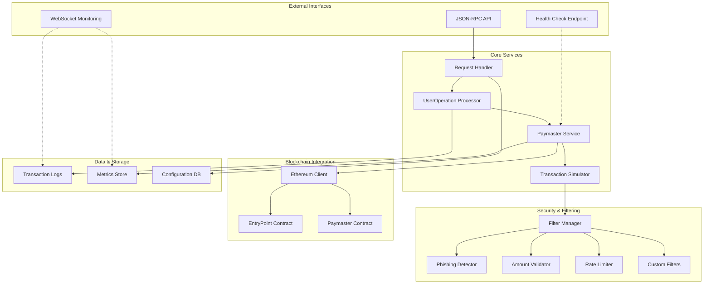
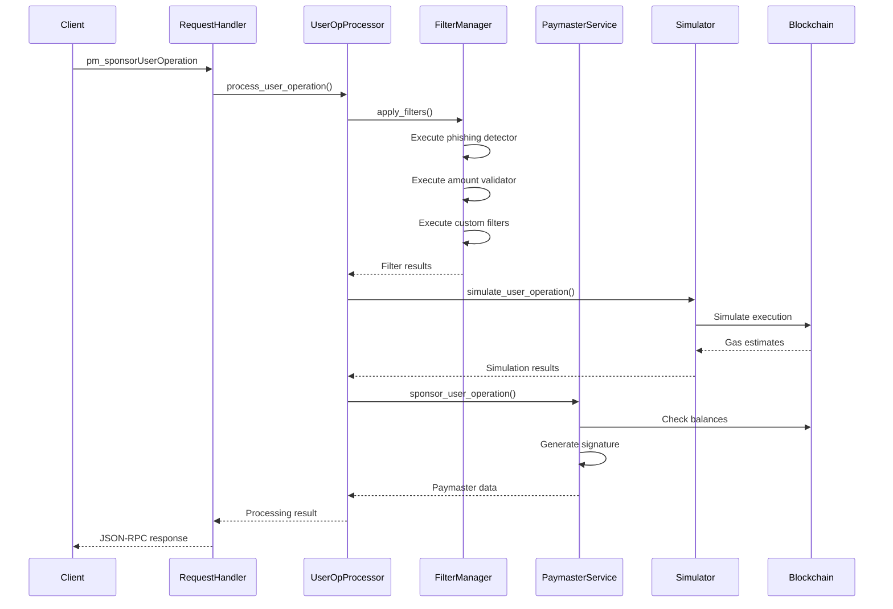

# aPaymaster Relay Server - Detailed System Design

## Overview

The aPaymaster Relay Server is a high-performance, configurable ERC-4337 paymaster service built in Rust. It provides gasless transaction sponsorship and ERC-20 token-based payments with integrated security filtering and monitoring capabilities. The system is designed for modularity, allowing independent development and hot-swappable insertion of detection/filtering modules.

## System Architecture



## Core Modules Design

### 1. Request Handler Module

**Purpose**: Handles incoming JSON-RPC requests and routes them to appropriate processors.

**Main Functions**:

#### `handle_request(request: JsonRpcRequest) -> Result<JsonRpcResponse, PaymasterError>`

**Parameters**:
- `request`: JsonRpcRequest struct containing method, params, and id

**Returns**:
- `Ok(JsonRpcResponse)`: Successful response with result
- `Err(PaymasterError)`: Error response with error details

**Logic Flow**:
1. Parse JSON-RPC request
2. Validate request format and required fields
3. Route to appropriate handler based on method
4. Apply rate limiting if configured
5. Log request for monitoring
6. Return formatted JSON-RPC response

#### `validate_request(request: &JsonRpcRequest) -> Result<(), ValidationError>`

**Parameters**:
- `request`: Reference to JsonRpcRequest

**Returns**:
- `Ok(())`: Request is valid
- `Err(ValidationError)`: Specific validation error

**Validation Rules**:
- Method exists in supported methods
- Parameters match expected schema
- Request ID is present and valid
- EntryPoint address is supported

### 2. UserOperation Processor Module

**Purpose**: Processes ERC-4337 UserOperations through the complete validation and execution pipeline.

**Main Functions**:

#### `process_user_operation(uo: UserOperation, context: ProcessingContext) -> Result<ProcessingResult, ProcessingError>`

**Parameters**:
- `uo`: Complete UserOperation struct
- `context`: ProcessingContext with metadata (entrypoint, chain_id, client_ip, etc.)

**Returns**:
- `Ok(ProcessingResult)`: Contains paymaster data, gas estimates, and validation results
- `Err(ProcessingError)`: Processing failed with specific error

**Logic Flow**:
1. Validate UserOperation structure and fields
2. Apply pre-processing filters
3. Simulate transaction execution
4. Calculate gas costs and token conversion (if ERC-20)
5. Generate paymaster signature
6. Apply post-processing filters
7. Log processing metrics

#### `validate_user_operation(uo: &UserOperation) -> Result<(), ValidationError>`

**Parameters**:
- `uo`: Reference to UserOperation

**Returns**:
- `Ok(())`: UserOperation is structurally valid
- `Err(ValidationError)`: Specific validation error

**Validation Rules**:
- All required fields present
- Addresses are valid checksum addresses
- Nonce is reasonable
- Gas limits are within bounds
- CallData is valid hex

### 3. Paymaster Service Module

**Purpose**: Core paymaster logic for sponsorship and ERC-20 payment processing.

**Main Functions**:

#### `sponsor_user_operation(uo: UserOperation, policy: SponsorshipPolicy) -> Result<PaymasterData, SponsorshipError>`

**Parameters**:
- `uo`: UserOperation to sponsor
- `policy`: SponsorshipPolicy configuration

**Returns**:
- `Ok(PaymasterData)`: Paymaster data with signature
- `Err(SponsorshipError)`: Sponsorship failed

**Logic Flow**:
1. Check sponsorship policy limits
2. Calculate gas costs
3. Verify sufficient paymaster balance
4. Generate paymaster data and signature
5. Update sponsorship counters
6. Log sponsorship event

#### `calculate_erc20_payment(uo: &UserOperation, token_config: TokenConfig) -> Result<PaymentCalculation, CalculationError>`

**Parameters**:
- `uo`: Reference to UserOperation
- `token_config`: Token configuration with exchange rates

**Returns**:
- `Ok(PaymentCalculation)`: Token amount and conversion details
- `Err(CalculationError)`: Calculation failed

**Formula**:
```rust
let gas_cost = (pre_verification_gas + verification_gas + call_gas + post_op_gas) * max_fee_per_gas;
let token_amount = (gas_cost * exchange_rate) / 10^18;
```

### 4. Transaction Simulator Module

**Purpose**: Simulates UserOperation execution to validate behavior and estimate gas costs.

**Main Functions**:

#### `simulate_user_operation(uo: &UserOperation, state_overrides: StateOverrides) -> Result<SimulationResult, SimulationError>`

**Parameters**:
- `uo`: Reference to UserOperation to simulate
- `state_overrides`: Optional state overrides for simulation

**Returns**:
- `Ok(SimulationResult)`: Gas estimates and execution results
- `Err(SimulationError)`: Simulation failed

**Logic Flow**:
1. Set up simulation environment
2. Apply state overrides if provided
3. Execute UserOperation on forked state
4. Capture gas usage and return values
5. Validate execution didn't revert
6. Return detailed gas breakdown

#### `estimate_gas_costs(uo: &UserOperation) -> Result<GasEstimates, EstimationError>`

**Parameters**:
- `uo`: Reference to UserOperation

**Returns**:
- `Ok(GasEstimates)`: Detailed gas cost breakdown
- `Err(EstimationError)`: Gas estimation failed

**Gas Components**:
- `pre_verification_gas`: EntryPoint verification
- `verification_gas_limit`: Account verification
- `call_gas_limit`: Transaction execution
- `paymaster_verification_gas_limit`: Paymaster verification
- `paymaster_post_op_gas_limit`: Paymaster post-operation

### 5. Filter Manager Module

**Purpose**: Orchestrates configurable filtering modules for transaction validation.

**Main Functions**:

#### `apply_filters(uo: &UserOperation, context: &FilterContext) -> Result<FilterResult, FilterError>`

**Parameters**:
- `uo`: Reference to UserOperation to filter
- `context`: FilterContext with metadata

**Returns**:
- `Ok(FilterResult)`: Filter results with warnings/blocks
- `Err(FilterError)`: Filter execution failed

**Logic Flow**:
1. Load active filter configurations
2. Execute filters in priority order
3. Collect filter results and warnings
4. Apply blocking logic based on severity
5. Log filter decisions

#### `register_filter(filter: Box<dyn TransactionFilter>) -> Result<(), RegistrationError>`

**Parameters**:
- `filter`: Boxed trait object implementing TransactionFilter

**Returns**:
- `Ok(())`: Filter registered successfully
- `Err(RegistrationError)`: Registration failed

### 6. Security Filter Modules

#### Phishing Detector Filter

**Purpose**: Detects transactions interacting with known phishing contracts.

**Main Functions**:

##### `check_phishing_contracts(uo: &UserOperation) -> Result<FilterDecision, FilterError>`

**Parameters**:
- `uo`: Reference to UserOperation

**Returns**:
- `Ok(FilterDecision::Allow)`: No phishing contracts detected
- `Ok(FilterDecision::Block)`: Phishing contract interaction detected
- `Ok(FilterDecision::Warn)`: Suspicious but not blocked

**Detection Logic**:
1. Extract all contract addresses from callData
2. Check against phishing contract database
3. Check against known malicious patterns
4. Apply risk scoring
5. Return decision based on risk level

##### `update_phishing_database(signatures: Vec<ContractSignature>) -> Result<(), UpdateError>`

**Parameters**:
- `signatures`: Vector of contract signatures to add/update

**Returns**:
- `Ok(())`: Database updated successfully
- `Err(UpdateError)`: Update failed

#### Amount Validator Filter

**Purpose**: Validates transaction amounts against configurable limits.

**Main Functions**:

##### `validate_amounts(uo: &UserOperation, limits: AmountLimits) -> Result<FilterDecision, FilterError>`

**Parameters**:
- `uo`: Reference to UserOperation
- `limits`: AmountLimits configuration

**Returns**:
- `Ok(FilterDecision)`: Amount validation result

**Validation Rules**:
- Maximum ETH transfer amount
- Maximum token transfer amount
- Daily/weekly spending limits
- Contract interaction value limits
- Gas cost vs. transaction value ratio

##### `check_daily_limits(user: Address, amount: U256, period: TimePeriod) -> Result<bool, LimitError>`

**Parameters**:
- `user`: User address to check
- `amount`: Amount to validate
- `period`: Time period for limit checking

**Returns**:
- `Ok(true)`: Within limits
- `Ok(false)`: Exceeds limits
- `Err(LimitError)`: Limit check failed

### 7. Configuration System

**Purpose**: Manages all system configuration including filter settings and policies.

**Main Functions**:

#### `load_configuration() -> Result<ServerConfig, ConfigError>`

**Returns**:
- `Ok(ServerConfig)`: Complete server configuration
- `Err(ConfigError)`: Configuration loading failed

#### `update_filter_config(filter_id: String, config: serde_json::Value) -> Result<(), ConfigError>`

**Parameters**:
- `filter_id`: Unique filter identifier
- `config`: New configuration as JSON value

**Returns**:
- `Ok(())`: Configuration updated
- `Err(ConfigError)`: Update failed

## Module Interaction Flow



## Configuration Schema

```rust
#[derive(Deserialize, Serialize)]
pub struct ServerConfig {
    pub server: ServerSettings,
    pub paymaster: PaymasterSettings,
    pub filters: FilterConfiguration,
    pub blockchain: BlockchainSettings,
    pub monitoring: MonitoringSettings,
}

#[derive(Deserialize, Serialize)]
pub struct FilterConfiguration {
    pub enabled_filters: Vec<String>,
    pub phishing_detector: PhishingConfig,
    pub amount_validator: AmountConfig,
    pub rate_limiter: RateLimitConfig,
    pub custom_filters: HashMap<String, serde_json::Value>,
}
```

## Error Handling Design

### Error Categories

1. **Validation Errors**: Invalid input data
2. **Processing Errors**: UserOperation processing failures
3. **Simulation Errors**: Transaction simulation failures
4. **Filter Errors**: Security filter execution failures
5. **Blockchain Errors**: Network or contract interaction failures
6. **Configuration Errors**: Invalid configuration

### Error Response Format

```json
{
  "jsonrpc": "2.0",
  "id": 1,
  "error": {
    "code": -32000,
    "message": "Processing failed",
    "data": {
      "error_type": "VALIDATION_ERROR",
      "details": "Invalid UserOperation format",
      "field": "callData"
    }
  }
}
```

## Performance Considerations

### Optimization Strategies

1. **Caching**: Gas price caching, exchange rate caching
2. **Async Processing**: Non-blocking filter execution
3. **Connection Pooling**: Ethereum client connection reuse
4. **Batch Processing**: Multiple UserOperation processing
5. **Memory Management**: Efficient data structures for large filter databases

### Monitoring Metrics

- Request latency percentiles
- Filter execution times
- Success/failure rates by filter type
- Gas estimation accuracy
- Memory usage and GC statistics
- Database query performance

## Security Considerations

### Threat Mitigation

1. **Input Validation**: Comprehensive input sanitization
2. **Rate Limiting**: Per-IP and per-user request limits
3. **Filter Updates**: Secure filter configuration updates
4. **Audit Logging**: Complete transaction audit trails
5. **Access Control**: API key and signature validation
6. **Data Encryption**: Sensitive configuration encryption

### Key Security Features

- **Immutable Logs**: Cryptographically signed log entries
- **Configuration Signing**: Signed configuration updates
- **Emergency Stops**: Ability to disable sponsorship instantly
- **Alert System**: Real-time security event alerting

## Self-Assessment and Improvements

### Strengths

1. **Modular Architecture**: Clean separation of concerns allows independent module development
2. **Type Safety**: Rust's type system prevents many runtime errors
3. **Performance**: Zero-cost abstractions and efficient async processing
4. **Configurability**: Hot-swappable filters without service restart
5. **Comprehensive Logging**: Detailed observability for debugging and monitoring

### Areas for Improvement

1. **Filter Performance**: Implement parallel filter execution for better throughput
2. **Database Integration**: Add persistent storage for filter databases and metrics
3. **API Versioning**: Support multiple API versions for backward compatibility
4. **Circuit Breaker**: Implement automatic failure recovery mechanisms
5. **Advanced Analytics**: Add ML-based anomaly detection for transaction patterns

### Future Enhancements

1. **Plugin System**: WebAssembly-based filter plugins for maximum flexibility
2. **Multi-Chain Support**: Extend beyond Ethereum to other EVM chains
3. **Cross-Contract Analysis**: Analyze transaction interactions across multiple contracts
4. **Economic Modeling**: Dynamic pricing based on network congestion and sponsorship costs
5. **Decentralized Operation**: Support for decentralized paymaster networks

## Implementation Priority

### Phase 1 (Core Functionality)
- Basic JSON-RPC server
- UserOperation processing pipeline
- Simple sponsorship logic
- Basic phishing detection

### Phase 2 (Advanced Features)
- ERC-20 payment support
- Advanced filtering modules
- Performance optimization
- Comprehensive monitoring

### Phase 3 (Enterprise Features)
- Plugin system
- Multi-chain support
- Advanced analytics
- Decentralized operation

This design provides a solid foundation for a production-ready paymaster service with strong security, performance, and maintainability characteristics.
