# Paymaster Server Workflow

```mermaid
flowchart TD
    %% User/Smart Account Flow
    subgraph "Smart Account Client"
        A[Smart Account Client] --> B[Create UserOperation]
        B --> C[Choose Payment Mode]
        C --> D{ERC-20 or Sponsorship?}

        D -->|ERC-20| E[Get Token Quotes]
        D -->|Sponsorship| F[Request Sponsorship]
    end

    %% Paymaster Server Flow
    subgraph "Paymaster Server"
        E --> G[pimlico_getTokenQuotes]
        F --> H[pm_sponsorUserOperation]

        G --> I[Return Token Exchange Rates]
        H --> J[Return Paymaster Data + Gas Estimates]
    end

    %% Bundler Interaction Flow
    subgraph "Bundler Interaction"
        I --> K[Calculate Required Approvals]
        J --> L[Prepare Final UserOperation]

        K --> M[Add Token Approval Calls]
        L --> N[Send to Bundler]

        M --> N
        N --> O[Estimate Gas]
        O --> P[Get Stub Paymaster Data]
    end

    %% Paymaster Server - Stub Data
    subgraph "Paymaster Server (Stub)"
        P --> Q[pm_getPaymasterStubData]
        Q --> R[Return Preliminary Data]
    end

    %% Final Preparation
    subgraph "Final Preparation"
        R --> S[Refine Gas Estimates]
        S --> T[Request Final Paymaster Data]
    end

    %% Paymaster Server - Final Data
    subgraph "Paymaster Server (Final)"
        T --> U[pm_getPaymasterData]
        U --> V[Return Signed Paymaster Data]
    end

    %% Execution Flow
    subgraph "Execution"
        V --> W[Submit to Bundler]
        W --> X[Bundler Validates & Bundles]
        X --> Y[Transaction Execution]

        Y --> Z{Validate Paymaster}
        Z -->|Valid| AA[Execute postOp]
        Z -->|Invalid| BB[Revert Transaction]
    end

    %% Post-Operation
    subgraph "Post-Operation"
        AA --> CC{ERC-20 Mode?}
        CC -->|Yes| DD[Transfer Tokens from User]
        CC -->|No| EE[Sponsorship - Pay from Paymaster]

        DD --> FF[Convert Tokens to Native]
        FF --> GG[Pay Bundler/Validators]

        EE --> GG
        GG --> HH[Update Balances/Metrics]
    end

    %% Styling
    classDef client fill:#e1f5fe,stroke:#01579b,stroke-width:2px
    classDef server fill:#f3e5f5,stroke:#4a148c,stroke-width:2px
    classDef execution fill:#e8f5e8,stroke:#1b5e20,stroke-width:2px
    classDef decision fill:#fff3e0,stroke:#e65100,stroke-width:2px

    class A,B,C client
    class D decision
    class E,F,G,H,I,J,Q,R,U,V server
    class W,X,Y,Z,AA,BB execution
```

## Detailed Workflow Explanation

### Phase 1: User Operation Creation
1. **Smart Account Client** creates a UserOperation
2. **Payment Mode Selection**: Choose between ERC-20 tokens or sponsorship
3. **Initial Paymaster Query**:
   - ERC-20: `pimlico_getTokenQuotes` for exchange rates
   - Sponsorship: `pm_sponsorUserOperation` for sponsored data

### Phase 2: Gas Estimation & Preparation
4. **Token Approval Calculation**: For ERC-20 mode, calculate required approvals
5. **Bundler Gas Estimation**: Get accurate gas limits from bundler
6. **Stub Data Request**: `pm_getPaymasterStubData` for preliminary paymaster data

### Phase 3: Final Data Preparation
7. **Gas Refinement**: Adjust gas estimates based on stub data
8. **Final Paymaster Data**: `pm_getPaymasterData` with signed paymaster data
9. **UserOperation Finalization**: Combine all data for submission

### Phase 4: Execution & Validation
10. **Bundler Submission**: Send complete UserOperation to bundler
11. **Batch Processing**: Bundler validates and includes in batch transaction
12. **On-Chain Validation**: Paymaster contract validates during execution
13. **Post-Operation**: Execute payment logic (token transfer or sponsorship)

### Phase 5: Settlement
14. **Payment Settlement**:
    - ERC-20: Transfer tokens → Convert to native → Pay network fees
    - Sponsorship: Pay directly from paymaster balance
15. **State Updates**: Update balances, metrics, and sponsorship policies

## Key Integration Points

- **Permissionless.js**: Client library that orchestrates the entire flow
- **Bundler**: Handles UserOperation batching and network submission
- **Paymaster Contract**: On-chain component that validates and executes payments
- **Paymaster Server**: Off-chain service providing gas estimation and signatures

## Error Handling & Fallbacks

- Gas estimation failures → Retry with adjusted parameters
- Paymaster rejection → Fallback to native payment
- Token balance/allowance issues → Clear error messages
- Network congestion → Dynamic gas price adjustments

## Monitoring & Analytics

- Success/failure rates by payment mode
- Gas usage patterns
- Token exchange rate monitoring
- Sponsorship policy utilization
- Performance metrics and latency tracking
