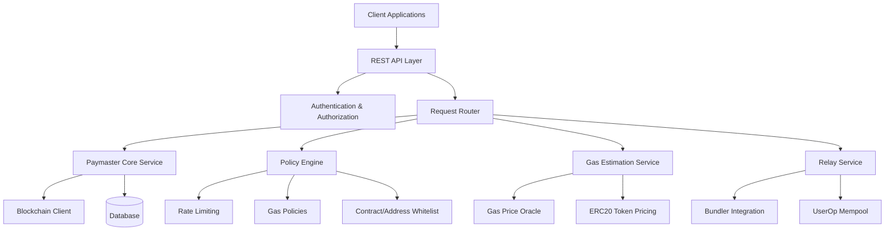

# Rust Paymaster Off-chain Server Design

## Overview

Based on the analysis of ZeroDev SDK and paymaster patterns, this document outlines the design of a Rust-based paymaster off-chain server that provides gas sponsorship and relay services for ERC-4337 Account Abstraction wallets.

## Core Architecture

The Rust paymaster server abstracts the essential capabilities of a paymaster relay server into modular components that can be invoked by external clients through well-defined APIs.

### Key Components



## Core Capabilities

### 1. Gas Sponsorship Service

**Primary Function**: Sponsor gas fees for user operations based on configurable policies.

**Key Features**:
- Validate user operations before sponsorship
- Apply gas policies (rate limiting, spending caps, whitelisting)
- Generate paymaster signatures for sponsored operations
- Support multiple sponsorship models (free, ERC20 payment, subscription-based)

### 2. ERC20 Paymaster Service

**Primary Function**: Enable users to pay gas fees using ERC20 tokens instead of native ETH.

**Key Features**:
- Support multiple ERC20 tokens (USDC, USDT, custom tokens)
- Real-time token price conversion
- Token allowance verification
- Exchange rate management with configurable markup

### 3. Policy Engine

**Primary Function**: Enforce fine-grained control over gas sponsorship policies.

**Policy Types**:
- **Project Policies**: Global limits for the entire project
- **Contract Policies**: Specific limits for contract interactions
- **Wallet Policies**: Per-wallet spending limits
- **Custom Policies**: Webhook-based custom validation logic

**Rate Limit Types**:
- **Amount Limits**: Maximum gas amount per time period
- **Request Limits**: Maximum number of requests per time period
- **Gas Price Limits**: Only sponsor when gas price is below threshold
- **Per-Transaction Limits**: Maximum gas per single transaction

### 4. Gas Estimation Service

**Primary Function**: Provide accurate gas cost estimates in both native tokens and ERC20 tokens.

**Key Features**:
- Multi-chain gas price oracle integration
- ERC20 token price feeds
- Dynamic gas estimation based on network conditions
- Estimation for batched transactions

### 5. Relay Service (UltraRelay Compatible)

**Primary Function**: Optimize transaction relay with combined bundler and paymaster functionality.

**Key Features**:
- 30% gas reduction compared to standard ERC-4337 bundlers
- 20% lower latency than traditional bundlers
- Direct mempool integration
- Optimized UserOp batching

## API Service Endpoints

### Core Paymaster APIs

#### 1. Sponsor User Operation
```http
POST /api/v1/paymaster/sponsor
Content-Type: application/json

{
  "userOperation": {
    "sender": "0x...",
    "nonce": "0x...",
    "initCode": "0x...",
    "callData": "0x...",
    "callGasLimit": "0x...",
    "verificationGasLimit": "0x...",
    "preVerificationGas": "0x...",
    "maxFeePerGas": "0x...",
    "maxPriorityFeePerGas": "0x...",
    "paymasterAndData": "0x",
    "signature": "0x..."
  },
  "entryPoint": "0x5FF137D4b0FDCD49DcA30c7CF57E578a026d2789",
  "chainId": 1
}
```

**Response:**
```json
{
  "paymasterAndData": "0x...",
  "preVerificationGas": "0x...",
  "verificationGasLimit": "0x...",
  "callGasLimit": "0x..."
}
```

#### 2. ERC20 Gas Payment
```http
POST /api/v1/paymaster/erc20
Content-Type: application/json

{
  "userOperation": { ... },
  "token": "0xA0b86a33E6441c8C0c45F2d7a6c6e5B8E6A8C8D2",
  "maxTokenAmount": "1000000"
}
```

#### 3. Gas Estimation
```http
POST /api/v1/estimate/gas
Content-Type: application/json

{
  "userOperation": { ... },
  "token": "0x..." // Optional: for ERC20 estimation
}
```

**Response:**
```json
{
  "gasEstimate": {
    "totalGasLimit": "150000",
    "gasPrice": "20000000000",
    "totalCostEth": "3000000000000000",
    "totalCostToken": "3500000" // If token specified
  }
}
```

### Policy Management APIs

#### 4. Create Gas Policy
```http
POST /api/v1/policies
Content-Type: application/json

{
  "name": "Contract Limit Policy",
  "type": "contract",
  "target": "0x...", // Contract address
  "rateLimits": [
    {
      "type": "amount",
      "limit": "1000000000000000000", // 1 ETH in wei
      "window": "3600" // 1 hour in seconds
    }
  ],
  "enabled": true
}
```

#### 5. Query Policy Status
```http
GET /api/v1/policies/{policyId}/status?wallet=0x...&contract=0x...
```

### Health and Monitoring APIs

#### 6. Health Check
```http
GET /api/v1/health
```

**Response:**
```json
{
  "status": "healthy",
  "version": "1.0.0",
  "chainConnections": {
    "ethereum": "connected",
    "polygon": "connected"
  },
  "uptime": 86400
}
```

#### 7. Metrics
```http
GET /api/v1/metrics
```

**Response:**
```json
{
  "totalOperationsSponsored": 15420,
  "totalGasSponsored": "150000000000000000000",
  "erc20PaymentsProcessed": 3240,
  "averageResponseTime": "120ms",
  "policyViolations": 12
}
```

## Rust Implementation Architecture

### Project Structure
```
relay-server/
├── Cargo.toml
├── src/
│   ├── main.rs
│   ├── lib.rs
│   ├── api/
│   │   ├── mod.rs
│   │   ├── paymaster.rs
│   │   ├── policies.rs
│   │   └── health.rs
│   ├── core/
│   │   ├── mod.rs
│   │   ├── paymaster.rs
│   │   ├── policy_engine.rs
│   │   ├── gas_estimator.rs
│   │   └── relay_service.rs
│   ├── blockchain/
│   │   ├── mod.rs
│   │   ├── client.rs
│   │   └── contracts.rs
│   ├── database/
│   │   ├── mod.rs
│   │   ├── models.rs
│   │   └── repositories.rs
│   ├── config/
│   │   ├── mod.rs
│   │   └── settings.rs
│   └── utils/
│       ├── mod.rs
│       ├── crypto.rs
│       └── validation.rs
├── tests/
└── docs/
```

### Key Dependencies
```toml
[dependencies]
# Web framework
axum = "0.7"
tower = "0.4"
tower-http = "0.5"

# Async runtime
tokio = { version = "1.0", features = ["full"] }

# Ethereum integration
ethers = "2.0"
alloy = "0.1"

# Database
sqlx = { version = "0.7", features = ["runtime-tokio-rustls", "postgres"] }
redis = "0.24"

# Serialization
serde = { version = "1.0", features = ["derive"] }
serde_json = "1.0"

# Configuration
config = "0.14"

# Cryptography
k256 = "0.13"
sha3 = "0.10"

# Logging and monitoring
tracing = "0.1"
tracing-subscriber = "0.3"
metrics = "0.22"

# HTTP client
reqwest = { version = "0.11", features = ["json"] }

# Error handling
anyhow = "1.0"
thiserror = "1.0"
```

## Security Considerations

### 1. Private Key Management
- Use Hardware Security Modules (HSM) for production deployments
- Implement key rotation mechanisms
- Support multiple signing methods (local, remote, multi-sig)

### 2. Rate Limiting and DDoS Protection
- Implement multiple layers of rate limiting
- Use Redis for distributed rate limiting
- IP-based and wallet-based throttling

### 3. Transaction Validation
- Comprehensive UserOp validation before sponsorship
- Signature verification for all operations
- Contract interaction whitelisting

### 4. Monitoring and Alerting
- Real-time monitoring of gas spending
- Alert on policy violations
- Transaction failure analysis

## Performance Optimizations

### 1. Caching Strategy
- Cache gas price data from oracles
- Cache policy evaluation results
- Cache contract interaction patterns

### 2. Database Optimizations
- Use connection pooling for database access
- Implement read replicas for scaling
- Optimize queries with proper indexing

### 3. Concurrent Processing
- Parallel processing of UserOp validations
- Async blockchain interactions
- Background policy evaluation

## Deployment Considerations

### 1. Multi-Chain Support
- Separate service instances per chain
- Shared policy and configuration management
- Cross-chain gas price normalization

### 2. High Availability
- Load balancer configuration
- Database replication
- Failover mechanisms

### 3. Monitoring and Observability
- Prometheus metrics integration
- Distributed tracing with Jaeger
- Comprehensive logging with structured logs

## Integration Examples

### Client Integration (TypeScript)
```typescript
import axios from 'axios';

class PaymasterClient {
  constructor(private baseUrl: string, private apiKey: string) {}

  async sponsorUserOperation(userOp: UserOperation): Promise<PaymasterResult> {
    const response = await axios.post(`${this.baseUrl}/api/v1/paymaster/sponsor`, {
      userOperation: userOp,
      entryPoint: "0x5FF137D4b0FDCD49DcA30c7CF57E578a026d2789",
      chainId: 1
    }, {
      headers: {
        'Authorization': `Bearer ${this.apiKey}`,
        'Content-Type': 'application/json'
      }
    });

    return response.data;
  }

  async estimateGas(userOp: UserOperation, token?: string): Promise<GasEstimate> {
    const response = await axios.post(`${this.baseUrl}/api/v1/estimate/gas`, {
      userOperation: userOp,
      token
    }, {
      headers: {
        'Authorization': `Bearer ${this.apiKey}`,
        'Content-Type': 'application/json'
      }
    });

    return response.data;
  }
}
```

## Conclusion

This Rust paymaster off-chain server design provides a comprehensive, scalable, and secure solution for ERC-4337 gas sponsorship and relay services. The modular architecture allows for easy extension and customization while maintaining high performance and reliability standards.

The design incorporates lessons learned from ZeroDev's successful implementation while leveraging Rust's performance and safety benefits for production-grade deployment.
