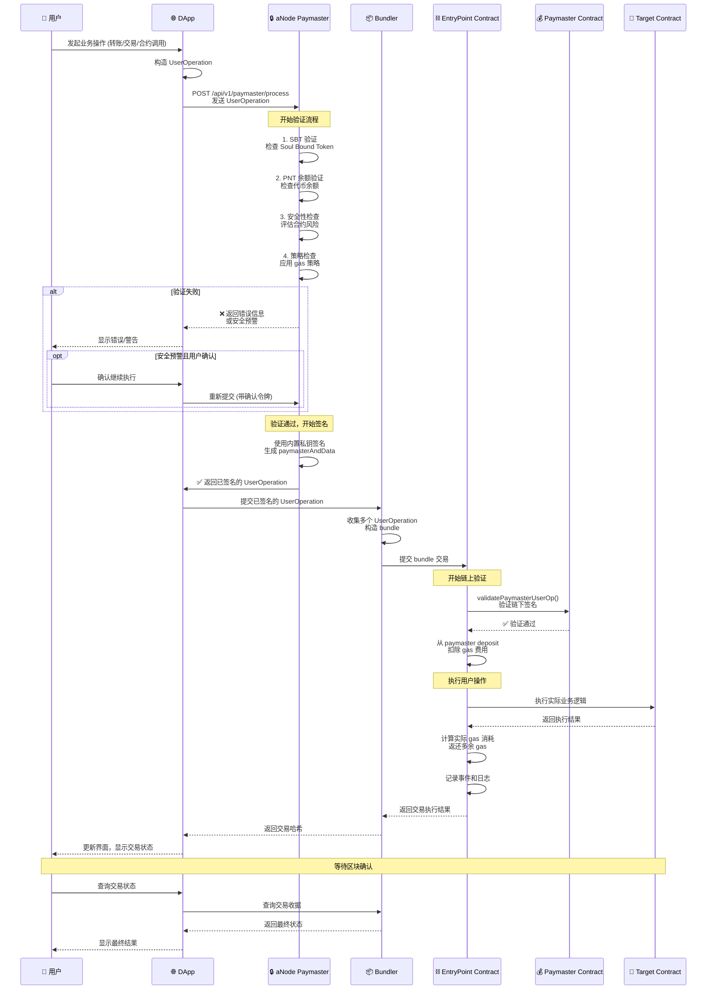
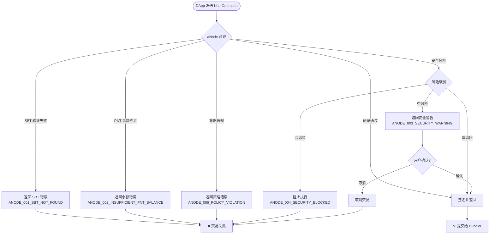

# ERC-4337 完整流程图 - aNode 集成

## 流程概述

本文档描述了用户通过 DApp 发起业务意图，经过 aNode paymaster 验证和签名，最终通过 bundler 提交到链上 EntryPoint 合约执行的完整 ERC-4337 流程。

## 完整流程描述

### 1. 用户意图发起阶段
用户在 DApp 界面上发起业务操作（如转账、交易、合约调用等），DApp 将用户意图转换为标准的 ERC-4337 UserOperation 结构。

### 2. aNode 验证阶段
DApp 将 UserOperation 发送到 aNode paymaster 服务器进行验证：
- **SBT 验证**：检查用户是否持有必要的 Soul Bound Token
- **PNT 余额验证**：验证用户 PNT 代币余额是否满足要求
- **安全性检查**：评估目标合约和交易的安全风险
- **策略检查**：应用配置的 gas 策略和限制规则

### 3. aNode 签名阶段
如果验证通过，aNode 使用内置私钥对 UserOperation 进行签名：
- 生成 `paymasterAndData` 字段
- 计算 gas 费用和限制
- 返回完整的已签名 UserOperation

### 4. 错误处理分支
如果验证失败或检测到安全风险：
- 返回具体的错误信息或安全预警
- 对于安全预警，提供二次确认机制
- 用户可选择取消或确认继续执行

### 5. Bundler 提交阶段
验证成功后，DApp 将已签名的 UserOperation 提交给标准 bundler：
- Bundler 收集多个 UserOperation 进行批处理
- 构造 bundle 交易准备提交到链上

### 6. EntryPoint 验证阶段
Bundler 将 bundle 提交到链上 EntryPoint 合约：
- EntryPoint 调用 aNode 的 paymaster 链上合约
- 执行 `validatePaymasterUserOp` 方法验证链下签名
- 验证通过后，从 paymaster 在 EntryPoint 的 deposit balance 中扣除 gas 费用

### 7. 交易执行阶段
EntryPoint 合约执行用户的实际操作：
- 调用目标合约或执行转账操作
- 计算实际消耗的 gas
- 返还多余的 gas 给 paymaster
- 记录交易结果和事件

### 8. 结果返回阶段
交易执行完毕后，结果通过各层级返回：
- EntryPoint 返回执行结果给 Bundler
- Bundler 返回交易哈希给 DApp
- DApp 更新用户界面显示交易状态

## Mermaid 流程图



## 关键数据流

### UserOperation 数据结构
```solidity
struct UserOperation {
    address sender;              // 发送方地址
    uint256 nonce;              // 账户 nonce
    bytes initCode;             // 账户初始化代码
    bytes callData;             // 调用数据
    uint256 callGasLimit;       // 调用 gas 限制
    uint256 verificationGasLimit; // 验证 gas 限制
    uint256 preVerificationGas;  // 预验证 gas
    uint256 maxFeePerGas;       // 最大 gas 费用
    uint256 maxPriorityFeePerGas; // 最大优先费用
    bytes paymasterAndData;     // Paymaster 数据和签名
    bytes signature;            // 用户签名
}
```

### aNode 验证结果
```json
{
  "success": true,
  "userOperation": { /* 已签名的 UserOperation */ },
  "validation": {
    "sbt": { "valid": true, "tokens": [...] },
    "pnt": { "valid": true, "balance": "250000000000000000000" },
    "security": { "riskLevel": "low", "score": 15 },
    "policies": { "passed": true, "appliedPolicies": [...] }
  },
  "gasEstimate": {
    "totalCost": "0x2386f26fc10000",
    "breakdown": { /* gas 分解 */ }
  }
}
```

## 错误处理流程



## 与 ZeroDev 流程的对比

### ZeroDev 标准流程
1. DApp → ZeroDev Paymaster → 签名返回
2. DApp → Bundler → EntryPoint → 执行

### aNode 增强流程
1. DApp → aNode Paymaster → **多层验证** (SBT + PNT + 安全) → 签名返回
2. DApp → Bundler → EntryPoint → **aNode 链上合约验证** → 执行

### 主要增强点
- **身份验证**：SBT 持有验证
- **经济模型**：PNT 代币余额要求
- **安全防护**：智能合约风险评估
- **用户体验**：分级安全警告和确认机制
- **策略驱动**：灵活的 gas 策略管理

## 性能考虑

### 验证阶段优化
- **并行验证**：SBT、PNT、安全检查可并行执行
- **缓存机制**：验证结果缓存，减少重复检查
- **快速路径**：低风险交易跳过部分检查

### 预期性能指标
- **验证延迟**：< 200ms (包含所有检查)
- **并发处理**：支持 1000+ TPS
- **缓存命中率**：> 80% (SBT/PNT 验证)

这个完整的流程图展示了 aNode 在 ERC-4337 生态中的关键作用，既保持了与标准的兼容性，又提供了增强的安全性和用户体验。
