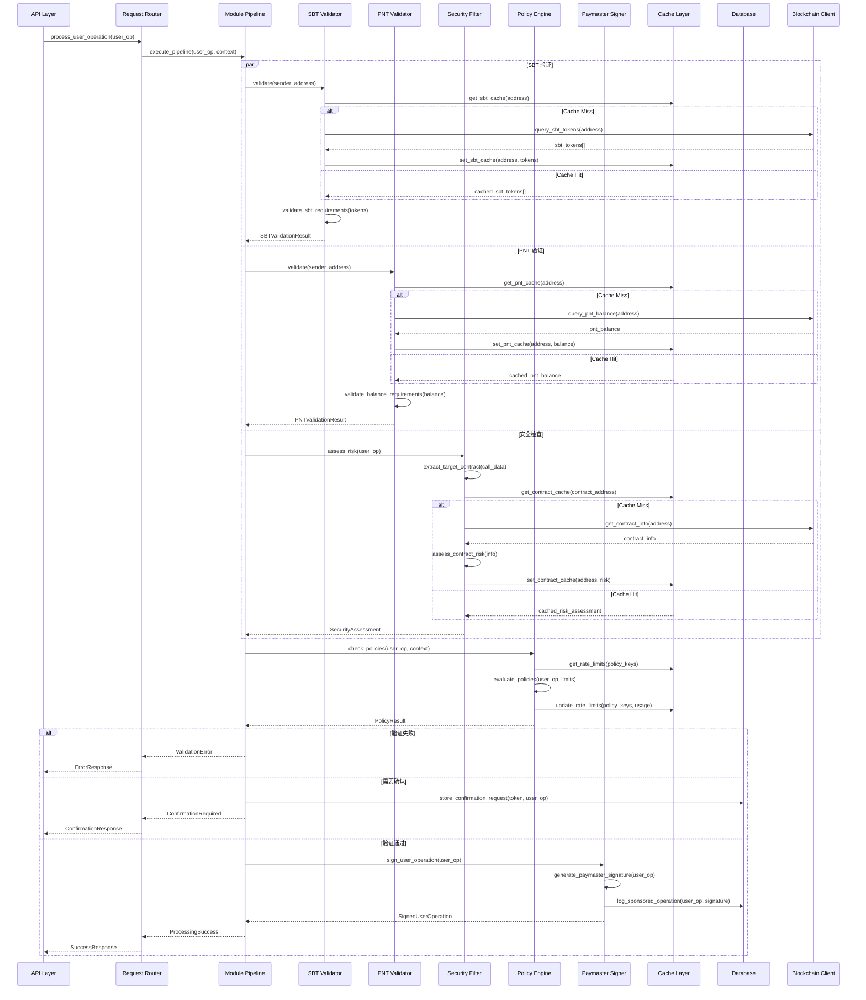
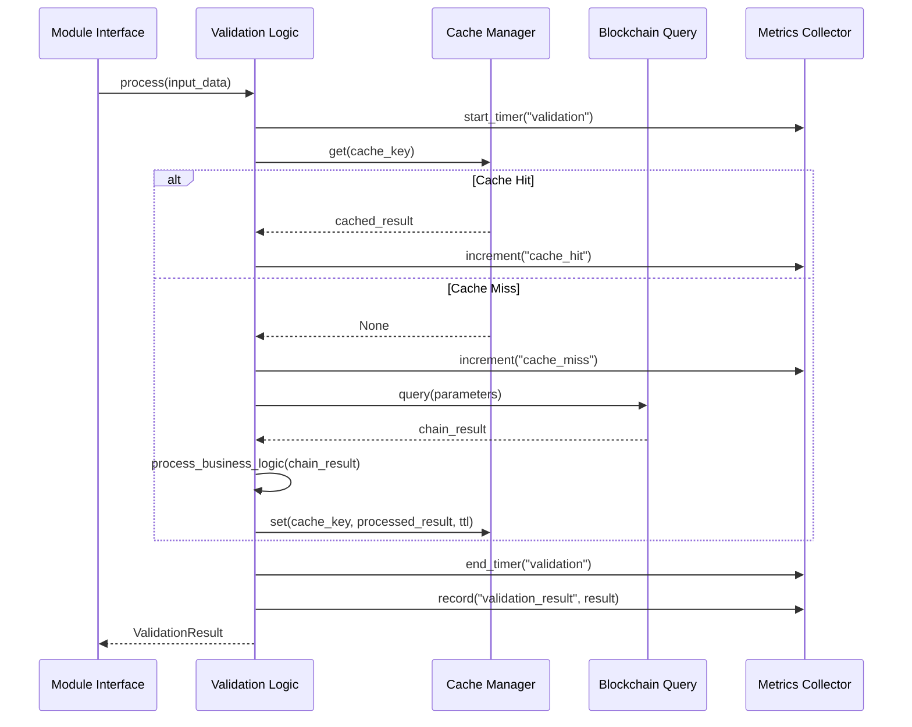

# aNode 模块设计文档

## 模块架构概述

aNode 采用可插拔的模块化架构，每个模块负责特定的验证或处理功能。模块之间通过标准化的接口进行通信，支持动态配置和扩展。

## 内部模块调用时序图

### 主要处理流程时序图



### 模块内部处理时序图



## 核心模块设计

### 1. API Layer (API 层)

#### 1.1 RESTful Handler
```rust
pub struct RestHandler {
    pipeline: Arc<ModulePipeline>,
    config: ApiConfig,
    metrics: Arc<MetricsCollector>,
}

impl RestHandler {
    // 主要处理接口
    pub async fn process_user_operation(
        &self,
        request: ProcessUserOperationRequest,
    ) -> Result<ProcessUserOperationResponse, ApiError> {
        let context = RequestContext::from_request(&request);
        let result = self.pipeline.execute(request.user_operation, context).await?;
        Ok(self.format_response(result))
    }
    
    // SBT 验证接口
    pub async fn validate_sbt(
        &self,
        address: String,
    ) -> Result<SBTValidationResponse, ApiError> {
        let result = self.pipeline.get_module::<SBTValidator>()
            .validate(&address).await?;
        Ok(SBTValidationResponse::from(result))
    }
    
    // PNT 验证接口
    pub async fn validate_pnt(
        &self,
        address: String,
    ) -> Result<PNTValidationResponse, ApiError> {
        let result = self.pipeline.get_module::<PNTValidator>()
            .validate(&address).await?;
        Ok(PNTValidationResponse::from(result))
    }
}
```

#### 1.2 JSON-RPC Handler
```rust
pub struct RpcHandler {
    pipeline: Arc<ModulePipeline>,
    method_registry: HashMap<String, Box<dyn RpcMethod>>,
}

impl RpcHandler {
    pub async fn handle_request(
        &self,
        request: JsonRpcRequest,
    ) -> JsonRpcResponse {
        match self.method_registry.get(&request.method) {
            Some(handler) => handler.execute(request.params).await,
            None => JsonRpcResponse::method_not_found(request.id),
        }
    }
}

// RPC 方法特征
#[async_trait]
pub trait RpcMethod: Send + Sync {
    async fn execute(&self, params: Value) -> JsonRpcResponse;
}
```

### 2. Module Pipeline (模块管道)

#### 2.1 Pipeline 核心
```rust
pub struct ModulePipeline {
    modules: Vec<Box<dyn ModuleProcessor>>,
    context_builder: ContextBuilder,
    confirmation_service: Arc<ConfirmationService>,
    metrics: Arc<MetricsCollector>,
}

impl ModulePipeline {
    pub async fn execute(
        &self,
        user_operation: UserOperation,
        context: RequestContext,
    ) -> Result<ProcessingResult, PipelineError> {
        let mut processing_context = ProcessingContext::new(user_operation, context);
        
        // 执行所有模块
        for (index, module) in self.modules.iter().enumerate() {
            let module_start = Instant::now();
            
            match module.process(&processing_context).await? {
                ModuleResult::Continue(updated_context) => {
                    processing_context = updated_context;
                }
                ModuleResult::Warning(warning) => {
                    if warning.requires_confirmation {
                        let token = self.confirmation_service
                            .create_confirmation(processing_context.clone(), warning).await?;
                        return Ok(ProcessingResult::RequiresConfirmation(token));
                    }
                    // 记录警告但继续处理
                    processing_context.add_warning(warning);
                }
                ModuleResult::Block(reason) => {
                    return Ok(ProcessingResult::Blocked(reason));
                }
            }
            
            // 记录模块执行时间
            self.metrics.record_module_duration(
                module.name(),
                module_start.elapsed(),
            );
        }
        
        Ok(ProcessingResult::Success(processing_context.user_operation))
    }
}
```

#### 2.2 Processing Context
```rust
pub struct ProcessingContext {
    pub user_operation: UserOperation,
    pub sender_info: SenderInfo,
    pub request_context: RequestContext,
    pub validation_results: HashMap<String, ValidationResult>,
    pub warnings: Vec<SecurityWarning>,
    pub metadata: HashMap<String, Value>,
}

impl ProcessingContext {
    pub fn new(user_operation: UserOperation, context: RequestContext) -> Self {
        Self {
            user_operation,
            sender_info: SenderInfo::from_address(&user_operation.sender),
            request_context: context,
            validation_results: HashMap::new(),
            warnings: Vec::new(),
            metadata: HashMap::new(),
        }
    }
    
    pub fn add_validation_result(&mut self, module: &str, result: ValidationResult) {
        self.validation_results.insert(module.to_string(), result);
    }
    
    pub fn get_validation_result(&self, module: &str) -> Option<&ValidationResult> {
        self.validation_results.get(module)
    }
}
```

### 3. SBT Validator (SBT 验证器)

#### 3.1 SBT 验证器实现
```rust
pub struct SBTValidator {
    config: SBTConfig,
    blockchain_client: Arc<BlockchainClient>,
    cache: Arc<CacheManager>,
    metrics: Arc<MetricsCollector>,
}

#[derive(Debug, Clone)]
pub struct SBTConfig {
    pub required_sbt_types: Vec<SBTType>,
    pub supported_contracts: Vec<Address>,
    pub cache_ttl: Duration,
    pub strict_mode: bool,
}

impl SBTValidator {
    pub async fn validate(&self, address: &str) -> Result<SBTValidationResult, ValidationError> {
        let sender_address: Address = address.parse()?;
        let cache_key = format!("sbt:{}:{}", address, self.config_hash());
        
        // 检查缓存
        if let Some(cached) = self.cache.get::<SBTValidationResult>(&cache_key).await? {
            self.metrics.increment("sbt_cache_hit");
            return Ok(cached);
        }
        
        self.metrics.increment("sbt_cache_miss");
        
        // 查询所有支持的 SBT 合约
        let mut all_tokens = Vec::new();
        for contract in &self.config.supported_contracts {
            let tokens = self.query_sbt_tokens(contract, &sender_address).await?;
            all_tokens.extend(tokens);
        }
        
        // 验证 SBT 要求
        let validation_result = self.validate_sbt_requirements(&all_tokens)?;
        
        // 缓存结果
        self.cache.set(&cache_key, &validation_result, self.config.cache_ttl).await?;
        
        Ok(validation_result)
    }
    
    async fn query_sbt_tokens(
        &self,
        contract: &Address,
        owner: &Address,
    ) -> Result<Vec<SBTToken>, BlockchainError> {
        // 调用 SBT 合约的 tokensOfOwner 方法
        let contract_instance = self.blockchain_client.get_contract(*contract).await?;
        let token_ids: Vec<U256> = contract_instance
            .method::<_, Vec<U256>>("tokensOfOwner", *owner)?
            .call()
            .await?;
        
        let mut tokens = Vec::new();
        for token_id in token_ids {
            let metadata = self.get_token_metadata(contract, token_id).await?;
            tokens.push(SBTToken {
                contract: *contract,
                token_id,
                metadata,
                owner: *owner,
            });
        }
        
        Ok(tokens)
    }
    
    fn validate_sbt_requirements(&self, tokens: &[SBTToken]) -> Result<SBTValidationResult, ValidationError> {
        let mut found_types = HashSet::new();
        let mut valid_tokens = Vec::new();
        
        for token in tokens {
            if let Some(token_type) = self.extract_sbt_type(&token.metadata) {
                found_types.insert(token_type.clone());
                valid_tokens.push(token.clone());
            }
        }
        
        let missing_types: Vec<SBTType> = self.config.required_sbt_types
            .iter()
            .filter(|&required| !found_types.contains(required))
            .cloned()
            .collect();
        
        let is_valid = missing_types.is_empty();
        
        Ok(SBTValidationResult {
            is_valid,
            sbt_tokens: valid_tokens,
            required_types: self.config.required_sbt_types.clone(),
            missing_types,
            found_types: found_types.into_iter().collect(),
        })
    }
}

#[async_trait]
impl ModuleProcessor for SBTValidator {
    async fn process(&self, context: &ProcessingContext) -> Result<ModuleResult, ModuleError> {
        let validation_result = self.validate(&context.user_operation.sender).await?;
        
        if !validation_result.is_valid {
            return Ok(ModuleResult::Block(BlockReason::SBTValidationFailed {
                missing_types: validation_result.missing_types,
                required_types: validation_result.required_types,
            }));
        }
        
        let mut updated_context = context.clone();
        updated_context.add_validation_result("sbt", ValidationResult::SBT(validation_result));
        
        Ok(ModuleResult::Continue(updated_context))
    }
    
    fn name(&self) -> &'static str {
        "sbt_validator"
    }
    
    fn version(&self) -> &'static str {
        "1.0.0"
    }
}
```

#### 3.2 SBT 数据结构
```rust
#[derive(Debug, Clone, Serialize, Deserialize)]
pub struct SBTToken {
    pub contract: Address,
    pub token_id: U256,
    pub owner: Address,
    pub metadata: SBTMetadata,
}

#[derive(Debug, Clone, Serialize, Deserialize)]
pub struct SBTMetadata {
    pub name: String,
    pub description: String,
    pub image: Option<String>,
    pub attributes: Vec<SBTAttribute>,
    pub sbt_type: SBTType,
    pub issued_at: u64,
    pub expires_at: Option<u64>,
    pub level: Option<String>,
}

#[derive(Debug, Clone, PartialEq, Eq, Hash, Serialize, Deserialize)]
pub enum SBTType {
    Identity,
    Reputation,
    Achievement,
    Credential,
    Custom(String),
}

#[derive(Debug, Clone, Serialize, Deserialize)]
pub struct SBTValidationResult {
    pub is_valid: bool,
    pub sbt_tokens: Vec<SBTToken>,
    pub required_types: Vec<SBTType>,
    pub missing_types: Vec<SBTType>,
    pub found_types: Vec<SBTType>,
}
```

### 4. PNT Validator (PNT 验证器)

#### 4.1 PNT 验证器实现
```rust
pub struct PNTValidator {
    config: PNTConfig,
    blockchain_client: Arc<BlockchainClient>,
    cache: Arc<CacheManager>,
    metrics: Arc<MetricsCollector>,
}

#[derive(Debug, Clone)]
pub struct PNTConfig {
    pub pnt_contract_address: Address,
    pub staking_contract_address: Option<Address>,
    pub min_balance_required: U256,
    pub include_staked: bool,
    pub include_locked: bool,
    pub cache_ttl: Duration,
}

impl PNTValidator {
    pub async fn validate(&self, address: &str) -> Result<PNTValidationResult, ValidationError> {
        let sender_address: Address = address.parse()?;
        let cache_key = format!("pnt:{}:{}", address, self.config_hash());
        
        // 检查缓存
        if let Some(cached) = self.cache.get::<PNTValidationResult>(&cache_key).await? {
            self.metrics.increment("pnt_cache_hit");
            return Ok(cached);
        }
        
        self.metrics.increment("pnt_cache_miss");
        
        // 查询 PNT 余额
        let balance_info = self.query_pnt_balance(&sender_address).await?;
        
        // 验证余额要求
        let validation_result = self.validate_balance_requirements(&balance_info)?;
        
        // 缓存结果
        self.cache.set(&cache_key, &validation_result, self.config.cache_ttl).await?;
        
        Ok(validation_result)
    }
    
    async fn query_pnt_balance(&self, owner: &Address) -> Result<PNTBalance, BlockchainError> {
        let pnt_contract = self.blockchain_client
            .get_contract(self.config.pnt_contract_address).await?;
        
        // 查询可用余额
        let available_balance: U256 = pnt_contract
            .method::<_, U256>("balanceOf", *owner)?
            .call()
            .await?;
        
        let mut staked_balance = U256::zero();
        let mut locked_balance = U256::zero();
        
        // 查询质押余额
        if let Some(staking_contract) = self.config.staking_contract_address {
            let staking_instance = self.blockchain_client
                .get_contract(staking_contract).await?;
            
            staked_balance = staking_instance
                .method::<_, U256>("stakedBalanceOf", *owner)?
                .call()
                .await?;
            
            locked_balance = staking_instance
                .method::<_, U256>("lockedBalanceOf", *owner)?
                .call()
                .await?;
        }
        
        let total_balance = available_balance + staked_balance + locked_balance;
        
        Ok(PNTBalance {
            available: available_balance,
            staked: staked_balance,
            locked: locked_balance,
            total: total_balance,
        })
    }
    
    fn validate_balance_requirements(&self, balance: &PNTBalance) -> Result<PNTValidationResult, ValidationError> {
        let effective_balance = if self.config.include_staked && self.config.include_locked {
            balance.total
        } else if self.config.include_staked {
            balance.available + balance.staked
        } else {
            balance.available
        };
        
        let is_valid = effective_balance >= self.config.min_balance_required;
        
        Ok(PNTValidationResult {
            is_valid,
            balance: balance.clone(),
            requirements: PNTRequirements {
                min_required: self.config.min_balance_required,
                include_staked: self.config.include_staked,
                include_locked: self.config.include_locked,
            },
            effective_balance,
        })
    }
}

#[async_trait]
impl ModuleProcessor for PNTValidator {
    async fn process(&self, context: &ProcessingContext) -> Result<ModuleResult, ModuleError> {
        let validation_result = self.validate(&context.user_operation.sender).await?;
        
        if !validation_result.is_valid {
            return Ok(ModuleResult::Block(BlockReason::InsufficientPNTBalance {
                required: validation_result.requirements.min_required,
                available: validation_result.effective_balance,
            }));
        }
        
        let mut updated_context = context.clone();
        updated_context.add_validation_result("pnt", ValidationResult::PNT(validation_result));
        
        Ok(ModuleResult::Continue(updated_context))
    }
    
    fn name(&self) -> &'static str {
        "pnt_validator"
    }
    
    fn version(&self) -> &'static str {
        "1.0.0"
    }
}
```

#### 4.2 PNT 数据结构
```rust
#[derive(Debug, Clone, Serialize, Deserialize)]
pub struct PNTBalance {
    pub available: U256,
    pub staked: U256,
    pub locked: U256,
    pub total: U256,
}

#[derive(Debug, Clone, Serialize, Deserialize)]
pub struct PNTRequirements {
    pub min_required: U256,
    pub include_staked: bool,
    pub include_locked: bool,
}

#[derive(Debug, Clone, Serialize, Deserialize)]
pub struct PNTValidationResult {
    pub is_valid: bool,
    pub balance: PNTBalance,
    pub requirements: PNTRequirements,
    pub effective_balance: U256,
}
```

### 5. Security Filter (安全过滤器)

#### 5.1 安全过滤器实现
```rust
pub struct SecurityFilter {
    config: SecurityConfig,
    risk_providers: Vec<Box<dyn RiskProvider>>,
    blockchain_client: Arc<BlockchainClient>,
    cache: Arc<CacheManager>,
    metrics: Arc<MetricsCollector>,
}

#[derive(Debug, Clone)]
pub struct SecurityConfig {
    pub risk_threshold: u8, // 0-100
    pub blacklist_contracts: Vec<Address>,
    pub enable_ml_analysis: bool,
    pub cache_ttl: Duration,
    pub confirmation_levels: HashMap<SecurityLevel, bool>, // 是否需要确认
}

impl SecurityFilter {
    pub async fn assess_risk(&self, user_operation: &UserOperation) -> Result<SecurityAssessment, SecurityError> {
        let target_contract = self.extract_target_contract(&user_operation.call_data)?;
        let cache_key = format!("security:{}:{}", target_contract, self.config_hash());
        
        // 检查缓存
        if let Some(cached) = self.cache.get::<SecurityAssessment>(&cache_key).await? {
            self.metrics.increment("security_cache_hit");
            return Ok(cached);
        }
        
        self.metrics.increment("security_cache_miss");
        
        // 检查黑名单
        if self.config.blacklist_contracts.contains(&target_contract) {
            return Ok(SecurityAssessment {
                risk_level: SecurityLevel::Blocked,
                risk_score: 100,
                risk_factors: vec![RiskFactor {
                    factor_type: RiskFactorType::Blacklisted,
                    severity: RiskSeverity::Critical,
                    description: "Contract is blacklisted".to_string(),
                    weight: 100,
                }],
                recommendations: vec!["Do not interact with this contract".to_string()],
                target_contract,
                requires_confirmation: false, // 直接阻止
            });
        }
        
        // 获取合约信息
        let contract_info = self.get_contract_info(&target_contract).await?;
        
        // 多维度风险评估
        let mut risk_factors = Vec::new();
        
        // 1. 合约验证状态
        if !contract_info.is_verified {
            risk_factors.push(RiskFactor {
                factor_type: RiskFactorType::UnverifiedContract,
                severity: RiskSeverity::Medium,
                description: "Contract source code is not verified".to_string(),
                weight: 30,
            });
        }
        
        // 2. 部署时间
        let deployment_age = self.get_deployment_age(&contract_info)?;
        if deployment_age < Duration::from_secs(86400) { // 24 hours
            risk_factors.push(RiskFactor {
                factor_type: RiskFactorType::RecentDeployment,
                severity: RiskSeverity::Low,
                description: format!("Contract deployed {} ago", format_duration(deployment_age)),
                weight: 15,
            });
        }
        
        // 3. 外部风险数据源检查
        for provider in &self.risk_providers {
            let provider_assessment = provider.assess_risk(&target_contract).await?;
            risk_factors.extend(provider_assessment.risk_factors);
        }
        
        // 4. 交易金额风险
        let transaction_value = self.extract_transaction_value(user_operation)?;
        if transaction_value > U256::from(10).pow(18.into()) { // > 1 ETH
            risk_factors.push(RiskFactor {
                factor_type: RiskFactorType::HighValueTransaction,
                severity: RiskSeverity::Medium,
                description: format!("High value transaction: {} ETH", format_ether(transaction_value)),
                weight: 20,
            });
        }
        
        // 计算总体风险分数
        let total_risk_score = risk_factors.iter().map(|f| f.weight).sum::<u8>().min(100);
        
        // 确定风险级别
        let risk_level = match total_risk_score {
            0..=20 => SecurityLevel::Safe,
            21..=50 => SecurityLevel::Low,
            51..=70 => SecurityLevel::Medium,
            71..=85 => SecurityLevel::High,
            _ => SecurityLevel::Critical,
        };
        
        // 生成建议
        let recommendations = self.generate_recommendations(&risk_factors, &risk_level);
        
        let assessment = SecurityAssessment {
            risk_level: risk_level.clone(),
            risk_score: total_risk_score,
            risk_factors,
            recommendations,
            target_contract,
            requires_confirmation: self.config.confirmation_levels
                .get(&risk_level)
                .copied()
                .unwrap_or(false),
        };
        
        // 缓存结果
        self.cache.set(&cache_key, &assessment, self.config.cache_ttl).await?;
        
        Ok(assessment)
    }
    
    fn extract_target_contract(&self, call_data: &str) -> Result<Address, SecurityError> {
        // 从 callData 中提取目标合约地址
        // 这里需要根据 callData 的格式进行解析
        // 简化实现，实际需要更复杂的 ABI 解码逻辑
        if call_data.len() < 42 {
            return Err(SecurityError::InvalidCallData("Call data too short".to_string()));
        }
        
        let address_hex = &call_data[2..42]; // 去掉 0x 前缀
        let address = Address::from_str(address_hex)?;
        Ok(address)
    }
}

#[async_trait]
impl ModuleProcessor for SecurityFilter {
    async fn process(&self, context: &ProcessingContext) -> Result<ModuleResult, ModuleError> {
        let assessment = self.assess_risk(&context.user_operation).await?;
        
        match assessment.risk_level {
            SecurityLevel::Blocked => {
                Ok(ModuleResult::Block(BlockReason::SecurityViolation {
                    risk_score: assessment.risk_score,
                    risk_factors: assessment.risk_factors,
                }))
            }
            SecurityLevel::Critical | SecurityLevel::High | SecurityLevel::Medium => {
                if assessment.requires_confirmation {
                    Ok(ModuleResult::Warning(SecurityWarning {
                        level: assessment.risk_level,
                        title: "Security Risk Detected".to_string(),
                        message: format!("Risk score: {}/100", assessment.risk_score),
                        risk_factors: assessment.risk_factors.iter()
                            .map(|f| f.description.clone())
                            .collect(),
                        recommendations: assessment.recommendations,
                        requires_confirmation: true,
                        assessment: Some(assessment),
                    }))
                } else {
                    let mut updated_context = context.clone();
                    updated_context.add_validation_result("security", ValidationResult::Security(assessment));
                    Ok(ModuleResult::Continue(updated_context))
                }
            }
            _ => {
                let mut updated_context = context.clone();
                updated_context.add_validation_result("security", ValidationResult::Security(assessment));
                Ok(ModuleResult::Continue(updated_context))
            }
        }
    }
    
    fn name(&self) -> &'static str {
        "security_filter"
    }
    
    fn version(&self) -> &'static str {
        "1.0.0"
    }
}
```

#### 5.2 安全相关数据结构
```rust
#[derive(Debug, Clone, Serialize, Deserialize)]
pub struct SecurityAssessment {
    pub risk_level: SecurityLevel,
    pub risk_score: u8, // 0-100
    pub risk_factors: Vec<RiskFactor>,
    pub recommendations: Vec<String>,
    pub target_contract: Address,
    pub requires_confirmation: bool,
}

#[derive(Debug, Clone, PartialEq, Eq, Hash, Serialize, Deserialize)]
pub enum SecurityLevel {
    Safe,
    Low,
    Medium,
    High,
    Critical,
    Blocked,
}

#[derive(Debug, Clone, Serialize, Deserialize)]
pub struct RiskFactor {
    pub factor_type: RiskFactorType,
    pub severity: RiskSeverity,
    pub description: String,
    pub weight: u8, // 0-100
}

#[derive(Debug, Clone, Serialize, Deserialize)]
pub enum RiskFactorType {
    UnverifiedContract,
    RecentDeployment,
    HighValueTransaction,
    SuspiciousActivity,
    KnownScam,
    Blacklisted,
    MLDetection,
}

#[derive(Debug, Clone, Serialize, Deserialize)]
pub enum RiskSeverity {
    Low,
    Medium,
    High,
    Critical,
}
```

### 6. Paymaster Signer (Paymaster 签名器)

#### 6.1 Paymaster 签名器实现
```rust
pub struct PaymasterSigner {
    config: PaymasterConfig,
    signer: LocalWallet,
    blockchain_client: Arc<BlockchainClient>,
    metrics: Arc<MetricsCollector>,
}

#[derive(Debug, Clone)]
pub struct PaymasterConfig {
    pub paymaster_address: Address,
    pub entry_point_address: Address,
    pub chain_id: u64,
    pub gas_markup_percentage: f64,
    pub max_gas_limit: U256,
    pub signature_validity_period: Duration,
}

impl PaymasterSigner {
    pub async fn sign_user_operation(
        &self,
        user_operation: &UserOperation,
        context: &ProcessingContext,
    ) -> Result<SignedUserOperation, SigningError> {
        // 验证 gas 限制
        self.validate_gas_limits(user_operation)?;
        
        // 计算 paymaster 签名
        let paymaster_and_data = self.generate_paymaster_and_data(user_operation).await?;
        
        // 创建已签名的 UserOperation
        let mut signed_user_op = user_operation.clone();
        signed_user_op.paymaster_and_data = paymaster_and_data;
        
        // 记录赞助操作
        self.log_sponsored_operation(&signed_user_op, context).await?;
        
        Ok(SignedUserOperation {
            user_operation: signed_user_op,
            paymaster_signature: self.extract_paymaster_signature(&paymaster_and_data)?,
            sponsored_at: Utc::now(),
            expires_at: Utc::now() + chrono::Duration::from_std(self.config.signature_validity_period)?,
        })
    }
    
    async fn generate_paymaster_and_data(
        &self,
        user_operation: &UserOperation,
    ) -> Result<String, SigningError> {
        // 构造 paymaster 数据结构
        let paymaster_data = PaymasterData {
            paymaster: self.config.paymaster_address,
            paymaster_verification_gas_limit: U256::from(100000), // 固定值
            paymaster_post_op_gas_limit: U256::from(50000),       // 固定值
            paymaster_data: Bytes::new(), // 空数据
        };
        
        // 编码 paymaster 数据
        let encoded_data = self.encode_paymaster_data(&paymaster_data)?;
        
        // 计算签名哈希
        let hash = self.calculate_user_op_hash(user_operation, &encoded_data).await?;
        
        // 使用私钥签名
        let signature = self.signer.sign_hash(&hash)?;
        
        // 组合最终的 paymasterAndData
        let paymaster_and_data = format!(
            "{}{}{}",
            hex::encode(encoded_data),
            hex::encode(signature.r.as_bytes()),
            hex::encode(signature.s.as_bytes()),
        );
        
        Ok(format!("0x{}", paymaster_and_data))
    }
    
    async fn calculate_user_op_hash(
        &self,
        user_operation: &UserOperation,
        paymaster_data: &[u8],
    ) -> Result<H256, SigningError> {
        // 按照 ERC-4337 标准计算 UserOperation 哈希
        let entry_point = self.blockchain_client
            .get_contract(self.config.entry_point_address).await?;
        
        let hash: H256 = entry_point
            .method::<_, H256>("getUserOpHash", (user_operation.clone(), paymaster_data))?
            .call()
            .await?;
        
        Ok(hash)
    }
    
    fn validate_gas_limits(&self, user_operation: &UserOperation) -> Result<(), SigningError> {
        let call_gas_limit: U256 = user_operation.call_gas_limit.parse()?;
        let verification_gas_limit: U256 = user_operation.verification_gas_limit.parse()?;
        let pre_verification_gas: U256 = user_operation.pre_verification_gas.parse()?;
        
        let total_gas = call_gas_limit + verification_gas_limit + pre_verification_gas;
        
        if total_gas > self.config.max_gas_limit {
            return Err(SigningError::GasLimitExceeded {
                requested: total_gas,
                maximum: self.config.max_gas_limit,
            });
        }
        
        Ok(())
    }
    
    async fn log_sponsored_operation(
        &self,
        user_operation: &UserOperation,
        context: &ProcessingContext,
    ) -> Result<(), SigningError> {
        // 记录赞助操作到数据库或日志
        self.metrics.increment("operations_sponsored");
        
        let gas_cost = self.calculate_gas_cost(user_operation)?;
        self.metrics.record("gas_sponsored", gas_cost.as_u64() as f64);
        
        // 这里可以添加数据库记录逻辑
        
        Ok(())
    }
}

#[async_trait]
impl ModuleProcessor for PaymasterSigner {
    async fn process(&self, context: &ProcessingContext) -> Result<ModuleResult, ModuleError> {
        let signed_operation = self.sign_user_operation(&context.user_operation, context).await?;
        
        let mut updated_context = context.clone();
        updated_context.user_operation = signed_operation.user_operation;
        updated_context.add_validation_result("paymaster", ValidationResult::Signed(signed_operation));
        
        Ok(ModuleResult::Continue(updated_context))
    }
    
    fn name(&self) -> &'static str {
        "paymaster_signer"
    }
    
    fn version(&self) -> &'static str {
        "1.0.0"
    }
}
```

#### 6.2 Paymaster 相关数据结构
```rust
#[derive(Debug, Clone)]
pub struct PaymasterData {
    pub paymaster: Address,
    pub paymaster_verification_gas_limit: U256,
    pub paymaster_post_op_gas_limit: U256,
    pub paymaster_data: Bytes,
}

#[derive(Debug, Clone, Serialize, Deserialize)]
pub struct SignedUserOperation {
    pub user_operation: UserOperation,
    pub paymaster_signature: Signature,
    pub sponsored_at: DateTime<Utc>,
    pub expires_at: DateTime<Utc>,
}

#[derive(Debug, Clone, Serialize, Deserialize)]
pub struct Signature {
    pub r: H256,
    pub s: H256,
    pub v: u8,
}
```

## 通用模块接口

### 1. ModuleProcessor Trait
```rust
#[async_trait]
pub trait ModuleProcessor: Send + Sync {
    async fn process(&self, context: &ProcessingContext) -> Result<ModuleResult, ModuleError>;
    
    fn name(&self) -> &'static str;
    fn version(&self) -> &'static str;
    fn dependencies(&self) -> Vec<&'static str> { vec![] }
    
    // 可选的生命周期方法
    async fn initialize(&mut self) -> Result<(), ModuleError> { Ok(()) }
    async fn shutdown(&mut self) -> Result<(), ModuleError> { Ok(()) }
    async fn health_check(&self) -> Result<HealthStatus, ModuleError> {
        Ok(HealthStatus::Healthy)
    }
}
```

### 2. 模块结果类型
```rust
pub enum ModuleResult {
    Continue(ProcessingContext),
    Warning(SecurityWarning),
    Block(BlockReason),
}

pub enum BlockReason {
    SBTValidationFailed {
        missing_types: Vec<SBTType>,
        required_types: Vec<SBTType>,
    },
    InsufficientPNTBalance {
        required: U256,
        available: U256,
    },
    SecurityViolation {
        risk_score: u8,
        risk_factors: Vec<RiskFactor>,
    },
    PolicyViolation {
        policy_id: String,
        violation_type: String,
        details: String,
    },
}

pub struct SecurityWarning {
    pub level: SecurityLevel,
    pub title: String,
    pub message: String,
    pub risk_factors: Vec<String>,
    pub recommendations: Vec<String>,
    pub requires_confirmation: bool,
    pub assessment: Option<SecurityAssessment>,
}
```

### 3. 验证结果枚举
```rust
pub enum ValidationResult {
    SBT(SBTValidationResult),
    PNT(PNTValidationResult),
    Security(SecurityAssessment),
    Policy(PolicyResult),
    Signed(SignedUserOperation),
}

pub struct PolicyResult {
    pub policies_applied: Vec<String>,
    pub rate_limits_checked: Vec<RateLimitResult>,
    pub violations: Vec<PolicyViolation>,
}
```

## 错误处理

### 1. 错误类型层次
```rust
#[derive(thiserror::Error, Debug)]
pub enum ModuleError {
    #[error("Validation error: {0}")]
    Validation(#[from] ValidationError),
    
    #[error("Blockchain error: {0}")]
    Blockchain(#[from] BlockchainError),
    
    #[error("Security error: {0}")]
    Security(#[from] SecurityError),
    
    #[error("Signing error: {0}")]
    Signing(#[from] SigningError),
    
    #[error("Configuration error: {0}")]
    Configuration(String),
    
    #[error("Internal error: {0}")]
    Internal(String),
}
```

这个模块设计文档提供了 aNode 内部模块的完整设计，包括详细的函数签名、数据结构和处理流程。每个模块都遵循统一的接口标准，支持独立开发、测试和部署。
