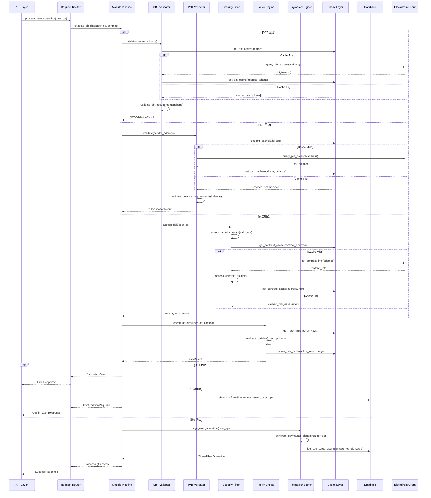

# aNode
aNode is a permissionless and public goods for community to support their own ERC-20 token for gas sponsor, useroperation security check and more feats.

- ERC-4337 bundler support (Pimlico, Alchemy, AAStar Rundler)
- ERC-20 PNTs and Community customized ERC-20 gas token support
- Self-running paymaster support with SuperPaymaster relay and contract(if you want publish your ERC-20 gas token)
- Entrypoint V06 support
- Entrypoint V07, V08 is working on (inlude EIP-7704, EOA delegation)

Just send me useroperation!

## Phase design
1. Phase 1: a off-chain **paymaster** signature node, working with on-chain contract.
  - sign after verify the useroperation and sender account SBT and PNTs balance
  - contract invoke by Entrypoint(validatePaymasterSignaure)
  - contract set and change different public key on-chain contract by owner
2. Phase 2: a passkey signature **validator**
  - invoked by outer aNode to verify it is user's will, returen a aNode BLS signature aggregation
  - if the BLS collection is enough, act as a sender, send to bundler RPC
  - will be changed for PQC
3. Phase 3: hardware dependent, **account manager** with TEE security guarantee
  - support web interface for account life management(many details)
  - support RPC API for KMS service
4. Phase 4: **Guardian** as social recovery and deadman's switch and more security service
  - join gourp weight for multi signature on creating AA account
  - verify special useroperation for changing the private key, by social verifications, not onchain
  - provide signature to confirm the special useroperation
  - the last guardian will submit to bundler if signature is enough
  - will change to Hash algorithm cause of Post Quantumn Computing


## On chain contract
We use pimlico singliton paymaster contract as initial version, thanks for their love and contribution.
It act as onchain deposit account to Entrypoint, and a manageable public key to verify off chain signature.
Entrypoint will invoke it's function to verify.
It must register to SuperPaymaster to join the OpenPNTs and OpenCards and more protocols to use infras.
We provide a 5-minutes guidance to do this.

## Off chain relay
We use Rust to develop a new simple version, you can deploy it to Cloudflare with almost zero cost.
We reference the Nodejs paymaster from ZeroDev, thanks for their contribution.
It act as a off chain signer(can rotate) after verifying their pre-setting rules(like only support specific contract, specific ERC-20 and more).

## Register on SuperPaymaster to run
This mechanism requires SuperPaymaster(include one contract and permissionless relays), which act as a register, a stake contract and smart router(relay do this).

## Documentation Structure

aNode maintains comprehensive documentation in the `docs/` directory:

### 📁 [docs/aNode-rust/](docs/aNode-rust/) - aNode Rust Implementation
Complete documentation for the aNode Rust paymaster service (Cloudflare Workers):

#### Core Architecture Documents
- **[aNodeFrameworkAndPaymasterModuleDesign.md](docs/aNode-rust/aNodeFrameworkAndPaymasterModuleDesign.md)** - Unified framework and paymaster module design, including ERC-4337 integration, modular architecture, and API interfaces
- **[aNodeRoadmap.md](docs/aNode-rust/aNodeRoadmap.md)** - Complete aNode development roadmap across 4 phases (Paymaster → Passkey Validator → Account Manager → Guardian System)
- **[aNodeArchitectureDesign.md](docs/aNode-rust/aNodeArchitectureDesign.md)** - Overall architecture design with pluggable modules and ZeroDev compatibility
- **[ArchitecturalAnalysis.md](docs/aNode-rust/ArchitecturalAnalysis.md)** - Senior architect's perspective on aNode system design analysis

#### Technical Implementation Documents
- **[aNodeAPIDesign.md](docs/aNode-rust/aNodeAPIDesign.md)** - Multi-protocol API design (RESTful + JSON-RPC) with comprehensive endpoint specifications
- **[aNodePolicySystem.md](docs/aNode-rust/aNodePolicySystem.md)** - Policy management system based on ZeroDev patterns with advanced rate limiting and rule engines
- **[SigningAndKeyManagement.md](docs/aNode-rust/SigningAndKeyManagement.md)** - Pluggable signing mechanisms supporting Local, AWS KMS, Cloudflare Secrets, and Keyless SSL
- **[ERC4337FlowDiagram.md](docs/aNode-rust/ERC4337FlowDiagram.md)** - Complete ERC-4337 flow integration with aNode enhancements
- **[ModuleDesign.md](docs/aNode-rust/ModuleDesign.md)** - Detailed module architecture with internal call sequence diagrams

#### Development Guides
- **[dev-guide.md](docs/aNode-rust/dev-guide.md)** - Comprehensive development guide with dual-version strategy, API specifications, and deployment instructions
- **[rust-cloudflare.md](docs/aNode-rust/rust-cloudflare.md)** - Complete guide for Rust Cloudflare Workers development, deployment, and testing
- **[RustWorkerCompatibility.md](docs/aNode-rust/RustWorkerCompatibility.md)** - Analysis of Rust Cloudflare Worker compatibility issues and solutions
- **[account-abstraction-reference.md](docs/aNode-rust/account-abstraction-reference.md)** - Official ERC-4337 implementation reference with EntryPoint, paymaster, and stake system details
- **[ultra-relay-paymaster-integration.md](docs/aNode-rust/ultra-relay-paymaster-integration.md)** - Analysis of how Ultra-Relay integrates paymaster capabilities into bundler
- **[bundler-architecture-knowledge.md](docs/aNode-rust/bundler-architecture-knowledge.md)** - Comprehensive bundler architecture guide based on Alto/Ultra-Relay analysis

### 📁 docs/ - Web Application & General Documentation
Documentation for web application and general project information:

- **[ALCHEMY_ACCOUNT_KIT_LEARNING.md](docs/ALCHEMY_ACCOUNT_KIT_LEARNING.md)** - Alchemy Account Kit integration learning and examples
- **[DEPLOY.md](docs/DEPLOY.md)** - Web application deployment guide
- **[TEST_REPORT.md](docs/TEST_REPORT.md)** - Testing reports and Playwright test results
- **[DetailedSystemDesign.md](docs/DetailedSystemDesign.md)** - Detailed system design specifications
- **[ERC4337-AB-Test-Guide.md](docs/ERC4337-AB-Test-Guide.md)** - ERC-4337 Account Abstraction testing guide
- **[setup-guide.md](docs/setup-guide.md)** - Development environment setup guide
- **[README-test-accounts.md](docs/README-test-accounts.md)** - Test accounts and configuration guide
- **[Changes.md](docs/Changes.md)** - Project change log and version history

## Live Demo

🚀 **aNode Paymaster Worker is now live on Cloudflare!**

**Production URL**: https://anode-js-worker.jhfnetboy.workers.dev

**Available Endpoints**:
- `GET /` - Service information and documentation
- `GET /health` - Health check endpoint
- `POST /api/v1/paymaster/sponsor` - Gas sponsorship endpoint
- `POST /api/v1/paymaster/process` - Full user operation processing with validation

**Test the live service**:
```bash
# Health check
curl https://anode-js-worker.jhfnetboy.workers.dev/health

# Process a user operation
curl -X POST https://anode-js-worker.jhfnetboy.workers.dev/api/v1/paymaster/process \
  -H "Content-Type: application/json"
```

### Worker Status

| Worker Type | Status | URL | Notes |
|-------------|--------|-----|-------|
| **JavaScript Worker** | ✅ **Live** | https://anode-js-worker.jhfnetboy.workers.dev | Full ERC-4337 paymaster API |
| **aNode Relay Server** | ✅ **Live** | https://anode-relay-server.jhfnetboy.workers.dev | aNode v0.01 - ERC-4337 Paymaster Service (Hello World) |
| **Rust Demo Worker** | 🗑️ **Removed** | N/A | Was: Hello World demo (cleaned up to save space) |

**Rust Worker 兼容性说明**:
- 当前 wrangler 版本：4.38.0
- Worker crate 兼容性：需要 wrangler 2.x 或 3.x 早期版本
- 建议解决方案：使用 JavaScript Worker 或等待 Cloudflare 修复兼容性
- 代码位置：`cloudflare-worker/` 和 `cloudflare-rust-simple/`

## Quick Start

```bash
# Clone the repository
git clone https://github.com/AAStarCommunity/aNode.git
cd aNode

# Install dependencies for web app
cd web-app && pnpm install

# Start development server
pnpm run dev

# Test Cloudflare Worker locally
cd ../cloudflare-js-worker && wrangler dev --port 8788

# For Rust paymaster server (future)
cd ../relay-server && cargo build
```

## Contributing

1. Read the [aNode Roadmap](docs/aNodeRoadmap.md) to understand the project vision
2. Review [Module Design](docs/ModuleDesign.md) for architecture guidelines
3. Follow the [API Design](docs/aNodeAPIDesign.md) for interface specifications
4. Check [Policy System](docs/aNodePolicySystem.md) for configuration patterns

## License

This project is licensed under the MIT License. 


  } else {
    await this.rejectUserOp(error.userOp, error.reason)
  }
}
```

## 性能优化技术

### 1. 批量处理 (Bundling)

**核心策略**:
- 多个 UserOperation 合并为单个交易
- 减少交易费用和网络开销
- 优化 gas 使用效率

```typescript
class BundleManager {
  private maxBundleSize = 10
  private maxBundleDelay = 10000 // 10 秒

  async createBundle(userOps: UserOperation[]): Promise<Bundle> {
    // 1. 按 gas 价格排序
    const sortedOps = sortByGasPrice(userOps)

    // 2. 计算最优批次大小
    const bundleSize = Math.min(sortedOps.length, this.maxBundleSize)

    // 3. 估算总 gas
    const totalGas = await estimateBundleGas(sortedOps.slice(0, bundleSize))

    return {
      userOps: sortedOps.slice(0, bundleSize),
      totalGas,
      expectedProfit: calculateProfit(totalGas, sortedOps)
    }
  }
}
```

### 2. Gas 价格优化

**动态 gas 价格策略**:

```typescript
interface GasPriceStrategy {
  slow: bigint    // 慢速交易
  standard: bigint // 标准交易
  fast: bigint    // 快速交易
}

class GasPriceManager {
  async getOptimalGasPrice(userOp: UserOperation): Promise<GasPriceStrategy> {
    const networkConditions = await this.monitor.getNetworkConditions()
    const userPreferences = this.extractUserPreferences(userOp)

    return this.calculateStrategy(networkConditions, userPreferences)
  }
}
```

### 3. 内存池优化

**优先级队列实现**:

```typescript
class PriorityMempool {
  private queues: Map<Priority, UserOperation[]> = new Map()

  add(userOp: UserOperation) {
    const priority = this.calculatePriority(userOp)
    const queue = this.queues.get(priority) || []
    queue.push(userOp)
    this.queues.set(priority, queue)
  }

  getNextBatch(): UserOperation[] {
    // 按优先级返回操作批次
    for (const [priority, queue] of this.queues) {
      if (queue.length > 0) {
        return queue.splice(0, BATCH_SIZE)
      }
    }
    return []
  }
}
```

## 安全和可靠性

### 1. 声誉系统 (Reputation System)

**目的**: 防止恶意用户滥用系统

```typescript
interface ReputationEntry {
  address: Address
  stake: bigint
  opsSeen: number
  opsIncluded: number
  status: 'ok' | 'throttled' | 'banned'
}

class ReputationManager {
  // 跟踪实体的历史表现
  updateReputation(address: Address, success: boolean) {
    const entry = this.getEntry(address)
    entry.opsSeen++

    if (success) {
      entry.opsIncluded++
    }

    this.updateStatus(entry)
  }

  // 基于声誉决定是否接受操作
  shouldAccept(address: Address): boolean {
    const entry = this.getEntry(address)
    return entry.status !== 'banned' && this.hasMinimumStake(entry)
  }
}
```

### 2. 速率限制 (Rate Limiting)

**防止 DoS 攻击**:

```typescript
class RateLimiter {
  private attempts = new Map<Address, number[]>()

  canProceed(address: Address): boolean {
    const now = Date.now()
    const window = now - RATE_LIMIT_WINDOW

    // 清理过期记录
    const userAttempts = this.attempts.get(address) || []
    const recentAttempts = userAttempts.filter(time => time > window)

    // 检查是否超过限制
    if (recentAttempts.length >= MAX_ATTEMPTS) {
      return false
    }

    // 记录新尝试
    recentAttempts.push(now)
    this.attempts.set(address, recentAttempts)

    return true
  }
}
```

### 3. 状态同步和一致性

**处理区块链重组**:

```typescript
class StateManager {
  async handleReorg(newBlock: Block) {
    // 1. 识别受影响的操作
    const affectedOps = await this.findAffectedOps(newBlock)

    // 2. 重新验证状态
    for (const op of affectedOps) {
      await this.revalidateOp(op)
    }

    // 3. 更新内存池
    await this.updateMempool(affectedOps)
  }
}
```

## 多链支持架构

### 网络抽象层

**统一的链上接口**:

```typescript
interface ChainAdapter {
  getChainId(): Promise<number>
  estimateGas(userOp: UserOperation): Promise<GasEstimate>
  submitBundle(bundle: Bundle): Promise<TransactionReceipt>
  getBlockNumber(): Promise<number>
  validateUserOp(userOp: UserOperation): Promise<ValidationResult>
}

class EthereumAdapter implements ChainAdapter {
  // Ethereum 特定的实现
}

class PolygonAdapter implements ChainAdapter {
  // Polygon 特定的实现
}
```

### 跨链操作处理

**EntryPoint 版本管理**:

```typescript
const ENTRYPOINT_VERSIONS = {
  '0.6': {
    address: '0x5FF137D4b0FDCD49DcA30c7CF57E578a026d2789',
    abi: EntryPointV06Abi
  },
  '0.7': {
    address: '0x0000000071727De22E5E9d8BAf0edAc6f37da032',
    abi: EntryPointV07Abi
  }
}

class EntryPointManager {
  getEntryPoint(chainId: number, version: string) {
    const config = ENTRYPOINT_CONFIGS[chainId]?.[version]
    if (!config) {
      throw new Error(`Unsupported EntryPoint version ${version} on chain ${chainId}`)
    }
    return config
  }
}
```

## 监控和可观测性

### 1. 指标收集 (Metrics)

**关键指标**:

```typescript
interface BundlerMetrics {
  // 操作处理指标
  userOpsReceived: Counter
  userOpsProcessed: Counter
  userOpsFailed: Counter

  // 性能指标
  bundleProcessingTime: Histogram
  gasPriceUpdates: Counter

  // 错误指标
  validationErrors: Counter
  executionErrors: Counter
  networkErrors: Counter

  // 业务指标
  totalGasSponsored: Counter
  totalFeesCollected: Counter
}
```

### 2. 日志系统 (Logging)

**结构化日志**:

```typescript
interface LogEntry {
  timestamp: Date
  level: 'debug' | 'info' | 'warn' | 'error'
  component: string
  userOpHash?: Hex
  message: string
  metadata?: Record<string, any>
}

class Logger {
  info(component: string, message: string, metadata?: any) {
    console.log(JSON.stringify({
      timestamp: new Date(),
      level: 'info',
      component,
      message,
      ...metadata
    }))
  }
}
```

## aNode Bundler 设计指导

### 1. 架构选择

**推荐采用类似的模块化架构**:

```
aNode-bundler/
├── src/
│   ├── rpc/           # RPC 接口
│   ├── mempool/       # 内存池
│   ├── executor/      # 执行引擎
│   ├── paymaster/     # Paymaster 集成
│   ├── handlers/      # 处理器
│   └── utils/         # 工具函数
├── contracts/         # 链上合约
├── test/             # 测试
└── docs/            # 文档
```

### 2. 技术栈建议

**核心技术栈**:
- **语言**: TypeScript (类型安全，生态成熟)
- **Web 框架**: Fastify (高性能，插件丰富)
- **区块链**: Viem (现代，以太坊优先)
- **数据库**: Redis (内存池) + PostgreSQL (持久化)
- **监控**: Prometheus + Grafana

### 3. 开发路线图

#### Phase 1: 基础功能
- [ ] RPC 接口实现
- [ ] 基本的 UserOperation 处理
- [ ] Gas 估算功能

#### Phase 2: 高级功能
- [ ] Mempool 管理
- [ ] 批量打包优化
- [ ] Paymaster 集成

#### Phase 3: 生产就绪
- [ ] 监控和日志
- [ ] 错误处理和恢复
- [ ] 性能优化

#### Phase 4: 多链扩展
- [ ] 多网络支持
- [ ] 跨链操作
- [ ] 统一接口

## 总结

基于 Alto 和 Ultra-Relay 的分析，现代 ERC-4337 bundler 的核心特征包括：

1. **模块化架构**: 清晰的功能分离和职责划分
2. **异步处理**: 基于事件驱动的高并发处理能力
3. **性能优化**: 批量处理、gas 优化、智能路由
4. **安全可靠**: 声誉系统、速率限制、状态一致性
5. **可扩展性**: 多链支持、插件化架构

这些设计原则为 aNode bundler 的开发提供了坚实的理论基础和实践指导。

---

*基于 Pimlico Alto 和 ZeroDev Ultra-Relay 架构分析*
      "limit": "1000000000000000000", // 1 ETH in wei
      "window": 3600, // 1 hour in seconds
      "enabled": true
    }
  ],
  "conditions": [
    {
      "field": "function",
      "operator": "in",
      "value": ["swap", "addLiquidity"]
    }
  ]
}
```

#### 3.2 查询策略状态
```http
GET /api/v1/policies/{policyId}/status?wallet=0x...&contract=0x...
```

### 4. 多协议支持

#### 4.1 RESTful API（主要）
标准的 HTTP 方法和状态码。

#### 4.2 JSON-RPC 2.0 支持
```http
POST /api/v1/rpc
Content-Type: application/json

{
  "jsonrpc": "2.0",
  "method": "anode_sponsorUserOperation",
  "params": {
    "userOperation": { ... },
    "entryPoint": "0x5FF137D4b0FDCD49DcA30c7CF57E578a026d2789",
    "chainId": 1,
    "context": { "type": "sponsor" }
  },
  "id": 1
}
```

## 模块化架构设计

### 1. 内部模块调用时序图



### 2. 核心模块实现

#### 2.1 SBT Validator 模块
```rust
pub struct SBTValidator {
    config: SBTConfig,
    blockchain_client: Arc<BlockchainClient>,
    cache: Arc<CacheManager>,
    metrics: Arc<MetricsCollector>,
}

#[async_trait]
impl ModuleProcessor for SBTValidator {
    async fn process(&self, context: &ProcessingContext) -> Result<ModuleResult, ModuleError> {
        let validation_result = self.validate(&context.user_operation.sender).await?;

        if !validation_result.is_valid {
            return Ok(ModuleResult::Block(BlockReason::SBTValidationFailed {
                missing_types: validation_result.missing_types,
                required_types: validation_result.required_types,
            }));
        }

        let mut updated_context = context.clone();
        updated_context.add_validation_result("sbt", ValidationResult::SBT(validation_result));

        Ok(ModuleResult::Continue(updated_context))
    }

    fn name(&self) -> &'static str {
        "sbt_validator"
    }

    fn version(&self) -> &'static str {
        "1.0.0"
    }
}
```

#### 2.2 PNT Validator 模块
```rust
pub struct PNTValidator {
    config: PNTConfig,
    blockchain_client: Arc<BlockchainClient>,
    cache: Arc<CacheManager>,
    metrics: Arc<MetricsCollector>,
}

#[async_trait]
impl ModuleProcessor for PNTValidator {
    async fn process(&self, context: &ProcessingContext) -> Result<ModuleResult, ModuleError> {
        let validation_result = self.validate(&context.user_operation.sender).await?;

        if !validation_result.is_valid {
            return Ok(ModuleResult::Block(BlockReason::InsufficientPNTBalance {
                required: validation_result.requirements.min_required,
                available: validation_result.effective_balance,
            }));
        }

        let mut updated_context = context.clone();
        updated_context.add_validation_result("pnt", ValidationResult::PNT(validation_result));

        Ok(ModuleResult::Continue(updated_context))
    }

    fn name(&self) -> &'static str {
        "pnt_validator"
    }

    fn version(&self) -> &'static str {
        "1.0.0"
    }
}
```

#### 2.3 Security Filter 模块
```rust
pub struct SecurityFilter {
    config: SecurityConfig,
    risk_providers: Vec<Box<dyn RiskProvider>>,
    blockchain_client: Arc<BlockchainClient>,
    cache: Arc<CacheManager>,
    metrics: Arc<MetricsCollector>,
}

#[async_trait]
impl ModuleProcessor for SecurityFilter {
    async fn process(&self, context: &ProcessingContext) -> Result<ModuleResult, ModuleError> {
        let assessment = self.assess_risk(&context.user_operation).await?;

        match assessment.risk_level {
            SecurityLevel::Blocked => {
                Ok(ModuleResult::Block(BlockReason::SecurityViolation {
                    risk_score: assessment.risk_score,
                    risk_factors: assessment.risk_factors,
                }))
            }
            SecurityLevel::Critical | SecurityLevel::High | SecurityLevel::Medium => {
                if assessment.requires_confirmation {
                    Ok(ModuleResult::Warning(SecurityWarning {
                        level: assessment.risk_level,
                        title: "Security Risk Detected".to_string(),
                        message: format!("Risk score: {}/100", assessment.risk_score),
                        risk_factors: assessment.risk_factors.iter()
                            .map(|f| f.description.clone())
                            .collect(),
                        recommendations: assessment.recommendations,
                        requires_confirmation: true,
                        assessment: Some(assessment),
                    }))
                } else {
                    let mut updated_context = context.clone();
                    updated_context.add_validation_result("security", ValidationResult::Security(assessment));
                    Ok(ModuleResult::Continue(updated_context))
                }
            }
            _ => {
                let mut updated_context = context.clone();
                updated_context.add_validation_result("security", ValidationResult::Security(assessment));
                Ok(ModuleResult::Continue(updated_context))
            }
        }
    }

    fn name(&self) -> &'static str {
        "security_filter"
    }

    fn version(&self) -> &'static str {
        "1.0.0"
    }
}
```

#### 2.4 Paymaster Signer 模块
```rust
pub struct PaymasterSigner {
    signer: Box<dyn PaymasterSigner>,
    config: PaymasterConfig,
    blockchain_client: Arc<BlockchainClient>,
    metrics: Arc<MetricsCollector>,
}

#[async_trait]
impl ModuleProcessor for PaymasterSigner {
    async fn process(&self, context: &ProcessingContext) -> Result<ModuleResult, ModuleError> {
        let signed_operation = self.signer.sign_user_operation_hash(
            &context.user_operation.hash(),
            &SigningContext::from_processing_context(context),
        ).await?;

        let mut updated_context = context.clone();
        updated_context.user_operation.paymaster_and_data = signed_operation.paymaster_and_data;
        updated_context.add_validation_result("paymaster", ValidationResult::Signed(signed_operation));

        Ok(ModuleResult::Continue(updated_context))
    }

    fn name(&self) -> &'static str {
        "paymaster_signer"
    }

    fn version(&self) -> &'static str {
        "1.0.0"
    }
}
```

### 3. 可插拔签名机制

#### 3.1 统一签名接口
```rust
#[async_trait]
pub trait PaymasterSigner: Send + Sync {
    /// 签名 UserOperation 哈希
    async fn sign_user_operation_hash(
        &self,
        hash: &H256,
        context: &SigningContext,
    ) -> Result<Signature, SigningError>;

    /// 获取签名者地址
    async fn get_address(&self) -> Result<Address, SigningError>;

    /// 验证签名能力（健康检查）
    async fn verify_capability(&self) -> Result<SignerCapability, SigningError>;

    /// 获取签名者元数据
    fn get_metadata(&self) -> SignerMetadata;
}
```

#### 3.2 签名器实现

**本地私钥签名器**：
```rust
pub struct LocalKeySigner {
    private_key: SecretKey,
    address: Address,
    config: LocalSignerConfig,
}

impl LocalKeySigner {
    pub fn from_private_key(private_key: &str) -> Result<Self, SigningError> {
        let key = SecretKey::from_str(private_key)?;
        let address = Address::from_private_key(&key)?;
        Ok(Self {
            private_key: key,
            address,
            config: LocalSignerConfig::default(),
        })
    }
}

#[async_trait]
impl PaymasterSigner for LocalKeySigner {
    async fn sign_user_operation_hash(
        &self,
        hash: &H256,
        _context: &SigningContext,
    ) -> Result<Signature, SigningError> {
        let signature = self.private_key.sign_hash(hash)?;
        Ok(signature)
    }

    async fn get_address(&self) -> Result<Address, SigningError> {
        Ok(self.address)
    }

    async fn verify_capability(&self) -> Result<SignerCapability, SigningError> {
        Ok(SignerCapability {
            can_sign: true,
            max_concurrent_requests: Some(1000),
            estimated_latency_ms: 1,
            supported_curves: vec![CurveType::Secp256k1],
        })
    }

    fn get_metadata(&self) -> SignerMetadata {
        SignerMetadata {
            name: "Local Key Signer".to_string(),
            version: "1.0.0".to_string(),
            provider: SignerProvider::Local,
            security_level: SecurityLevel::Development,
            cost_per_signature: Some(0.0),
        }
    }
}
```

**Cloudflare Secrets Store 签名器**：
```rust
pub struct CloudflareSecretsSigner {
    client: CloudflareSecretsClient,
    secret_name: String,
    address: Address,
    config: CloudflareSecretsConfig,
}

#[async_trait]
impl PaymasterSigner for CloudflareSecretsSigner {
    async fn sign_user_operation_hash(
        &self,
        hash: &H256,
        _context: &SigningContext,
    ) -> Result<Signature, SigningError> {
        let private_key_hex = self.client.get_secret(&self.secret_name).await?;
        let private_key = SecretKey::from_str(&private_key_hex)?;
        let signature = private_key.sign_hash(hash)?;
        Ok(signature)
    }

    async fn get_address(&self) -> Result<Address, SigningError> {
        Ok(self.address)
    }

    async fn verify_capability(&self) -> Result<SignerCapability, SigningError> {
        let _test = self.client.get_secret(&self.secret_name).await?;
        Ok(SignerCapability {
            can_sign: true,
            max_concurrent_requests: Some(500),
            estimated_latency_ms: 50,
            supported_curves: vec![CurveType::Secp256k1],
        })
    }

    fn get_metadata(&self) -> SignerMetadata {
        SignerMetadata {
            name: "Cloudflare Secrets Signer".to_string(),
            version: "1.0.0".to_string(),
            provider: SignerProvider::CloudflareSecrets,
            security_level: SecurityLevel::Production,
            cost_per_signature: Some(0.001),
        }
    }
}
```

## Rust 实现架构

### 1. 项目结构
```
relay-server/
├── Cargo.toml
├── src/
│   ├── main.rs
│   ├── lib.rs
│   ├── api/
│   │   ├── mod.rs
│   │   ├── paymaster.rs
│   │   ├── policies.rs
│   │   └── health.rs
│   ├── core/
│   │   ├── mod.rs
│   │   ├── paymaster.rs
│   │   ├── policy_engine.rs
│   │   ├── gas_estimator.rs
│   │   └── relay_service.rs
│   ├── blockchain/
│   │   ├── mod.rs
│   │   ├── client.rs
│   │   └── contracts.rs
│   ├── database/
│   │   ├── mod.rs
│   │   ├── models.rs
│   │   └── repositories.rs
│   ├── config/
│   │   ├── mod.rs
│   │   └── settings.rs
│   └── utils/
│       ├── mod.rs
│       ├── crypto.rs
│       └── validation.rs
├── tests/
└── docs/
```

### 2. 核心依赖（精简原则）
```toml
[dependencies]
# 核心必需（< 10 个）
tokio = { version = "1", features = ["rt-multi-thread", "macros"] }
axum = "0.7"
serde = { version = "1", features = ["derive"] }
alloy = { version = "0.1", features = ["rpc", "provider-http"] }
config = "0.14"
anyhow = "1"

# 按需可选
sqlx = { version = "0.7", optional = true }
redis = { version = "0.24", optional = true }
tracing = { version = "0.1", optional = true }

[features]
default = []
database = ["sqlx"]
cache = ["redis"]
monitoring = ["tracing", "metrics"]
```

### 3. 模块化配置
```yaml
# config/modules.yaml
pipeline:
  modules:
    - name: "sbt_validator"
      enabled: true
      config:
        supported_contracts:
          - "0x1234...SBT1"
          - "0x5678...SBT2"
        required_types: ["identity"]
        cache_ttl: 300

    - name: "pnt_balance_validator"
      enabled: true
      config:
        contract_address: "0xabcd...PNT"
        min_balance: "100000000000000000000"
        include_staked: true

    - name: "security_filter"
      enabled: true
      config:
        risk_threshold: 70
        providers: ["chainabuse", "forta"]
        blacklist_contracts:
          - "0xbad1...SCAM"

    - name: "paymaster_signer"
      enabled: true
      config:
        signer_type: "cloudflare_secrets"
        cf_account_id: "${CF_ACCOUNT_ID}"
        secret_name: "anode_paymaster_key"
```

## 部署架构

### 1. Cloudflare Workers 优先
```yaml
deployment:
  primary: Cloudflare Workers
  backup: AWS Lambda
  storage: Cloudflare KV + D1
  monitoring: Cloudflare Analytics
```

### 2. 多云部署
```yaml
deployment:
  edge: Cloudflare Workers (API Layer)
  compute: AWS ECS/EKS (BLS Aggregation)
  secure: AWS Nitro Enclaves (TEE)
  storage: AWS RDS + DynamoDB
  monitoring: CloudWatch + Datadog
```

## 总结

aNode Framework and Paymaster Module Design 提供了：

1. **完整的 ERC-4337 集成**：从用户意图到链上执行的全流程支持
2. **可插拔模块化架构**：SBT 验证、PNT 验证、安全过滤、策略引擎、签名器
3. **多协议 API 支持**：RESTful + JSON-RPC，支持多种客户端
4. **可插拔签名机制**：本地密钥到企业级 KMS 的平滑迁移
5. **精简高效实现**：最小化依赖，按需启用功能
6. **安全优先设计**：多层验证、风险评估、用户确认机制
7. **扩展性保证**：预留 bundler 集成和其他 Phase 扩展接口

这个设计完全融合了我们之前讨论的所有技术架构，为 aNode 提供了从 paymaster 服务到完整账户抽象生态的坚实基础。
                    self.metrics.record_signature_failure(&format!("backup_{}", index), &e).await;
                    tracing::warn!("Backup signer {} failed: {}", index, e);
                }
            }
        }
        
        Err(SigningError::ServiceUnavailable {
            service: "All signers failed".to_string(),
        })
    }
}

pub struct SignerHealthChecker {
    check_interval: Duration,
    last_check: HashMap<String, Instant>,
}

impl SignerHealthChecker {
    pub fn new() -> Self {
        Self {
            check_interval: Duration::from_secs(60),
            last_check: HashMap::new(),
        }
    }
    
    pub async fn check_signer_health(
        &mut self,
        signer: &dyn PaymasterSigner,
    ) -> Result<SignerCapability, SigningError> {
        let signer_id = signer.get_metadata().name;
        let now = Instant::now();
        
        // 检查是否需要健康检查
        if let Some(last_check) = self.last_check.get(&signer_id) {
            if now.duration_since(*last_check) < self.check_interval {
                // 跳过检查，返回缓存结果
                return signer.verify_capability().await;
            }
        }
        
        let capability = signer.verify_capability().await?;
        self.last_check.insert(signer_id, now);
        
        Ok(capability)
    }
}

pub struct SignerMetrics {
    signature_count: Arc<AtomicU64>,
    signature_latency: Arc<Mutex<Vec<Duration>>>,
    error_count: Arc<AtomicU64>,
}

impl SignerMetrics {
    pub fn new() -> Self {
        Self {
            signature_count: Arc::new(AtomicU64::new(0)),
            signature_latency: Arc::new(Mutex::new(Vec::new())),
            error_count: Arc::new(AtomicU64::new(0)),
        }
    }
    
    pub async fn record_signature_success(&self, signer_type: &str) {
        self.signature_count.fetch_add(1, Ordering::Relaxed);
        // 记录更详细的指标...
    }
    
    pub async fn record_signature_failure(&self, signer_type: &str, error: &SigningError) {
        self.error_count.fetch_add(1, Ordering::Relaxed);
        // 记录错误详情...
    }
}
```

### 6. 精炼的 API 设计总结

基于对 AWS KMS 和 Cloudflare Secrets Store 的分析，我们设计了以下精炼的 API：

#### 6.1 核心接口
1. **统一签名接口**：`PaymasterSigner` trait
2. **配置驱动**：通过配置文件切换不同的签名服务
3. **错误处理**：标准化的错误类型和处理
4. **健康检查**：签名器可用性验证
5. **指标监控**：签名性能和错误统计

#### 6.2 扩展能力
1. **插件架构**：易于添加新的 KMS 服务支持
2. **备份机制**：主备签名器自动切换
3. **缓存优化**：减少 KMS 服务调用频率
4. **批量操作**：支持批量签名优化

#### 6.3 安全特性
1. **权限控制**：基于角色的访问控制
2. **审计日志**：完整的签名操作记录
3. **密钥轮换**：支持密钥定期更换
4. **环境隔离**：不同环境使用不同的密钥

## Cloudflare Workers 部署规划

### 1. aNode Rust 服务适配 Workers

基于 Cloudflare Workers 的边缘计算特性，我们规划将 aNode 部署为分布式边缘服务：

#### 1.1 架构适配
```rust
// src/worker.rs - Cloudflare Workers 入口
use worker::*;

#[event(fetch)]
pub async fn main(req: Request, env: Env, _ctx: Context) -> Result<Response> {
    let router = Router::new();
    
    // 初始化 aNode 服务
    let anode_service = aNodeService::new_from_env(&env).await?;
    
    router
        // RESTful API 路由
        .post_async("/api/v1/paymaster/process", |req, ctx| async move {
            let service = ctx.data::<aNodeService>()?;
            service.process_user_operation(req).await
        })
        .post_async("/api/v1/paymaster/sponsor", |req, ctx| async move {
            let service = ctx.data::<aNodeService>()?;
            service.sponsor_user_operation(req).await
        })
        // JSON-RPC 路由
        .post_async("/api/v1/rpc", |req, ctx| async move {
            let service = ctx.data::<aNodeService>()?;
            service.handle_jsonrpc(req).await
        })
        .with_data(anode_service)
        .run(req, env).await
}

pub struct aNodeService {
    signer: Box<dyn PaymasterSigner>,
    modules: ModulePipeline,
    config: aNodeConfig,
}

impl aNodeService {
    pub async fn new_from_env(env: &Env) -> Result<Self, Error> {
        // 从 Cloudflare 环境变量和 Secrets Store 初始化
        let signer_config = Self::load_signer_config(env).await?;
        let signer = SignerFactory::create_signer(signer_config).await?;
        
        let modules = ModulePipeline::new_from_env(env).await?;
        let config = aNodeConfig::from_env(env)?;
        
        Ok(Self {
            signer,
            modules,
            config,
        })
    }
    
    async fn load_signer_config(env: &Env) -> Result<SignerConfig, Error> {
        // 从 Cloudflare Secrets Store 加载签名器配置
        let signer_type = env.var("SIGNER_TYPE")?.to_string();
        
        match signer_type.as_str() {
            "cloudflare_secrets" => {
                Ok(SignerConfig::CloudflareSecrets(CloudflareSecretsConfig {
                    account_id: env.var("CF_ACCOUNT_ID")?.to_string(),
                    api_token: env.secret("CF_API_TOKEN")?.to_string(),
                    secret_name: env.var("PAYMASTER_SECRET_NAME")?.to_string(),
                    cache_ttl_seconds: 300,
                    enable_local_cache: true,
                }))
            }
            "local" => {
                Ok(SignerConfig::Local(LocalSignerConfig {
                    private_key: env.secret("PAYMASTER_PRIVATE_KEY")?.to_string(),
                    ..Default::default()
                }))
            }
            _ => Err(Error::RustError("Unsupported signer type".to_string()))
        }
    }
}
```

#### 1.2 Workers 配置
```toml
# wrangler.toml
name = "anode-paymaster"
main = "build/worker/shim.mjs"
compatibility_date = "2025-09-18"

[build]
command = "cargo install -q worker-build && worker-build --release"

# Cloudflare Secrets Store 绑定
[[secrets]]
binding = "PAYMASTER_PRIVATE_KEY"
secret_name = "anode_paymaster_key"

[[secrets]]
binding = "CF_API_TOKEN"
secret_name = "cloudflare_api_token"

# 环境变量
[vars]
SIGNER_TYPE = "cloudflare_secrets"
CF_ACCOUNT_ID = "your-account-id"
PAYMASTER_SECRET_NAME = "anode_paymaster_key"
LOG_LEVEL = "info"

# KV 存储（用于缓存）
[[kv_namespaces]]
binding = "ANODE_CACHE"
id = "your-kv-namespace-id"
```

#### 1.3 部署优势
1. **全球边缘部署**：降低延迟，提升用户体验
2. **自动扩缩容**：根据请求量自动调整资源
3. **成本优化**：按请求付费，无需维护服务器
4. **高可用性**：Cloudflare 全球网络保障
5. **安全集成**：与 Cloudflare Secrets Store 深度集成

## aNode 签名机制实施路线图

### 阶段 1：开发阶段 (v0.1.x)
**目标**：快速启动，使用本地私钥
```yaml
# .env 配置
SIGNER_TYPE=local
PAYMASTER_PRIVATE_KEY=0x1234567890abcdef...
```

**实现优先级**：
1. ✅ 本地私钥签名器 (`LocalKeySigner`)
2. ✅ 统一签名接口 (`PaymasterSigner` trait)
3. ✅ 签名器工厂模式 (`SignerFactory`)

### 阶段 2：生产准备 (v0.2.x)
**目标**：集成 Cloudflare Secrets Store，支持边缘部署
```yaml
# 生产配置
signer:
  type: "cloudflare_secrets"
  account_id: "${CF_ACCOUNT_ID}"
  api_token: "${CLOUDFLARE_API_TOKEN}"
  secret_name: "anode_paymaster_key"
```

**实现优先级**：
1. 🔄 Cloudflare Secrets Store 签名器
2. 🔄 签名器健康检查和监控
3. 🔄 主备签名器切换机制

### 阶段 3：企业级扩展 (v0.3.x)
**目标**：支持企业级 KMS 服务
```yaml
# 企业配置选项
signer:
  primary:
    type: "aws_kms"  # 或 "cloudflare_keyless"
  backup:
    type: "cloudflare_secrets"
```

**实现优先级**：
1. 📋 AWS KMS 签名器
2. 📋 Cloudflare Keyless SSL 签名器
3. 📋 HashiCorp Vault 签名器
4. 📋 自定义 KMS 接口

### 阶段 4：高级功能 (v1.0.x)
**目标**：完整的企业级签名管理
- 密钥轮换自动化
- 多区域签名器部署
- 高级监控和告警
- 合规性审计支持

## 签名机制选择指南

### 开发环境
**推荐**：Local Key Signer
- ✅ 快速启动
- ✅ 零成本
- ✅ 简单配置
- ❌ 安全性低

### 测试/预生产环境  
**推荐**：Cloudflare Secrets Store
- ✅ 边缘部署优化
- ✅ RBAC 权限控制
- ✅ 版本控制
- ✅ 低延迟 (~50ms)
- ✅ 成本极低

### 生产环境
**推荐**：AWS KMS (高安全) 或 Cloudflare Secrets (高性能)
- **AWS KMS**：企业级安全，完整审计
- **Cloudflare Secrets**：边缘优化，极低延迟

### 企业/金融环境
**推荐**：Cloudflare Keyless SSL
- ✅ 私钥主权
- ✅ 最高安全级别
- ✅ 合规性强
- ✅ 支持 HSM
- ❌ 部署复杂度高

## 安全最佳实践

### 1. 环境隔离
- 不同环境使用不同的签名器和密钥
- 生产密钥绝不用于开发/测试

### 2. 权限控制
- 实施最小权限原则
- 使用 RBAC 控制访问
- 定期审计权限配置

### 3. 监控和告警
- 监控签名频率和延迟
- 设置异常签名告警
- 记录所有签名操作

### 4. 密钥轮换
- 定期更换签名密钥
- 实施密钥版本管理
- 平滑的密钥切换流程

### 5. 灾难恢复
- 配置主备签名器
- 实施自动故障转移
- 定期测试恢复流程

这个设计提供了完整的可插拔签名机制，支持从开发环境的本地密钥到企业级 KMS 服务的平滑迁移，优先使用 Cloudflare 生态的解决方案，同时为 Cloudflare Workers 边缘部署做好了准备。
