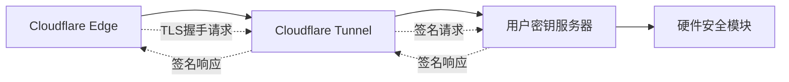
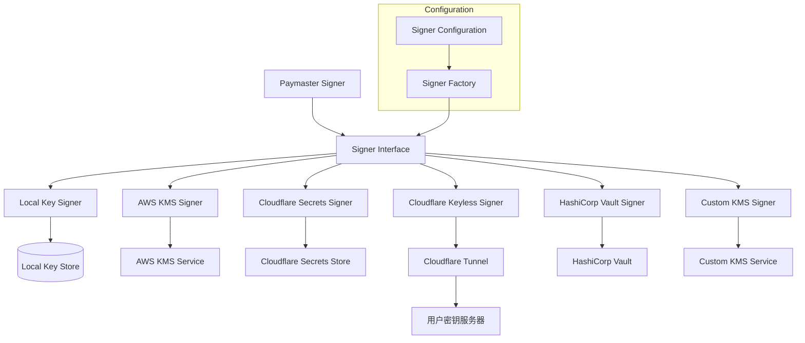

# aNode 签名机制与密钥管理系统设计

## 设计理念

aNode 的 paymaster 签名机制采用可插拔架构，支持多种密钥管理和签名服务，从本地私钥到企业级 KMS 服务，确保在不同部署环境下的安全性和灵活性。

## 密钥管理服务调研

### 1. AWS KMS (Key Management Service)

#### 核心 API 模式
```http
# 创建密钥
POST https://kms.{region}.amazonaws.com/
X-Amz-Target: TrentService.CreateKey
Content-Type: application/x-amz-json-1.1

{
  "KeyUsage": "SIGN_VERIFY",
  "KeySpec": "ECC_SECG_P256K1",
  "Origin": "AWS_KMS"
}

# 签名操作
POST https://kms.{region}.amazonaws.com/
X-Amz-Target: TrentService.Sign
{
  "KeyId": "arn:aws:kms:us-west-2:123456789012:key/1234abcd-12ab-34cd-56ef-1234567890ab",
  "Message": "base64-encoded-hash",
  "MessageType": "DIGEST",
  "SigningAlgorithm": "ECDSA_SHA_256"
}
```

#### 特点分析
- **优点**：企业级安全、审计日志、细粒度权限控制、全球可用
- **缺点**：成本较高、延迟相对较高、需要 AWS 账户
- **适用场景**：大型企业、高安全要求、已有 AWS 基础设施

### 2. Cloudflare Secrets Store (2025 新特性)

#### API 模式分析
```http
# 创建/更新密钥
POST https://api.cloudflare.com/client/v4/accounts/{account_id}/secrets
Authorization: Bearer {api_token}
{
  "name": "PAYMASTER_PRIVATE_KEY",
  "value": "0x1234567890abcdef...",
  "type": "secret_text"
}

# 批量管理
POST https://api.cloudflare.com/client/v4/accounts/{account_id}/secrets/bulk
{
  "secrets": [
    {"name": "KEY_1", "value": "..."},
    {"name": "KEY_2", "value": "..."}
  ]
}
```

#### Rust Workers 集成
```toml
# wrangler.toml
[[secrets]]
binding = "PAYMASTER_KEY"
secret_name = "PAYMASTER_PRIVATE_KEY"
```

```rust
// 在 Worker 中访问
let private_key = env.secret("PAYMASTER_KEY")?;
```

#### 特点分析
- **优点**：边缘部署、低延迟、RBAC 支持、版本控制、审计日志
- **缺点**：Beta 阶段、功能相对简单、主要针对 Workers 生态
- **适用场景**：边缘计算、微服务架构、快速部署

### 3. Cloudflare Keyless SSL

#### 架构模式
Keyless SSL 是一种"无钥"模式，私钥保留在用户控制的服务器上，Cloudflare 仅处理代理和 TLS 终止，通过安全通道请求签名操作。



#### API 模式分析
```http
# 通过 Cloudflare Tunnel 的签名请求
POST https://tunnel.example.com/sign
Authorization: Bearer {tunnel_token}
Content-Type: application/json

{
  "algorithm": "ECDSA_SHA256",
  "data": "base64-encoded-hash",
  "key_id": "paymaster-key-001"
}

# 响应
{
  "signature": "base64-encoded-signature",
  "algorithm": "ECDSA_SHA256",
  "key_id": "paymaster-key-001"
}
```

#### 特点分析
- **优点**：私钥主权、最高安全性、合规性强、支持 HSM
- **缺点**：部署复杂、需要维护密钥服务器、延迟相对较高
- **适用场景**：金融级安全要求、监管严格环境、私有云部署

### 4. HashiCorp Vault

#### API 模式
```http
# 创建签名密钥
POST /v1/transit/keys/paymaster-key
{
  "type": "ecdsa-p256"
}

# 签名操作
POST /v1/transit/sign/paymaster-key/sha2-256
{
  "input": "base64-encoded-data"
}
```

## aNode 签名机制架构设计

### 1. 可插拔签名架构



### 2. 核心签名接口设计

#### 2.1 统一签名接口
```rust
#[async_trait]
pub trait PaymasterSigner: Send + Sync {
    /// 签名 UserOperation 哈希
    async fn sign_user_operation_hash(
        &self,
        hash: &H256,
        context: &SigningContext,
    ) -> Result<Signature, SigningError>;
    
    /// 获取签名者地址
    async fn get_address(&self) -> Result<Address, SigningError>;
    
    /// 验证签名能力（健康检查）
    async fn verify_capability(&self) -> Result<SignerCapability, SigningError>;
    
    /// 获取签名者元数据
    fn get_metadata(&self) -> SignerMetadata;
}

/// 签名上下文
#[derive(Debug, Clone)]
pub struct SigningContext {
    pub user_operation: UserOperation,
    pub entry_point: Address,
    pub chain_id: u64,
    pub timestamp: u64,
    pub request_id: String,
}

/// 签名能力信息
#[derive(Debug, Clone)]
pub struct SignerCapability {
    pub can_sign: bool,
    pub max_concurrent_requests: Option<u32>,
    pub estimated_latency_ms: u32,
    pub supported_curves: Vec<CurveType>,
}

/// 签名者元数据
#[derive(Debug, Clone)]
pub struct SignerMetadata {
    pub name: String,
    pub version: String,
    pub provider: SignerProvider,
    pub security_level: SecurityLevel,
    pub cost_per_signature: Option<f64>,
}

#[derive(Debug, Clone)]
pub enum SignerProvider {
    Local,
    AWSKMS,
    CloudflareSecrets,
    CloudflareKeyless,
    HashiCorpVault,
    Custom(String),
}

#[derive(Debug, Clone, PartialEq, Eq)]
pub enum SecurityLevel {
    Development,  // 本地开发
    Testing,      // 测试环境
    Staging,      // 预生产环境  
    Production,   // 生产环境
    Enterprise,   // 企业级
}
```

#### 2.2 签名错误处理
```rust
#[derive(thiserror::Error, Debug)]
pub enum SigningError {
    #[error("Key not found: {key_id}")]
    KeyNotFound { key_id: String },
    
    #[error("Authentication failed: {reason}")]
    AuthenticationFailed { reason: String },
    
    #[error("KMS service unavailable: {service}")]
    ServiceUnavailable { service: String },
    
    #[error("Rate limit exceeded: {limit} requests per {window}")]
    RateLimitExceeded { limit: u32, window: String },
    
    #[error("Invalid signature parameters: {details}")]
    InvalidParameters { details: String },
    
    #[error("Network error: {error}")]
    NetworkError { error: String },
    
    #[error("Configuration error: {config}")]
    ConfigurationError { config: String },
    
    #[error("Security policy violation: {policy}")]
    SecurityViolation { policy: String },
}
```

### 3. 具体签名器实现设计

#### 3.1 本地私钥签名器
```rust
pub struct LocalKeySigner {
    private_key: SecretKey,
    address: Address,
    config: LocalSignerConfig,
}

#[derive(Debug, Clone)]
pub struct LocalSignerConfig {
    pub key_derivation_path: Option<String>,
    pub enable_key_rotation: bool,
    pub backup_keys: Vec<String>,
}

impl LocalKeySigner {
    pub fn from_private_key(private_key: &str) -> Result<Self, SigningError> {
        let key = SecretKey::from_str(private_key)?;
        let address = Address::from_private_key(&key)?;
        
        Ok(Self {
            private_key: key,
            address,
            config: LocalSignerConfig::default(),
        })
    }
    
    pub fn from_mnemonic(
        mnemonic: &str, 
        derivation_path: &str
    ) -> Result<Self, SigningError> {
        let key = derive_private_key_from_mnemonic(mnemonic, derivation_path)?;
        Self::from_private_key(&key)
    }
}

#[async_trait]
impl PaymasterSigner for LocalKeySigner {
    async fn sign_user_operation_hash(
        &self,
        hash: &H256,
        _context: &SigningContext,
    ) -> Result<Signature, SigningError> {
        let signature = self.private_key.sign_hash(hash)?;
        Ok(signature)
    }
    
    async fn get_address(&self) -> Result<Address, SigningError> {
        Ok(self.address)
    }
    
    async fn verify_capability(&self) -> Result<SignerCapability, SigningError> {
        Ok(SignerCapability {
            can_sign: true,
            max_concurrent_requests: Some(1000),
            estimated_latency_ms: 1,
            supported_curves: vec![CurveType::Secp256k1],
        })
    }
    
    fn get_metadata(&self) -> SignerMetadata {
        SignerMetadata {
            name: "Local Key Signer".to_string(),
            version: "1.0.0".to_string(),
            provider: SignerProvider::Local,
            security_level: SecurityLevel::Development,
            cost_per_signature: Some(0.0),
        }
    }
}
```

#### 3.2 AWS KMS 签名器
```rust
pub struct AWSKMSSigner {
    client: aws_sdk_kms::Client,
    key_id: String,
    address: Address,
    config: AWSKMSConfig,
}

#[derive(Debug, Clone)]
pub struct AWSKMSConfig {
    pub region: String,
    pub key_id: String,
    pub signing_algorithm: String,
    pub max_retry_attempts: u32,
    pub timeout_seconds: u64,
}

impl AWSKMSSigner {
    pub async fn new(config: AWSKMSConfig) -> Result<Self, SigningError> {
        let aws_config = aws_config::load_from_env().await;
        let client = aws_sdk_kms::Client::new(&aws_config);
        
        // 获取公钥并计算地址
        let public_key = client
            .get_public_key()
            .key_id(&config.key_id)
            .send()
            .await?;
            
        let address = derive_address_from_public_key(&public_key.public_key)?;
        
        Ok(Self {
            client,
            key_id: config.key_id.clone(),
            address,
            config,
        })
    }
}

#[async_trait]
impl PaymasterSigner for AWSKMSSigner {
    async fn sign_user_operation_hash(
        &self,
        hash: &H256,
        context: &SigningContext,
    ) -> Result<Signature, SigningError> {
        let request = self.client
            .sign()
            .key_id(&self.key_id)
            .message(hash.as_bytes())
            .message_type(aws_sdk_kms::types::MessageType::Digest)
            .signing_algorithm(
                aws_sdk_kms::types::SigningAlgorithmSpec::EcdsaSha256
            );
        
        let response = request.send().await
            .map_err(|e| SigningError::ServiceUnavailable {
                service: format!("AWS KMS: {}", e),
            })?;
        
        let signature_bytes = response.signature()
            .ok_or(SigningError::InvalidParameters {
                details: "Empty signature from AWS KMS".to_string(),
            })?;
        
        // 转换 DER 格式签名为 Ethereum 格式
        let signature = convert_der_to_ethereum_signature(signature_bytes)?;
        
        Ok(signature)
    }
    
    async fn get_address(&self) -> Result<Address, SigningError> {
        Ok(self.address)
    }
    
    async fn verify_capability(&self) -> Result<SignerCapability, SigningError> {
        // 测试 KMS 连接
        let _public_key = self.client
            .get_public_key()
            .key_id(&self.key_id)
            .send()
            .await
            .map_err(|e| SigningError::ServiceUnavailable {
                service: format!("AWS KMS health check failed: {}", e),
            })?;
        
        Ok(SignerCapability {
            can_sign: true,
            max_concurrent_requests: Some(100), // AWS KMS 限制
            estimated_latency_ms: 200,
            supported_curves: vec![CurveType::Secp256k1],
        })
    }
    
    fn get_metadata(&self) -> SignerMetadata {
        SignerMetadata {
            name: "AWS KMS Signer".to_string(),
            version: "1.0.0".to_string(),
            provider: SignerProvider::AWSKMS,
            security_level: SecurityLevel::Enterprise,
            cost_per_signature: Some(0.03), // AWS KMS 定价
        }
    }
}
```

#### 3.3 Cloudflare Secrets Store 签名器
```rust
pub struct CloudflareSecretsSigner {
    client: CloudflareSecretsClient,
    secret_name: String,
    address: Address,
    config: CloudflareSecretsConfig,
}

#[derive(Debug, Clone)]
pub struct CloudflareSecretsConfig {
    pub account_id: String,
    pub api_token: String,
    pub secret_name: String,
    pub cache_ttl_seconds: u64,
    pub enable_local_cache: bool,
}

pub struct CloudflareSecretsClient {
    http_client: reqwest::Client,
    base_url: String,
    api_token: String,
    cache: Option<Arc<Mutex<LruCache<String, String>>>>,
}

impl CloudflareSecretsClient {
    pub fn new(config: &CloudflareSecretsConfig) -> Self {
        let cache = if config.enable_local_cache {
            Some(Arc::new(Mutex::new(LruCache::new(100))))
        } else {
            None
        };
        
        Self {
            http_client: reqwest::Client::new(),
            base_url: format!(
                "https://api.cloudflare.com/client/v4/accounts/{}/secrets",
                config.account_id
            ),
            api_token: config.api_token.clone(),
            cache,
        }
    }
    
    pub async fn get_secret(&self, name: &str) -> Result<String, SigningError> {
        // 检查缓存
        if let Some(cache) = &self.cache {
            if let Some(value) = cache.lock().await.get(name) {
                return Ok(value.clone());
            }
        }
        
        // 从 Cloudflare API 获取
        let response = self.http_client
            .get(&format!("{}/{}", self.base_url, name))
            .header("Authorization", format!("Bearer {}", self.api_token))
            .send()
            .await
            .map_err(|e| SigningError::NetworkError {
                error: e.to_string(),
            })?;
        
        if !response.status().is_success() {
            return Err(SigningError::ServiceUnavailable {
                service: format!("Cloudflare Secrets API: {}", response.status()),
            });
        }
        
        let secret_data: CloudflareSecretResponse = response.json().await
            .map_err(|e| SigningError::InvalidParameters {
                details: format!("Failed to parse Cloudflare response: {}", e),
            })?;
        
        let secret_value = secret_data.result.value;
        
        // 更新缓存
        if let Some(cache) = &self.cache {
            cache.lock().await.put(name.to_string(), secret_value.clone());
        }
        
        Ok(secret_value)
    }
}

#[derive(serde::Deserialize)]
struct CloudflareSecretResponse {
    result: CloudflareSecret,
}

#[derive(serde::Deserialize)]
struct CloudflareSecret {
    name: String,
    value: String,
}

impl CloudflareSecretsSigner {
    pub async fn new(config: CloudflareSecretsConfig) -> Result<Self, SigningError> {
        let client = CloudflareSecretsClient::new(&config);
        
        // 获取私钥
        let private_key_hex = client.get_secret(&config.secret_name).await?;
        let private_key = SecretKey::from_str(&private_key_hex)?;
        let address = Address::from_private_key(&private_key)?;
        
        Ok(Self {
            client,
            secret_name: config.secret_name.clone(),
            address,
            config,
        })
    }
}

#[async_trait]
impl PaymasterSigner for CloudflareSecretsSigner {
    async fn sign_user_operation_hash(
        &self,
        hash: &H256,
        _context: &SigningContext,
    ) -> Result<Signature, SigningError> {
        // 获取私钥（可能来自缓存）
        let private_key_hex = self.client.get_secret(&self.secret_name).await?;
        let private_key = SecretKey::from_str(&private_key_hex)?;
        
        let signature = private_key.sign_hash(hash)?;
        Ok(signature)
    }
    
    async fn get_address(&self) -> Result<Address, SigningError> {
        Ok(self.address)
    }
    
    async fn verify_capability(&self) -> Result<SignerCapability, SigningError> {
        // 测试 Cloudflare Secrets API 连接
        let _test = self.client.get_secret(&self.secret_name).await?;
        
        Ok(SignerCapability {
            can_sign: true,
            max_concurrent_requests: Some(500),
            estimated_latency_ms: 50, // 边缘网络优势
            supported_curves: vec![CurveType::Secp256k1],
        })
    }
    
    fn get_metadata(&self) -> SignerMetadata {
        SignerMetadata {
            name: "Cloudflare Secrets Signer".to_string(),
            version: "1.0.0".to_string(),
            provider: SignerProvider::CloudflareSecrets,
            security_level: SecurityLevel::Production,
            cost_per_signature: Some(0.001), // 边缘计算成本
        }
    }
}
```

#### 3.4 Cloudflare Keyless SSL 签名器
```rust
pub struct CloudflareKeylessSigner {
    tunnel_client: KeylessTunnelClient,
    key_server_config: KeyServerConfig,
    address: Address,
    config: CloudflareKeylessConfig,
}

#[derive(Debug, Clone)]
pub struct CloudflareKeylessConfig {
    pub tunnel_url: String,
    pub tunnel_token: String,
    pub key_id: String,
    pub key_server_endpoint: String,
    pub timeout_seconds: u64,
    pub max_retry_attempts: u32,
}

#[derive(Debug, Clone)]
pub struct KeyServerConfig {
    pub endpoint: String,
    pub auth_token: String,
    pub key_id: String,
    pub algorithm: String,
}

pub struct KeylessTunnelClient {
    http_client: reqwest::Client,
    tunnel_url: String,
    tunnel_token: String,
    timeout: Duration,
}

impl KeylessTunnelClient {
    pub fn new(config: &CloudflareKeylessConfig) -> Self {
        Self {
            http_client: reqwest::Client::builder()
                .timeout(Duration::from_secs(config.timeout_seconds))
                .build()
                .unwrap(),
            tunnel_url: config.tunnel_url.clone(),
            tunnel_token: config.tunnel_token.clone(),
            timeout: Duration::from_secs(config.timeout_seconds),
        }
    }
    
    pub async fn request_signature(
        &self,
        hash: &H256,
        key_id: &str,
    ) -> Result<KeylessSignatureResponse, SigningError> {
        let request = KeylessSignatureRequest {
            algorithm: "ECDSA_SHA256".to_string(),
            data: base64::encode(hash.as_bytes()),
            key_id: key_id.to_string(),
        };
        
        let response = self.http_client
            .post(&format!("{}/sign", self.tunnel_url))
            .header("Authorization", format!("Bearer {}", self.tunnel_token))
            .header("Content-Type", "application/json")
            .json(&request)
            .send()
            .await
            .map_err(|e| SigningError::NetworkError {
                error: format!("Keyless tunnel request failed: {}", e),
            })?;
        
        if !response.status().is_success() {
            return Err(SigningError::ServiceUnavailable {
                service: format!("Keyless key server: HTTP {}", response.status()),
            });
        }
        
        let signature_response: KeylessSignatureResponse = response.json().await
            .map_err(|e| SigningError::InvalidParameters {
                details: format!("Failed to parse keyless response: {}", e),
            })?;
        
        Ok(signature_response)
    }
    
    pub async fn health_check(&self, key_id: &str) -> Result<(), SigningError> {
        let request = KeylessHealthCheckRequest {
            key_id: key_id.to_string(),
        };
        
        let response = self.http_client
            .post(&format!("{}/health", self.tunnel_url))
            .header("Authorization", format!("Bearer {}", self.tunnel_token))
            .header("Content-Type", "application/json")
            .json(&request)
            .send()
            .await
            .map_err(|e| SigningError::NetworkError {
                error: format!("Keyless health check failed: {}", e),
            })?;
        
        if !response.status().is_success() {
            return Err(SigningError::ServiceUnavailable {
                service: format!("Keyless key server health check failed: HTTP {}", response.status()),
            });
        }
        
        Ok(())
    }
}

#[derive(serde::Serialize)]
struct KeylessSignatureRequest {
    algorithm: String,
    data: String, // base64 encoded hash
    key_id: String,
}

#[derive(serde::Deserialize)]
struct KeylessSignatureResponse {
    signature: String, // base64 encoded signature
    algorithm: String,
    key_id: String,
}

#[derive(serde::Serialize)]
struct KeylessHealthCheckRequest {
    key_id: String,
}

impl CloudflareKeylessSigner {
    pub async fn new(config: CloudflareKeylessConfig) -> Result<Self, SigningError> {
        let tunnel_client = KeylessTunnelClient::new(&config);
        
        // 健康检查以验证连接
        tunnel_client.health_check(&config.key_id).await?;
        
        // 获取公钥并计算地址（通过特殊的公钥请求）
        let address = Self::get_public_key_address(&tunnel_client, &config.key_id).await?;
        
        Ok(Self {
            tunnel_client,
            key_server_config: KeyServerConfig {
                endpoint: config.key_server_endpoint.clone(),
                auth_token: config.tunnel_token.clone(),
                key_id: config.key_id.clone(),
                algorithm: "ECDSA_SHA256".to_string(),
            },
            address,
            config,
        })
    }
    
    async fn get_public_key_address(
        tunnel_client: &KeylessTunnelClient,
        key_id: &str,
    ) -> Result<Address, SigningError> {
        // 这里需要实现从 keyless 服务器获取公钥的逻辑
        // 实际实现中，可能需要在密钥服务器上提供一个获取公钥的端点
        
        // 临时实现：从配置中获取或通过其他方式确定地址
        // 在实际部署中，这个地址应该在初始化时确定并保存
        
        // 示例：通过配置文件或环境变量获取
        let address_str = std::env::var("KEYLESS_SIGNER_ADDRESS")
            .map_err(|_| SigningError::ConfigurationError {
                config: "KEYLESS_SIGNER_ADDRESS not found".to_string(),
            })?;
        
        let address = Address::from_str(&address_str)
            .map_err(|e| SigningError::ConfigurationError {
                config: format!("Invalid keyless signer address: {}", e),
            })?;
        
        Ok(address)
    }
}

#[async_trait]
impl PaymasterSigner for CloudflareKeylessSigner {
    async fn sign_user_operation_hash(
        &self,
        hash: &H256,
        context: &SigningContext,
    ) -> Result<Signature, SigningError> {
        let mut retry_count = 0;
        let max_retries = self.config.max_retry_attempts;
        
        while retry_count <= max_retries {
            match self.tunnel_client.request_signature(hash, &self.config.key_id).await {
                Ok(signature_response) => {
                    // 解码 base64 签名
                    let signature_bytes = base64::decode(&signature_response.signature)
                        .map_err(|e| SigningError::InvalidParameters {
                            details: format!("Invalid base64 signature: {}", e),
                        })?;
                    
                    // 转换为 Ethereum 签名格式
                    let signature = convert_keyless_signature_to_ethereum(&signature_bytes)?;
                    
                    return Ok(signature);
                }
                Err(e) if retry_count < max_retries => {
                    retry_count += 1;
                    tracing::warn!(
                        "Keyless signature attempt {} failed: {}, retrying...", 
                        retry_count, e
                    );
                    
                    // 指数退避
                    let delay = Duration::from_millis(100 * (1 << retry_count));
                    tokio::time::sleep(delay).await;
                }
                Err(e) => return Err(e),
            }
        }
        
        Err(SigningError::ServiceUnavailable {
            service: format!("Keyless signing failed after {} retries", max_retries),
        })
    }
    
    async fn get_address(&self) -> Result<Address, SigningError> {
        Ok(self.address)
    }
    
    async fn verify_capability(&self) -> Result<SignerCapability, SigningError> {
        // 执行健康检查
        self.tunnel_client.health_check(&self.config.key_id).await?;
        
        Ok(SignerCapability {
            can_sign: true,
            max_concurrent_requests: Some(50), // 受限于密钥服务器性能
            estimated_latency_ms: 150, // 通过 tunnel 的额外延迟
            supported_curves: vec![CurveType::Secp256k1],
        })
    }
    
    fn get_metadata(&self) -> SignerMetadata {
        SignerMetadata {
            name: "Cloudflare Keyless SSL Signer".to_string(),
            version: "1.0.0".to_string(),
            provider: SignerProvider::CloudflareKeyless,
            security_level: SecurityLevel::Enterprise,
            cost_per_signature: Some(0.01), // 考虑 tunnel 和服务器成本
        }
    }
}

// 辅助函数：转换 keyless 签名格式
fn convert_keyless_signature_to_ethereum(
    keyless_signature: &[u8],
) -> Result<Signature, SigningError> {
    // 这里需要根据密钥服务器返回的签名格式进行转换
    // 通常 keyless 服务器返回的是 DER 格式的 ECDSA 签名
    // 需要转换为 Ethereum 的 (r, s, v) 格式
    
    // 简化实现，实际需要根据具体的签名格式进行解析
    if keyless_signature.len() < 64 {
        return Err(SigningError::InvalidParameters {
            details: "Keyless signature too short".to_string(),
        });
    }
    
    let r = H256::from_slice(&keyless_signature[0..32]);
    let s = H256::from_slice(&keyless_signature[32..64]);
    let v = if keyless_signature.len() > 64 {
        keyless_signature[64]
    } else {
        27 // 默认值，实际应该通过恢复计算
    };
    
    Ok(Signature { r, s, v })
}
```

### 4. 签名器工厂和配置

#### 4.1 签名器工厂
```rust
pub struct SignerFactory;

impl SignerFactory {
    pub async fn create_signer(
        config: SignerConfig,
    ) -> Result<Box<dyn PaymasterSigner>, SigningError> {
        match config {
            SignerConfig::Local(local_config) => {
                let signer = LocalKeySigner::from_private_key(&local_config.private_key)?;
                Ok(Box::new(signer))
            }
            SignerConfig::AWSKMS(aws_config) => {
                let signer = AWSKMSSigner::new(aws_config).await?;
                Ok(Box::new(signer))
            }
            SignerConfig::CloudflareSecrets(cf_config) => {
                let signer = CloudflareSecretsSigner::new(cf_config).await?;
                Ok(Box::new(signer))
            }
            SignerConfig::CloudflareKeyless(keyless_config) => {
                let signer = CloudflareKeylessSigner::new(keyless_config).await?;
                Ok(Box::new(signer))
            }
            SignerConfig::HashiCorpVault(vault_config) => {
                let signer = HashiCorpVaultSigner::new(vault_config).await?;
                Ok(Box::new(signer))
            }
            SignerConfig::Custom(custom_config) => {
                let signer = CustomKMSSigner::new(custom_config).await?;
                Ok(Box::new(signer))
            }
        }
    }
}

#[derive(Debug, Clone, serde::Deserialize)]
#[serde(tag = "type")]
pub enum SignerConfig {
    #[serde(rename = "local")]
    Local(LocalSignerConfig),
    
    #[serde(rename = "aws_kms")]
    AWSKMS(AWSKMSConfig),
    
    #[serde(rename = "cloudflare_secrets")]
    CloudflareSecrets(CloudflareSecretsConfig),
    
    #[serde(rename = "cloudflare_keyless")]
    CloudflareKeyless(CloudflareKeylessConfig),
    
    #[serde(rename = "hashicorp_vault")]
    HashiCorpVault(HashiCorpVaultConfig),
    
    #[serde(rename = "custom")]
    Custom(CustomKMSConfig),
}
```

#### 4.2 配置文件示例
```yaml
# config/signer.yaml
signer:
  # 开发环境 - 本地私钥
  development:
    type: "local"
    private_key: "0x1234567890abcdef..."
    enable_key_rotation: false
    
  # 测试环境 - Cloudflare Secrets
  testing:
    type: "cloudflare_secrets"
    account_id: "your-cloudflare-account-id"
    api_token: "${CLOUDFLARE_API_TOKEN}"
    secret_name: "PAYMASTER_PRIVATE_KEY_TEST"
    cache_ttl_seconds: 300
    enable_local_cache: true
    
  # 预生产环境 - AWS KMS
  staging:
    type: "aws_kms"
    region: "us-west-2"
    key_id: "arn:aws:kms:us-west-2:123456789012:key/staging-key"
    signing_algorithm: "ECDSA_SHA_256"
    max_retry_attempts: 3
    timeout_seconds: 10
    
  # 生产环境 - AWS KMS
  production:
    type: "aws_kms"
    region: "us-west-2"
    key_id: "arn:aws:kms:us-west-2:123456789012:key/production-key"
    signing_algorithm: "ECDSA_SHA_256"
    max_retry_attempts: 5
    timeout_seconds: 30
    
  # 企业环境 - Cloudflare Keyless SSL
  enterprise:
    type: "cloudflare_keyless"
    tunnel_url: "https://keyless-tunnel.company.com"
    tunnel_token: "${CLOUDFLARE_TUNNEL_TOKEN}"
    key_id: "paymaster-key-001"
    key_server_endpoint: "https://keyserver.company.com"
    timeout_seconds: 30
    max_retry_attempts: 3
    
  # 高安全环境 - HashiCorp Vault
  high_security:
    type: "hashicorp_vault"
    vault_url: "https://vault.company.com"
    auth_method: "kubernetes"
    mount_path: "transit"
    key_name: "paymaster-signing-key"
    role: "paymaster-service"
```

### 5. 签名器管理和监控

#### 5.1 签名器管理器
```rust
pub struct SignerManager {
    primary_signer: Box<dyn PaymasterSigner>,
    backup_signers: Vec<Box<dyn PaymasterSigner>>,
    health_checker: SignerHealthChecker,
    metrics: Arc<SignerMetrics>,
}

impl SignerManager {
    pub async fn new(
        primary_config: SignerConfig,
        backup_configs: Vec<SignerConfig>,
    ) -> Result<Self, SigningError> {
        let primary_signer = SignerFactory::create_signer(primary_config).await?;
        
        let mut backup_signers = Vec::new();
        for config in backup_configs {
            let signer = SignerFactory::create_signer(config).await?;
            backup_signers.push(signer);
        }
        
        Ok(Self {
            primary_signer,
            backup_signers,
            health_checker: SignerHealthChecker::new(),
            metrics: Arc::new(SignerMetrics::new()),
        })
    }
    
    pub async fn sign_with_fallback(
        &self,
        hash: &H256,
        context: &SigningContext,
    ) -> Result<Signature, SigningError> {
        // 尝试主签名器
        match self.primary_signer.sign_user_operation_hash(hash, context).await {
            Ok(signature) => {
                self.metrics.record_signature_success("primary").await;
                return Ok(signature);
            }
            Err(e) => {
                self.metrics.record_signature_failure("primary", &e).await;
                tracing::warn!("Primary signer failed: {}, trying backup signers", e);
            }
        }
        
        // 尝试备份签名器
        for (index, backup_signer) in self.backup_signers.iter().enumerate() {
            match backup_signer.sign_user_operation_hash(hash, context).await {
                Ok(signature) => {
                    self.metrics.record_signature_success(&format!("backup_{}", index)).await;
                    return Ok(signature);
                }
                Err(e) => {
                    self.metrics.record_signature_failure(&format!("backup_{}", index), &e).await;
                    tracing::warn!("Backup signer {} failed: {}", index, e);
                }
            }
        }
        
        Err(SigningError::ServiceUnavailable {
            service: "All signers failed".to_string(),
        })
    }
}

pub struct SignerHealthChecker {
    check_interval: Duration,
    last_check: HashMap<String, Instant>,
}

impl SignerHealthChecker {
    pub fn new() -> Self {
        Self {
            check_interval: Duration::from_secs(60),
            last_check: HashMap::new(),
        }
    }
    
    pub async fn check_signer_health(
        &mut self,
        signer: &dyn PaymasterSigner,
    ) -> Result<SignerCapability, SigningError> {
        let signer_id = signer.get_metadata().name;
        let now = Instant::now();
        
        // 检查是否需要健康检查
        if let Some(last_check) = self.last_check.get(&signer_id) {
            if now.duration_since(*last_check) < self.check_interval {
                // 跳过检查，返回缓存结果
                return signer.verify_capability().await;
            }
        }
        
        let capability = signer.verify_capability().await?;
        self.last_check.insert(signer_id, now);
        
        Ok(capability)
    }
}

pub struct SignerMetrics {
    signature_count: Arc<AtomicU64>,
    signature_latency: Arc<Mutex<Vec<Duration>>>,
    error_count: Arc<AtomicU64>,
}

impl SignerMetrics {
    pub fn new() -> Self {
        Self {
            signature_count: Arc::new(AtomicU64::new(0)),
            signature_latency: Arc::new(Mutex::new(Vec::new())),
            error_count: Arc::new(AtomicU64::new(0)),
        }
    }
    
    pub async fn record_signature_success(&self, signer_type: &str) {
        self.signature_count.fetch_add(1, Ordering::Relaxed);
        // 记录更详细的指标...
    }
    
    pub async fn record_signature_failure(&self, signer_type: &str, error: &SigningError) {
        self.error_count.fetch_add(1, Ordering::Relaxed);
        // 记录错误详情...
    }
}
```

### 6. 精炼的 API 设计总结

基于对 AWS KMS 和 Cloudflare Secrets Store 的分析，我们设计了以下精炼的 API：

#### 6.1 核心接口
1. **统一签名接口**：`PaymasterSigner` trait
2. **配置驱动**：通过配置文件切换不同的签名服务
3. **错误处理**：标准化的错误类型和处理
4. **健康检查**：签名器可用性验证
5. **指标监控**：签名性能和错误统计

#### 6.2 扩展能力
1. **插件架构**：易于添加新的 KMS 服务支持
2. **备份机制**：主备签名器自动切换
3. **缓存优化**：减少 KMS 服务调用频率
4. **批量操作**：支持批量签名优化

#### 6.3 安全特性
1. **权限控制**：基于角色的访问控制
2. **审计日志**：完整的签名操作记录
3. **密钥轮换**：支持密钥定期更换
4. **环境隔离**：不同环境使用不同的密钥

## Cloudflare Workers 部署规划

### 1. aNode Rust 服务适配 Workers

基于 Cloudflare Workers 的边缘计算特性，我们规划将 aNode 部署为分布式边缘服务：

#### 1.1 架构适配
```rust
// src/worker.rs - Cloudflare Workers 入口
use worker::*;

#[event(fetch)]
pub async fn main(req: Request, env: Env, _ctx: Context) -> Result<Response> {
    let router = Router::new();
    
    // 初始化 aNode 服务
    let anode_service = aNodeService::new_from_env(&env).await?;
    
    router
        // RESTful API 路由
        .post_async("/api/v1/paymaster/process", |req, ctx| async move {
            let service = ctx.data::<aNodeService>()?;
            service.process_user_operation(req).await
        })
        .post_async("/api/v1/paymaster/sponsor", |req, ctx| async move {
            let service = ctx.data::<aNodeService>()?;
            service.sponsor_user_operation(req).await
        })
        // JSON-RPC 路由
        .post_async("/api/v1/rpc", |req, ctx| async move {
            let service = ctx.data::<aNodeService>()?;
            service.handle_jsonrpc(req).await
        })
        .with_data(anode_service)
        .run(req, env).await
}

pub struct aNodeService {
    signer: Box<dyn PaymasterSigner>,
    modules: ModulePipeline,
    config: aNodeConfig,
}

impl aNodeService {
    pub async fn new_from_env(env: &Env) -> Result<Self, Error> {
        // 从 Cloudflare 环境变量和 Secrets Store 初始化
        let signer_config = Self::load_signer_config(env).await?;
        let signer = SignerFactory::create_signer(signer_config).await?;
        
        let modules = ModulePipeline::new_from_env(env).await?;
        let config = aNodeConfig::from_env(env)?;
        
        Ok(Self {
            signer,
            modules,
            config,
        })
    }
    
    async fn load_signer_config(env: &Env) -> Result<SignerConfig, Error> {
        // 从 Cloudflare Secrets Store 加载签名器配置
        let signer_type = env.var("SIGNER_TYPE")?.to_string();
        
        match signer_type.as_str() {
            "cloudflare_secrets" => {
                Ok(SignerConfig::CloudflareSecrets(CloudflareSecretsConfig {
                    account_id: env.var("CF_ACCOUNT_ID")?.to_string(),
                    api_token: env.secret("CF_API_TOKEN")?.to_string(),
                    secret_name: env.var("PAYMASTER_SECRET_NAME")?.to_string(),
                    cache_ttl_seconds: 300,
                    enable_local_cache: true,
                }))
            }
            "local" => {
                Ok(SignerConfig::Local(LocalSignerConfig {
                    private_key: env.secret("PAYMASTER_PRIVATE_KEY")?.to_string(),
                    ..Default::default()
                }))
            }
            _ => Err(Error::RustError("Unsupported signer type".to_string()))
        }
    }
}
```

#### 1.2 Workers 配置
```toml
# wrangler.toml
name = "anode-paymaster"
main = "build/worker/shim.mjs"
compatibility_date = "2025-09-18"

[build]
command = "cargo install -q worker-build && worker-build --release"

# Cloudflare Secrets Store 绑定
[[secrets]]
binding = "PAYMASTER_PRIVATE_KEY"
secret_name = "anode_paymaster_key"

[[secrets]]
binding = "CF_API_TOKEN"
secret_name = "cloudflare_api_token"

# 环境变量
[vars]
SIGNER_TYPE = "cloudflare_secrets"
CF_ACCOUNT_ID = "your-account-id"
PAYMASTER_SECRET_NAME = "anode_paymaster_key"
LOG_LEVEL = "info"

# KV 存储（用于缓存）
[[kv_namespaces]]
binding = "ANODE_CACHE"
id = "your-kv-namespace-id"
```

#### 1.3 部署优势
1. **全球边缘部署**：降低延迟，提升用户体验
2. **自动扩缩容**：根据请求量自动调整资源
3. **成本优化**：按请求付费，无需维护服务器
4. **高可用性**：Cloudflare 全球网络保障
5. **安全集成**：与 Cloudflare Secrets Store 深度集成

## aNode 签名机制实施路线图

### 阶段 1：开发阶段 (v0.1.x)
**目标**：快速启动，使用本地私钥
```yaml
# .env 配置
SIGNER_TYPE=local
PAYMASTER_PRIVATE_KEY=0x1234567890abcdef...
```

**实现优先级**：
1. ✅ 本地私钥签名器 (`LocalKeySigner`)
2. ✅ 统一签名接口 (`PaymasterSigner` trait)
3. ✅ 签名器工厂模式 (`SignerFactory`)

### 阶段 2：生产准备 (v0.2.x)
**目标**：集成 Cloudflare Secrets Store，支持边缘部署
```yaml
# 生产配置
signer:
  type: "cloudflare_secrets"
  account_id: "${CF_ACCOUNT_ID}"
  api_token: "${CLOUDFLARE_API_TOKEN}"
  secret_name: "anode_paymaster_key"
```

**实现优先级**：
1. 🔄 Cloudflare Secrets Store 签名器
2. 🔄 签名器健康检查和监控
3. 🔄 主备签名器切换机制

### 阶段 3：企业级扩展 (v0.3.x)
**目标**：支持企业级 KMS 服务
```yaml
# 企业配置选项
signer:
  primary:
    type: "aws_kms"  # 或 "cloudflare_keyless"
  backup:
    type: "cloudflare_secrets"
```

**实现优先级**：
1. 📋 AWS KMS 签名器
2. 📋 Cloudflare Keyless SSL 签名器
3. 📋 HashiCorp Vault 签名器
4. 📋 自定义 KMS 接口

### 阶段 4：高级功能 (v1.0.x)
**目标**：完整的企业级签名管理
- 密钥轮换自动化
- 多区域签名器部署
- 高级监控和告警
- 合规性审计支持

## 签名机制选择指南

### 开发环境
**推荐**：Local Key Signer
- ✅ 快速启动
- ✅ 零成本
- ✅ 简单配置
- ❌ 安全性低

### 测试/预生产环境  
**推荐**：Cloudflare Secrets Store
- ✅ 边缘部署优化
- ✅ RBAC 权限控制
- ✅ 版本控制
- ✅ 低延迟 (~50ms)
- ✅ 成本极低

### 生产环境
**推荐**：AWS KMS (高安全) 或 Cloudflare Secrets (高性能)
- **AWS KMS**：企业级安全，完整审计
- **Cloudflare Secrets**：边缘优化，极低延迟

### 企业/金融环境
**推荐**：Cloudflare Keyless SSL
- ✅ 私钥主权
- ✅ 最高安全级别
- ✅ 合规性强
- ✅ 支持 HSM
- ❌ 部署复杂度高

## 安全最佳实践

### 1. 环境隔离
- 不同环境使用不同的签名器和密钥
- 生产密钥绝不用于开发/测试

### 2. 权限控制
- 实施最小权限原则
- 使用 RBAC 控制访问
- 定期审计权限配置

### 3. 监控和告警
- 监控签名频率和延迟
- 设置异常签名告警
- 记录所有签名操作

### 4. 密钥轮换
- 定期更换签名密钥
- 实施密钥版本管理
- 平滑的密钥切换流程

### 5. 灾难恢复
- 配置主备签名器
- 实施自动故障转移
- 定期测试恢复流程

这个设计提供了完整的可插拔签名机制，支持从开发环境的本地密钥到企业级 KMS 服务的平滑迁移，优先使用 Cloudflare 生态的解决方案，同时为 Cloudflare Workers 边缘部署做好了准备。
