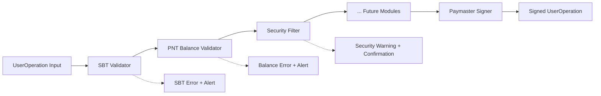
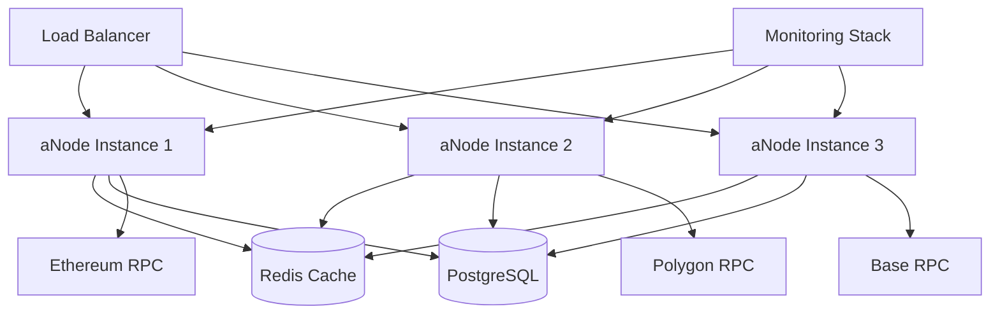
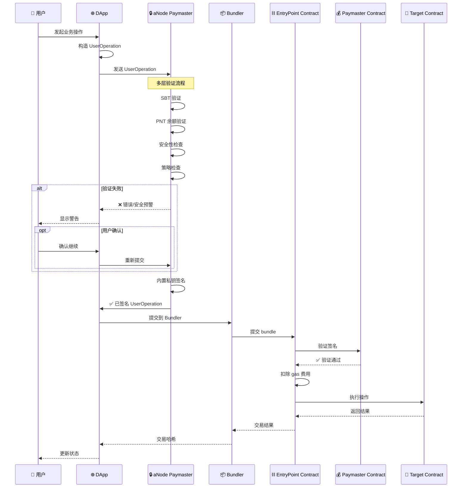

# aNode Relay Server Architecture Design

## 项目愿景

aNode 是一个精简、高效的 ERC-4337 paymaster 服务器，借鉴 ZeroDev 的成熟设计模式，并扩展了传统 paymaster 的服务范围：
- aNode Paymaster 服务（paymaster 主流程）
- 可预设安全检查和二次确认机制（嵌入到 paymaster 的 useroperation 处理流程中）
- Passkey Validator(独立提供服务 API，不参与 paymaster 流程)
- Account Manager（Web 版本，依赖外部 KMS，独立提供 Web 服务，不参与 paymaster 流程）
- Guardian System（依赖链上合约和 KMS，独立提供服务 API，不参与 paymaster 流程）
我们专注于提供小巧精干的解决方案，最小化依赖包，降低应用体积，同时为未来集成 KMS 和 bundler 模块预留标准接口。
当前设计主要围绕 aNode Paymaster 服务进行，其他服务为后续功能扩展。

### 核心服务矩阵

| 服务模块 | 功能描述 | 当前状态 | 集成方式 |
|---------|---------|---------|---------|
| **Paymaster** | ERC-4337 标准 paymaster 流程 | ✅ 核心开发 | 主流程集成 |
| **Bundler** | Bundler 私钥支付 + 链下结算 | 📋 扩展规划 | 可选集成 |
| **Security Module** | 安全检查和二次确认机制 | 📋 扩展规划 | 嵌入 paymaster |
| **Passkey Validator** | 基于 Passkey 的签名验证 | 📋 扩展规划 | 独立 API 服务 |
| **Account Manager** | Web 账户管理和 KMS 集成 | 📋 扩展规划 | 独立 Web 服务 |
| **Guardian System** | 社交恢复和多签治理 | 📋 扩展规划 | 独立 API 服务 |
| **KMS Service** | 多层次密钥管理解决方案 | 📋 扩展规划 | 基础设施层 |

## Paymaster 服务本质分析

基于对 ZeroDev SDK、Bastion、Examples 等仓库的深入分析，aNode 将 paymaster 服务器定位为 **ERC-4337 生态中的关键中间件**：

### 1. 核心功能定位（借鉴 ZeroDev）
- **Gas 代付服务**：替用户支付交易 gas 费用（映射 ZeroDev 的 sponsor paymaster）
- **条件验证器**：根据业务逻辑验证是否应该代付（扩展 ZeroDev 的策略引擎）
- **策略执行器**：执行复杂的业务规则和限制策略（增强版 gas policies）
- **安全网关**：过滤恶意交易，保护资金安全（aNode 独有扩展）

### 2. ZeroDev 设计模式的继承与扩展

**继承的核心模式**：
- **模块化架构**：不同类型的 paymaster（sponsor、ERC20、custom）
- **可插拔策略引擎**：灵活的政策配置系统
- **独立 gas 估算服务**：精确的费用计算
- **多链支持**：统一接口，链特定优化

**aNode 的扩展创新**：
- **SBT + PNT 验证**：基于身份和代币的准入机制
- **安全过滤层**：智能合约风险评估
- **二次确认机制**：用户友好的安全交互
- **模块化管道**：可动态配置的处理流程

## 核心架构理念

### 1. 可插拔模块化设计 (Pluggable Modular Architecture)

aNode 采用管道式的模块化架构，每个模块都可以独立开发、测试、部署和替换：



### 2. 标准化的输入输出接口

**输入**：标准 ERC-4337 UserOperation
```json
{
  "sender": "0x...",
  "nonce": "0x...",
  "initCode": "0x...",
  "callData": "0x...",
  "callGasLimit": "0x...",
  "verificationGasLimit": "0x...",
  "preVerificationGas": "0x...",
  "maxFeePerGas": "0x...",
  "maxPriorityFeePerGas": "0x...",
  "paymasterAndData": "0x",
  "signature": "0x..."
}
```

**输出**：加工后的 UserOperation 或标准化错误响应

## 详细架构设计

### 核心模块流水线

#### 第一阶段：身份验证模块 (Identity Validation)

**1. SBT 验证器 (SBT Validator)**
```rust
pub struct SBTValidator {
    supported_sbt_contracts: Vec<String>,
    required_sbt_types: Vec<SBTType>,
}

impl ModuleProcessor for SBTValidator {
    async fn process(&self, user_op: &UserOperation) -> ModuleResult {
        // 验证 sender 是否持有指定的 SBT
        // 检查 SBT 的有效性和类型
    }
}
```

**2. PNT 余额验证器 (PNT Balance Validator)**
```rust
pub struct PNTBalanceValidator {
    min_balance_required: u256,
    pnt_contract_address: String,
}

impl ModuleProcessor for PNTBalanceValidator {
    async fn process(&self, user_op: &UserOperation) -> ModuleResult {
        // 验证用户 PNT 代币余额是否足够
        // 可能涉及质押、锁定等复杂逻辑
    }
}
```

#### 第二阶段：安全过滤模块 (Security Filtering)

**3. 合约安全过滤器 (Contract Security Filter)**
```rust
pub struct ContractSecurityFilter {
    blacklist_contracts: Vec<String>,
    risk_assessment_rules: Vec<RiskRule>,
    security_providers: Vec<Box<dyn SecurityProvider>>,
}

pub enum SecurityLevel {
    Safe,
    Warning,
    Danger,
    Blocked,
}

impl ModuleProcessor for ContractSecurityFilter {
    async fn process(&self, user_op: &UserOperation) -> ModuleResult {
        let target_contract = self.extract_target_contract(&user_op.callData)?;
        let security_level = self.assess_contract_risk(&target_contract).await?;
        
        match security_level {
            SecurityLevel::Safe => Ok(ProcessResult::Continue),
            SecurityLevel::Warning => Ok(ProcessResult::Warning(SecurityWarning {
                message: "目标合约存在潜在风险",
                risk_factors: vec!["未验证合约", "最近部署"],
                confirmation_required: true,
            })),
            SecurityLevel::Danger => Ok(ProcessResult::Warning(SecurityWarning {
                message: "目标合约高风险",
                risk_factors: vec!["已知钓鱼合约", "资金流向异常"],
                confirmation_required: true,
            })),
            SecurityLevel::Blocked => Err(ModuleError::SecurityViolation(
                "目标合约已被列入黑名单".to_string()
            )),
        }
    }
}
```

#### 第三阶段：业务逻辑模块 (Business Logic)

**4. 费率控制模块 (Rate Limiting Module)**
```rust
pub struct RateLimitingModule {
    policies: Vec<RatePolicy>,
    redis_client: RedisClient,
}
```

**5. Gas 优化模块 (Gas Optimization Module)**
```rust
pub struct GasOptimizationModule {
    gas_estimator: GasEstimator,
    optimization_strategies: Vec<Box<dyn OptimizationStrategy>>,
}
```

#### 第四阶段：签名生成模块 (Signature Generation)

**6. Paymaster 签名器 (Paymaster Signer)**
```rust
pub struct PaymasterSigner {
    private_key: SigningKey,
    paymaster_address: Address,
    entry_point: Address,
}

impl ModuleProcessor for PaymasterSigner {
    async fn process(&self, user_op: &UserOperation) -> ModuleResult {
        // 遵循 ERC-4337 标准生成 paymaster 签名
        let paymaster_and_data = self.generate_paymaster_signature(user_op).await?;
        
        let mut signed_user_op = user_op.clone();
        signed_user_op.paymasterAndData = paymaster_and_data;
        
        Ok(ProcessResult::Success(signed_user_op))
    }
}
```

### 错误处理和安全报警系统

#### 标准化错误响应
```rust
#[derive(Debug, Serialize)]
pub struct aNodeError {
    pub code: ErrorCode,
    pub message: String,
    pub details: Option<ErrorDetails>,
    pub security_alert: Option<SecurityAlert>,
    pub retry_suggestion: Option<RetrySuggestion>,
}

#[derive(Debug, Serialize)]
pub enum ErrorCode {
    // ERC-4337 标准错误
    AA10_SenderNotDeployed,
    AA13_InitCodeFailed,
    AA14_InitCodeMustReturnSender,
    AA15_InitCodeMustCreateSender,
    AA21_DidntPayPrefund,
    AA22_ExpiredOrNotDue,
    AA23_ReversionDuringValidation,
    AA24_SignatureValidationFailed,
    AA25_InvalidAccountNonce,
    
    // aNode 自定义错误
    ANODE_001_SBT_NOT_FOUND,
    ANODE_002_INSUFFICIENT_PNT_BALANCE,
    ANODE_003_SECURITY_WARNING,
    ANODE_004_RATE_LIMIT_EXCEEDED,
    ANODE_005_UNSUPPORTED_OPERATION,
}

#[derive(Debug, Serialize)]
pub struct SecurityAlert {
    pub level: AlertLevel,
    pub title: String,
    pub description: String,
    pub risk_factors: Vec<String>,
    pub recommendations: Vec<String>,
    pub confirmation_token: Option<String>, // 用于二次确认
}

#[derive(Debug, Serialize)]
pub enum AlertLevel {
    Info,
    Warning,
    Critical,
    Blocked,
}
```

#### 二次确认机制
```rust
pub struct ConfirmationService {
    pending_confirmations: HashMap<String, PendingConfirmation>,
}

pub struct PendingConfirmation {
    pub user_operation: UserOperation,
    pub security_warnings: Vec<SecurityWarning>,
    pub expires_at: DateTime<Utc>,
    pub confirmation_count: u8,
}

impl ConfirmationService {
    pub async fn request_confirmation(&self, user_op: UserOperation, warnings: Vec<SecurityWarning>) -> String {
        let token = self.generate_confirmation_token();
        // 存储待确认的操作
        // 返回确认令牌
        token
    }
    
    pub async fn confirm_and_process(&self, token: String) -> Result<UserOperation, aNodeError> {
        // 验证确认令牌
        // 如果是第二次确认，则跳过安全检查继续处理
        // 否则返回更严格的警告
    }
}
```

### 模块接口标准

#### 通用模块接口
```rust
#[async_trait]
pub trait ModuleProcessor: Send + Sync {
    async fn process(&self, user_op: &UserOperation) -> ModuleResult;
    fn module_name(&self) -> &'static str;
    fn module_version(&self) -> &'static str;
    fn dependencies(&self) -> Vec<&'static str> { vec![] }
}

pub enum ProcessResult {
    Success(UserOperation),
    Continue, // 继续下一个模块
    Warning(SecurityWarning),
    RequireConfirmation(ConfirmationRequest),
}

pub type ModuleResult = Result<ProcessResult, ModuleError>;
```

#### 模块注册和管道构建
```rust
pub struct ModulePipeline {
    modules: Vec<Box<dyn ModuleProcessor>>,
    confirmation_service: ConfirmationService,
}

impl ModulePipeline {
    pub fn builder() -> PipelineBuilder {
        PipelineBuilder::new()
    }
    
    pub async fn process_user_operation(&self, user_op: UserOperation) -> Result<UserOperation, aNodeError> {
        let mut current_op = user_op;
        
        for module in &self.modules {
            match module.process(&current_op).await? {
                ProcessResult::Success(processed_op) => {
                    current_op = processed_op;
                }
                ProcessResult::Continue => {
                    // 继续下一个模块
                }
                ProcessResult::Warning(warning) => {
                    if warning.confirmation_required {
                        let token = self.confirmation_service
                            .request_confirmation(current_op.clone(), vec![warning]).await;
                        return Err(aNodeError::security_warning_with_confirmation(token));
                    }
                }
                ProcessResult::RequireConfirmation(req) => {
                    let token = self.confirmation_service
                        .request_confirmation(current_op.clone(), req.warnings).await;
                    return Err(aNodeError::confirmation_required(token));
                }
            }
        }
        
        Ok(current_op)
    }
}
```

### 配置管理

#### 模块化配置
```yaml
# config/modules.yaml
pipeline:
  modules:
    - name: "sbt_validator"
      enabled: true
      config:
        supported_sbt_contracts:
          - "0x1234...SBT1"
          - "0x5678...SBT2"
        required_sbt_types: ["identity", "reputation"]
    
    - name: "pnt_balance_validator"
      enabled: true
      config:
        min_balance_required: "100000000000000000000" # 100 PNT
        pnt_contract_address: "0xabcd...PNT"
    
    - name: "contract_security_filter"
      enabled: true
      config:
        blacklist_contracts:
          - "0xbad1...SCAM"
        risk_providers:
          - "chainabuse"
          - "forta"
          - "custom_ml_model"
    
    - name: "paymaster_signer"
      enabled: true
      config:
        private_key_env: "PAYMASTER_PRIVATE_KEY"
        paymaster_address: "0xpaymaster...ADDRESS"
```

### API 接口设计

#### 主要端点
```http
POST /api/v1/paymaster/process
Content-Type: application/json

{
  "userOperation": { ... },
  "confirmationToken": "optional-for-retry"
}
```

**成功响应：**
```json
{
  "success": true,
  "userOperation": { ... },
  "processedBy": ["sbt_validator", "pnt_balance_validator", "paymaster_signer"],
  "gasEstimate": {
    "totalCost": "0x...",
    "breakdown": { ... }
  }
}
```

**错误响应（需要确认）：**
```json
{
  "success": false,
  "error": {
    "code": "ANODE_003_SECURITY_WARNING",
    "message": "检测到潜在风险交易",
    "securityAlert": {
      "level": "Warning",
      "title": "目标合约风险警告",
      "description": "您正在与一个未验证的合约交互",
      "riskFactors": [
        "合约未经过安全审计",
        "合约部署时间少于 24 小时",
        "类似合约曾出现资金损失事件"
      ],
      "recommendations": [
        "建议等待合约验证完成",
        "建议降低交易金额",
        "建议咨询社区意见"
      ],
      "confirmationToken": "confirm_abc123def456"
    }
  }
}
```

**二次确认响应：**
```json
{
  "success": false,
  "error": {
    "code": "ANODE_003_SECURITY_WARNING",
    "message": "高风险交易二次确认",
    "securityAlert": {
      "level": "Critical",
      "title": "您正在执行高风险操作",
      "description": "即使您已确认，我们仍然强烈建议您重新考虑此操作",
      "confirmationCount": 2,
      "finalWarning": true
    }
  }
}
```

### 扩展性设计

#### 未来模块扩展示例
```rust
// 未来可以添加的模块
pub struct MLRiskAssessment;      // 机器学习风险评估
pub struct CrossChainValidator;   // 跨链操作验证
pub struct ComplianceChecker;     // 合规性检查
pub struct GasOptimizer;          // 智能 Gas 优化
pub struct BatchProcessor;       // 批量交易处理
pub struct PrivacyProtector;     // 隐私保护
```

### 监控和可观测性

#### 关键指标
- 每个模块的处理时间和成功率
- 安全警告的触发频率和类型
- 用户确认率和放弃率
- Gas 优化效果统计
- 系统整体吞吐量

#### 告警机制
- 异常交易模式检测
- 模块故障自动切换
- 资金池余额监控
- 性能阈值告警

## 技术栈选择（精简原则）

### 核心依赖（最小化原则）
- **核心语言**: Rust (零成本抽象 + 内存安全)
- **Web 框架**: Axum (轻量 + 高性能)
- **异步运行时**: Tokio (标准异步运行时)
- **区块链交互**: Alloy (下一代 Ethereum 库，比 Ethers 更轻量)
- **序列化**: Serde (标准序列化库)
- **配置**: Config + TOML (简单配置管理)

### 可选依赖（按需启用）
- **数据库**: SQLx (仅在需要持久化时)
- **缓存**: Redis (仅在需要分布式缓存时)  
- **监控**: Metrics (仅在生产环境)
- **日志**: Tracing (可配置级别)

### 依赖最小化策略
```toml
[dependencies]
# 核心必需（< 10 个）
tokio = { version = "1", features = ["rt-multi-thread", "macros"] }
axum = "0.7"
serde = { version = "1", features = ["derive"] }
alloy = { version = "0.1", features = ["rpc", "provider-http"] }
config = "0.14"
anyhow = "1"

# 按需可选
sqlx = { version = "0.7", optional = true }
redis = { version = "0.24", optional = true }
tracing = { version = "0.1", optional = true }

[features]
default = []
database = ["sqlx"]
cache = ["redis"] 
monitoring = ["tracing", "metrics"]
```

### ZeroDev 兼容性设计

#### Paymaster 接口映射
```rust
// 映射 ZeroDev 的 PaymasterClient 接口
pub trait PaymasterClient {
    async fn sponsor_user_operation(&self, user_op: &UserOperation) -> Result<PaymasterResult>;
    async fn estimate_gas_in_erc20(&self, user_op: &UserOperation, token: &str) -> Result<u64>;
}

// aNode 扩展接口
pub trait aNodePaymasterClient: PaymasterClient {
    async fn validate_sbt(&self, sender: &str) -> Result<SBTValidation>;
    async fn check_pnt_balance(&self, sender: &str) -> Result<PNTBalance>;
    async fn assess_security_risk(&self, user_op: &UserOperation) -> Result<SecurityAssessment>;
}
```

### 未来 Bundler 集成预留接口

#### 核心接口设计
```rust
// 预留 Bundler 集成接口（暂不实现）
#[cfg(feature = "bundler")]
pub trait BundlerInterface {
    async fn submit_user_operation(&self, user_op: &UserOperation) -> Result<String>;
    async fn get_user_operation_by_hash(&self, hash: &str) -> Result<UserOperationReceipt>;
    async fn get_user_operation_receipt(&self, hash: &str) -> Result<TransactionReceipt>;
    async fn estimate_user_operation_gas(&self, user_op: &UserOperation) -> Result<GasEstimate>;
}

// UltraRelay 风格的集成接口
#[cfg(feature = "ultra-relay")]
pub trait UltraRelayInterface: PaymasterClient + BundlerInterface {
    async fn process_user_operation_end_to_end(&self, user_op: &UserOperation) -> Result<TransactionReceipt>;
    // 30% gas 优化 + 20% 延迟优化的实现
}

// 模块化集成点
pub struct aNodeCore {
    paymaster: Box<dyn aNodePaymasterClient>,
    #[cfg(feature = "bundler")]
    bundler: Option<Box<dyn BundlerInterface>>,
}

impl aNodeCore {
    // 当前只实现 paymaster 功能
    pub fn new_paymaster_only(config: PaymasterConfig) -> Self {
        Self {
            paymaster: Box::new(aNodePaymaster::new(config)),
            #[cfg(feature = "bundler")]
            bundler: None,
        }
    }
    
    // 未来可以启用 bundler 集成
    #[cfg(feature = "bundler")]
    pub fn new_with_bundler(paymaster_config: PaymasterConfig, bundler_config: BundlerConfig) -> Self {
        Self {
            paymaster: Box::new(aNodePaymaster::new(paymaster_config)),
            bundler: Some(Box::new(aNodeBundler::new(bundler_config))),
        }
    }
}
```

#### 预留的架构扩展点
```rust
// 1. 统一的 UserOperation 处理管道
pub struct OperationPipeline {
    // 当前：只有 paymaster 处理
    paymaster_modules: Vec<Box<dyn ModuleProcessor>>,
    
    // 预留：bundler 处理模块
    #[cfg(feature = "bundler")]
    bundler_modules: Vec<Box<dyn BundlerModule>>,
    
    // 预留：UltraRelay 优化模块
    #[cfg(feature = "ultra-relay")]
    optimization_modules: Vec<Box<dyn OptimizationModule>>,
}

// 2. 统一的配置接口
#[derive(Deserialize)]
pub struct aNodeConfig {
    pub paymaster: PaymasterConfig,
    
    #[cfg(feature = "bundler")]
    pub bundler: Option<BundlerConfig>,
    
    #[cfg(feature = "ultra-relay")]
    pub ultra_relay: Option<UltraRelayConfig>,
}

// 3. 统一的 API 路由
pub fn create_routes(core: aNodeCore) -> Router {
    Router::new()
        // 当前 paymaster 路由
        .route("/api/v1/paymaster/sponsor", post(sponsor_user_operation))
        .route("/api/v1/paymaster/estimate", post(estimate_gas))
        
        // 预留 bundler 路由
        .route("/api/v1/bundler/submit", post(placeholder_bundler_submit))
        .route("/api/v1/bundler/receipt/:hash", get(placeholder_bundler_receipt))
        
        // 预留 ultra-relay 路由  
        .route("/api/v1/ultra-relay/process", post(placeholder_ultra_relay_process))
        .with_state(core)
}

// 当前返回 "功能未启用" 的占位符
async fn placeholder_bundler_submit() -> impl IntoResponse {
    (StatusCode::NOT_IMPLEMENTED, Json(json!({
        "error": "Bundler feature not enabled. Use --features bundler to enable."
    })))
}
```

## 部署架构



## 实现路线图（精简优先）

### 阶段 1: 核心 Paymaster 功能（v0.1.0）
```bash
# 最小可行产品 - 只实现核心功能
cargo build --no-default-features
```
- [x] 基础 UserOperation 处理
- [ ] SBT 验证模块
- [ ] PNT 余额验证模块  
- [ ] 基础 Paymaster 签名
- [ ] 简单的 HTTP API

**依赖包数量目标**: < 15 个直接依赖
**编译后体积目标**: < 10MB

### 阶段 2: 安全增强（v0.2.0）
```bash
# 启用安全功能
cargo build --features security
```
- [ ] 合约安全过滤器
- [ ] 二次确认机制
- [ ] 基础监控和日志

### 阶段 3: 生产就绪（v0.3.0）
```bash  
# 生产环境功能
cargo build --features database,cache,monitoring
```
- [ ] 数据库持久化
- [ ] Redis 缓存
- [ ] 完整监控体系

### 阶段 4: Bundler 集成预留（v1.0.0）
```bash
# 未来 bundler 集成
cargo build --features bundler,ultra-relay
```
- [ ] Bundler 接口实现
- [ ] UltraRelay 优化
- [ ] 端到端处理

### 精简设计原则总结

1. **最小化依赖** - 核心功能 < 15 个直接依赖
2. **按需启用** - 通过 feature flags 控制功能
3. **ZeroDev 兼容** - 映射并扩展 ZeroDev 接口
4. **预留扩展** - 为 bundler 集成留出接口
5. **渐进增强** - 从最小可行产品开始迭代

## ERC-4337 完整流程集成

### aNode 在 ERC-4337 生态中的角色

aNode 作为 ERC-4337 生态中的增强型 paymaster 节点，提供了从用户意图到链上执行的完整验证和签名服务。



### 核心增强特性

1. **身份验证层**：基于 SBT 的身份准入机制
2. **经济模型**：PNT 代币余额要求和质押机制
3. **安全防护**：智能合约风险评估和分级警告
4. **策略驱动**：灵活的 gas 策略和限制规则
5. **用户体验**：友好的错误提示和确认流程

### 与标准 ERC-4337 的兼容性

aNode 完全兼容标准 ERC-4337 流程，同时在 paymaster 验证阶段提供增强功能：
- **向下兼容**：支持标准 UserOperation 结构
- **可选增强**：验证模块可按需启用/禁用
- **标准接口**：与现有 bundler 和 EntryPoint 无缝集成

详细的流程图和数据结构请参考：[ERC-4337 完整流程图](./ERC4337FlowDiagram.md)

这个架构设计体现了您提出的核心理念：
1. **可插拔模块化** - 每个功能都是独立的模块
2. **标准化接口** - 统一的输入输出格式，兼容 ZeroDev
3. **安全优先** - 多层安全检查和确认机制
4. **可扩展性** - 易于添加新的验证和处理模块，预留 bundler 接口
5. **用户友好** - 清晰的错误信息和确认流程
6. **精简高效** - 最小化依赖，按需启用功能
7. **渐进式** - 从核心功能开始，逐步扩展到完整生态
