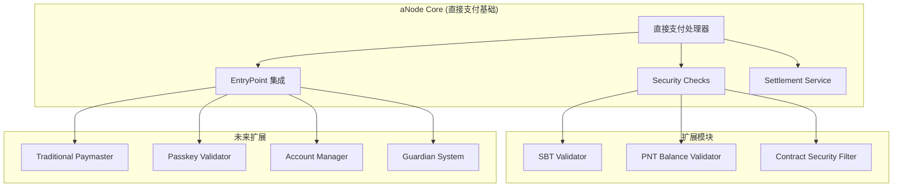
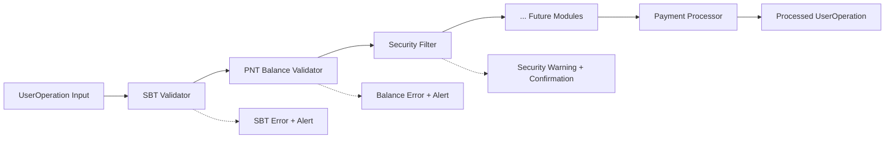
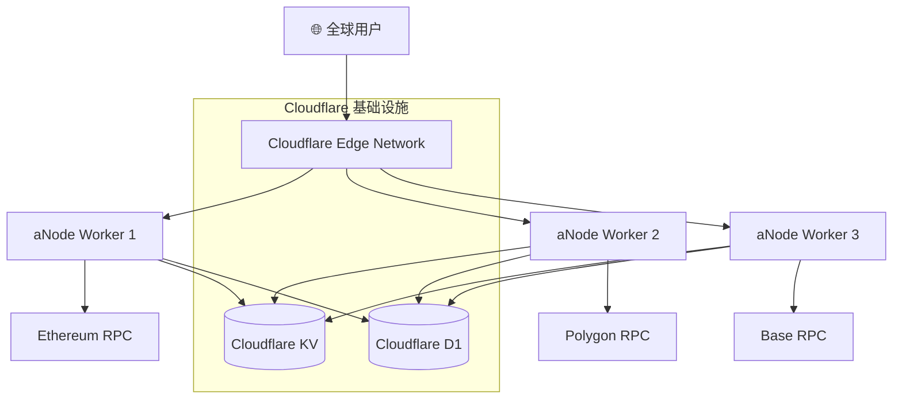

# aNode 社区节点服务器架构设计

## 项目定位与愿景

aNode 是一个**精简、高效的社区节点服务器**，为 Web3 社区提供多层次的账户抽象服务。借鉴 ZeroDev 等成熟方案的设计思路（包括其 Ultra-Relay 直接支付模式），aNode 通过模块化的服务架构，支持从基础 gas 赞助到高级账户管理的完整功能栈。

### 核心服务矩阵

| 服务模块 | 功能描述 | 当前状态 | 集成方式 |
|---------|---------|---------|---------|
| **Paymaster Core** | ERC-4337 标准 paymaster + 直接支付扩展 | ✅ 核心开发 | 主流程集成 |
| **Bundler Service** | UserOperation 打包和提交服务 | 📋 扩展规划 | 可选集成 |
| **Security Service** | 安全检查和二次确认机制 | 📋 扩展规划 | 嵌入 paymaster |
| **Passkey Validator** | 基于 Passkey 的签名验证 | 📋 扩展规划 | 独立 API 服务 |
| **Account Manager** | Web 账户管理和 KMS 集成 | 📋 扩展规划 | 独立 Web 服务 |
| **Guardian System** | 社交恢复和多签治理 | 📋 扩展规划 | 独立 API 服务 |
| **KMS Infrastructure** | 多层次密钥管理解决方案 | 📋 扩展规划 | 基础设施层 |

### 设计原则

- **Cloudflare Workers 优先**：基于边缘计算的全球部署架构
- **直接支付优先**：支持 bundler 直接支付的 gas 赞助模式
- **极简起步**：从最简单的 paymaster 功能开始
- **KV 存储**：使用 Cloudflare KV 替代传统数据库
- **渐进增强**：TS 先行验证，Rust 性能优化

## 从 ZeroDev 到 aNode：设计思路演进

### ZeroDev Paymaster 架构分析

基于对 ZeroDev SDK、permissionless.js 和 Ultra-Relay 的深入分析，aNode 继承并扩展了以下核心模式：

#### 1. 服务接口设计
- **JSON-RPC 2.0 + RESTful**：双协议支持，兼容性强
- **EntryPoint 多版本兼容**：v0.6/v0.7/v0.8 全支持
- **Gas 估算增强**：支持 ERC20 代币 gas 估算
- **策略验证机制**：赞助策略的灵活配置

#### 2. Ultra-Relay 关键创新
**双模式支付机制**：
- **传统 Paymaster**：链下签名验证，paymaster 合约支付
- **Relayer 直接支付**：bundler 使用 executor 账户支付，跳过 paymaster 验证

**关键代码洞察**：
```typescript
// Ultra-Relay 支持零 gas 价格 UserOperation
if (userOp.maxFeePerGas === 0n && userOp.maxPriorityFeePerGas === 0n) {
  // Relayer 直接支付，链下结算
  await handleRelayerSponsorship(userOp)
}
```

### aNode 核心设计决策

#### 1. 直接支付优先策略
**为什么选择 bundler 直接支付作为基础？**
- **性能优势**：节省 10k-50k gas，降低用户成本
- **用户体验**：完全透明的 gas 赞助
- **商业模式灵活**：支持积分系统和链下结算
- **技术复杂度可控**：比传统 paymaster 更简单

#### 2. 模块化扩展架构


## Cloudflare Workers TS Paymaster 实现架构

### 基于 Ultra-Relay 的 Cloudflare Workers 实现

#### 1. 核心架构设计

aNode TS 版本基于 Cloudflare Workers + Ultra-Relay 架构，采用极简设计：

```typescript
// Cloudflare Workers 环境
interface Env {
  CACHE_KV: KVNamespace
  SETTLEMENT_KV: KVNamespace
  PAYMASTER_SECRET: string
}

// 核心 Paymaster 服务
export class aNodePaymaster {
  constructor(private env: Env) {}

  async processUserOperation(userOp: UserOperation): Promise<ProcessedUserOp> {
    // Phase 1: 最简单的 paymaster 实现
    return this.handleBasicPaymaster(userOp)
  }

  // Phase 1: 基础 paymaster 功能
  private async handleBasicPaymaster(userOp: UserOperation): Promise<ProcessedUserOp> {
    // 1. 验证 paymaster 合约地址
    const paymasterAddress = await this.getPaymasterAddress()

    // 2. 生成 paymasterAndData (简化版本)
    const paymasterAndData = this.generatePaymasterData(paymasterAddress)

    // 3. 返回处理结果
    return {
      userOp: {
        ...userOp,
        paymasterAndData,
        maxFeePerGas: 0n,      // 直接支付模式
        maxPriorityFeePerGas: 0n
      },
      paymentMethod: 'direct-payment',
      processed: true
    }
  }

  // Phase 2: 直接支付增强 (未来)
  private async handleDirectPayment(userOp: UserOperation): Promise<ProcessedUserOp> {
    // 记录结算信息到 KV
    const settlementKey = `settlement:${userOp.sender}:${Date.now()}`
    await this.env.SETTLEMENT_KV.put(settlementKey, JSON.stringify({
      userOp,
      timestamp: Date.now(),
      gasEstimate: await this.estimateGas(userOp)
    }))

    return {
      userOp: {
        ...userOp,
        maxFeePerGas: 0n,
        maxPriorityFeePerGas: 0n
      },
      paymentMethod: 'direct-payment',
      settlementKey,
      processed: true
    }
  }
}
```

#### 2. 极简实现 (Phase 1)

**Phase 1 只实现最基础的功能**：

```typescript
// Phase 1: 极简 paymaster - 只有基础功能
export default {
  async fetch(request: Request, env: Env): Promise<Response> {
    if (request.method === 'POST' && new URL(request.url).pathname === '/api/v1/paymaster/process') {
      const { userOperation } = await request.json()

      // 基础 paymaster 处理
      const paymasterAndData = generateBasicPaymasterData(env.PAYMASTER_SECRET)

      return Response.json({
        success: true,
        userOperation: {
          ...userOperation,
          paymasterAndData,
          maxFeePerGas: '0x0',      // 直接支付模式
          maxPriorityFeePerGas: '0x0'
        },
        paymentMethod: 'direct-payment'
      })
    }

    return new Response('Not Found', { status: 404 })
  }
}

// 基础 paymasterAndData 生成
function generateBasicPaymasterData(secret: string): string {
  // 简化实现：返回固定格式的 paymasterAndData
  // 实际实现需要根据 ERC-4337 标准生成
  return '0x' + '00'.repeat(32) // 占位符
}
```

#### 3. Phase 2 扩展 (直接支付完整实现)

**Phase 2 将添加完整的直接支付功能**：

```typescript
// Phase 2: 完整直接支付实现
class DirectPaymentProcessor {
  constructor(private env: Env) {}

  async process(userOp: UserOperation): Promise<ProcessedUserOp> {
    // 1. 验证用户资格（可选的 SBT/PNT 检查）
    // 2. 记录结算信息到 Cloudflare KV
    const settlementKey = `settlement:${userOp.sender}:${Date.now()}`
    await this.env.SETTLEMENT_KV.put(settlementKey, JSON.stringify({
      userOp,
      timestamp: Date.now(),
      gasEstimate: await this.estimateGas(userOp)
    }))

    // 3. 返回零 gas 价格的 UserOperation
    return {
      userOp: {
        ...userOp,
        maxFeePerGas: 0n,
        maxPriorityFeePerGas: 0n,
        paymasterAndData: '0x' // 直接支付无需 paymasterAndData
      },
      paymentMethod: 'direct-payment',
      settlementKey,
      processed: true
    }
  }
}
```

### 模块化设计 (Pluggable Modular Architecture)

aNode 采用管道式的模块化架构，每个模块都可以独立开发、测试、部署和替换：



## Cloudflare Workers 优先的开发策略

### 两阶段开发策略

aNode 采用 **Cloudflare Workers + TS 先行，Rust 优化** 的开发策略：

#### Phase 1: 极简 Paymaster (当前重点) ⚡

**目标**: 在 Cloudflare Workers 上实现最简单的 paymaster 功能

**核心任务**:
- ✅ Cloudflare Workers 基础设置
- ✅ 基础 API 实现 (`/api/v1/paymaster/process`)
- ✅ 简单的 paymasterAndData 生成
- ✅ 直接支付模式支持 (零 gas 价格)
- ✅ Cloudflare KV 基础存储

**技术栈 (Phase 1)**:
```json
{
  "devDependencies": {
    "@cloudflare/workers-types": "^4.20231218.0",
    "typescript": "^5.3.0",
    "wrangler": "^3.22.4"
  }
}
```

**部署命令**:
```bash
# 本地开发
npm run dev

# 部署到 Cloudflare
npm run deploy
```

**测试目标**:
- 基本的 UserOperation 处理
- 与 bundler 的集成测试
- KV 存储的基本读写

#### Phase 2: 直接支付完整实现

**目标**: 添加完整的直接支付功能和模块化验证

**扩展功能**:
- 📋 SBT/PNT 验证模块
- 📋 安全过滤器
- 📋 链下结算系统
- 📋 监控和指标收集

#### Phase 3: Rust 版本性能优化

**目标**: 高性能 Rust 版本，支持企业级部署

### 为什么选择 Cloudflare Workers？

| 优势 | 说明 |
|------|------|
| 🌐 全球边缘 | 200+ 数据中心，超低延迟 |
| ⚡ 无服务器 | 自动扩缩容，零运维成本 |
| 🛡️ 内置安全 | DDoS 防护，WAF，Rate Limiting |
| 💾 原生存储 | Cloudflare KV，D1 数据库 |
| 🔧 开发友好 | TypeScript 支持，Wrangler CLI |
| 💰 成本优势 | 按使用量付费，免费额度充足 |

## API 设计与接口

### 核心 API 接口

#### POST /api/v1/paymaster/process
完整用户操作处理

**请求体**:
```json
{
  "userOperation": {
    "sender": "0x742d35Cc6634C0532925a3b8D2C8f93c2b8D8f93c2",
    "nonce": "0x0",
    "initCode": "0x",
    "callData": "0x...",
    "callGasLimit": "0x186a0",
    "verificationGasLimit": "0x186a0",
    "preVerificationGas": "0x5208",
    "maxFeePerGas": "0x4a817c800",
    "maxPriorityFeePerGas": "0x3b9aca00",
    "paymasterAndData": "0x",
    "signature": "0x..."
  },
  "context": {
    "paymentMethod": "direct-payment"
  }
}
```

**成功响应**:
```json
{
  "success": true,
  "userOperation": {
    "sender": "0x742d35Cc6634C0532925a3b8D2C8f93c2b8D8f93c2",
    "nonce": "0x0",
    "paymasterAndData": "0x...",
    "maxFeePerGas": "0x0",
    "maxPriorityFeePerGas": "0x0"
  },
  "validation": {
    "sbtValidated": true,
    "pntBalanceValidated": true,
    "securityRisk": 25
  },
  "processing": {
    "modules": ["sbt_validator", "pnt_validator", "security_filter", "ultra_relay_processor"],
    "totalDuration": "45ms",
    "service": "aNode Paymaster"
  },
  "settlement": {
    "method": "direct-payment",
    "recordId": "settlement_123",
    "estimatedGas": "0x2386f26fc10000"
  }
}
```

#### POST /api/v1/paymaster/sponsor
Gas 赞助请求 (兼容 ZeroDev)

**请求体**:
```json
{
  "userOperation": { ... },
  "entryPoint": "0x5FF137D4b0FDCD49DcA30c7CF57E578a026d2789",
  "chainId": 1
}
```

### JSON-RPC 2.0 接口

```typescript
// pm_processUserOperation - aNode 增强接口
{
  "jsonrpc": "2.0",
  "method": "pm_processUserOperation",
  "params": [{
    "userOp": { ... },
    "context": {
      "paymentMethod": "direct-payment",
      "modules": ["sbt", "pnt", "security"]
    }
  }],
  "id": 1
}

// pm_getPaymentMethods - 获取支持的支付方式
{
  "jsonrpc": "2.0",
  "method": "pm_getPaymentMethods",
  "params": [],
  "id": 2
}
```

## Cloudflare Workers 技术架构

### 技术栈选择（Cloudflare Workers 优化）

#### Phase 1: Cloudflare Workers 核心依赖
```json
{
  "dependencies": {
    // Cloudflare Workers 运行时 (内置)
  },
  "devDependencies": {
    "@cloudflare/workers-types": "^4.20231218.0",
    "typescript": "^5.3.0",
    "wrangler": "^3.22.4",
    "vitest": "^1.0.0"
  }
}
```

#### Phase 2: 增强依赖
```json
{
  "dependencies": {
    "viem": "^2.0.0",           // 以太坊交互 (Cloudflare Workers 兼容)
    "zod": "^3.22.0"            // 数据验证
  }
}
```

#### Phase 3: Rust 版本 (Cloudflare Workers)
```toml
[dependencies]
worker = "0.0.18"              # Cloudflare Workers Rust 绑定
serde = { version = "1", features = ["derive"] }
anyhow = "1"
```

### Cloudflare Workers 部署架构



**架构优势**:
- **全球分布**: 200+ 数据中心，自动路由到最近节点
- **无状态设计**: 每个请求独立处理，通过 KV 共享状态
- **自动扩缩**: 根据请求量自动调整实例数量
- **内置缓存**: KV 提供高速读写，D1 提供关系型存储

### Cloudflare Workers 项目结构

```
aNode/
├── src/
│   ├── index.ts              # 主入口文件
│   ├── paymaster.ts          # Paymaster 核心逻辑
│   ├── direct-payment.ts        # 直接支付处理器 (Phase 2)
│   └── types.ts              # 类型定义
├── wrangler.toml             # Cloudflare Workers 配置
├── package.json
└── tsconfig.json
```

### Wrangler 配置示例

```toml
# wrangler.toml
name = "anode-paymaster"
main = "src/index.ts"
compatibility_date = "2024-01-01"

[vars]
ENVIRONMENT = "development"

# KV Namespaces
[[kv_namespaces]]
binding = "CACHE_KV"
id = "your_cache_kv_id"
preview_id = "your_cache_kv_preview_id"

[[kv_namespaces]]
binding = "SETTLEMENT_KV"
id = "your_settlement_kv_id"
preview_id = "your_settlement_kv_preview_id"

# Secrets (通过 wrangler secret put 设置)
# PAYMASTER_SECRET
```

## 开发环境配置

### 本地开发设置

```bash
# 安装 Wrangler CLI
npm install -g wrangler

# 登录 Cloudflare
wrangler auth login

# 创建 KV 命名空间
wrangler kv:namespace create "CACHE_KV"
wrangler kv:namespace create "SETTLEMENT_KV"

# 设置密钥
wrangler secret put PAYMASTER_SECRET

# 本地开发
npm run dev

# 部署
npm run deploy
```

### 环境变量配置

参考项目根目录的 `env.example` 文件，重点关注：

- **Cloudflare 配置**: `CF_ACCOUNT_ID`, KV 命名空间 ID
- **区块链配置**: RPC URLs, EntryPoint 地址
- **Paymaster 配置**: 私钥 (开发) 或 Secret 名称 (生产)
- **功能开关**: 启用/禁用各个验证模块

### Phase 1 实现清单

**✅ 已完成**:
- Cloudflare Workers 基础架构
- 基础 API 路由设计
- KV 存储集成准备
- 极简 paymaster 逻辑

**🔄 Phase 1 目标**:
- 实现基本的 paymasterAndData 生成
- 支持直接支付零 gas 模式
- KV 基础读写操作
- 与 bundler 的集成测试

**📋 Phase 2 规划**:
- SBT/PNT 验证模块
- 安全过滤器
- 完整的直接支付结算系统
- 监控和指标收集

这个架构设计现在完全基于 Cloudflare Workers，强调极简起步，逐步扩展的开发策略。
