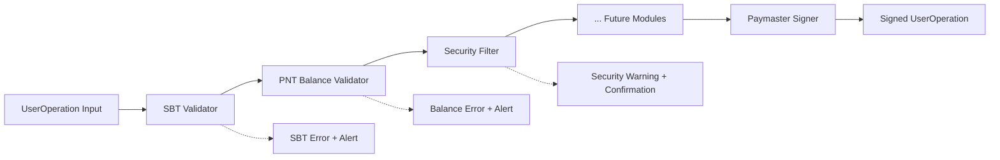
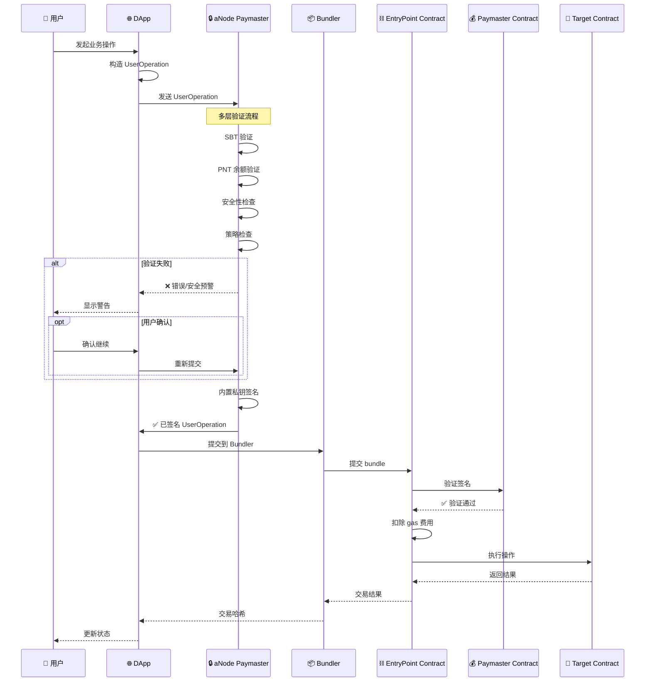
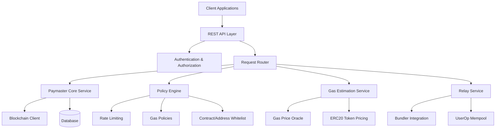
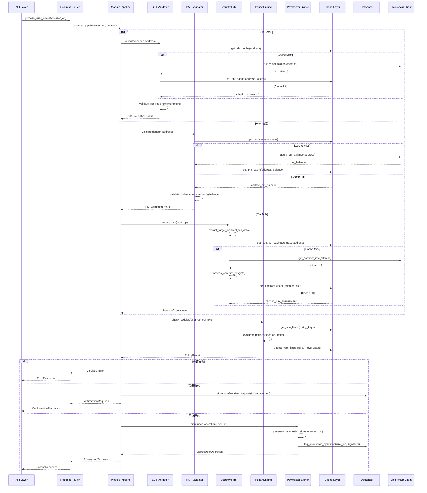

# aNode Framework and Paymaster Module Design

## 项目概述

aNode 是一个精简、高效的 ERC-4337 paymaster 服务器，借鉴 ZeroDev 的成熟设计模式，扩展了传统 paymaster 的服务范围。我们专注于提供小巧精干的解决方案，最小化依赖包，降低应用体积，同时为未来集成 bundler 模块预留标准接口。

## 核心架构理念

### 1. 可插拔模块化设计 (Pluggable Modular Architecture)

aNode 采用管道式的模块化架构，每个模块负责特定的验证或处理功能，支持动态配置和扩展：



### 2. 标准化的输入输出接口

**输入**：标准 ERC-4337 UserOperation
```json
{
  "sender": "0x...",
  "nonce": "0x...",
  "initCode": "0x...",
  "callData": "0x...",
  "callGasLimit": "0x...",
  "verificationGasLimit": "0x...",
  "preVerificationGas": "0x...",
  "maxFeePerGas": "0x...",
  "maxPriorityFeePerGas": "0x...",
  "paymasterAndData": "0x",
  "signature": "0x..."
}
```

**输出**：加工后的 UserOperation 或标准化错误响应

## ERC-4337 完整流程集成

### aNode 在 ERC-4337 生态中的角色

aNode 作为 ERC-4337 生态中的增强型 paymaster 节点，提供了从用户意图到链上执行的完整验证和签名服务。



### 核心增强特性

1. **身份验证层**：基于 SBT 的身份准入机制
2. **经济模型**：PNT 代币余额要求和质押机制
3. **安全防护**：智能合约风险评估和分级警告
4. **策略驱动**：灵活的 gas 策略和限制规则
5. **用户体验**：友好的错误提示和确认流程

## Paymaster 核心架构

### 1. Paymaster 服务模式

#### 1.1 Verifying Mode (Gas Sponsorship)
**功能**：Paymaster 完全代付交易 gas 费用
**适用场景**：免费试用、忠诚用户奖励、平台补贴
**验证要求**：强签名验证，严格的策略控制

#### 1.2 ERC-20 Mode (Token Payment)
**功能**：用户使用 ERC-20 代币支付 gas
**适用场景**：付费服务、商业应用
**验证要求**：代币授权、余额检查、汇率转换

### 2. 核心组件架构



### 3. 核心能力

#### 3.1 Gas Sponsorship Service
**主要功能**：根据可配置策略为用户操作赞助 gas 费用

**关键特性**：
- 赞助前验证用户操作
- 应用 gas 策略（速率限制、消费上限、白名单）
- 为赞助操作生成 paymaster 签名
- 支持多种赞助模式（免费、ERC20 支付、订阅制）

#### 3.2 ERC20 Paymaster Service
**主要功能**：允许用户使用 ERC20 代币而不是原生 ETH 支付 gas 费用

**关键特性**：
- 支持多种 ERC20 代币（USDC、USDT、自定义代币）
- 实时代币价格转换
- 代币授权验证
- 可配置加价的汇率管理

#### 3.3 Policy Engine
**主要功能**：对 gas 赞助策略执行精细控制

**策略类型**：
- **Project Policies**：整个项目的全局限制
- **Contract Policies**：特定合约的限制
- **Wallet Policies**：特定钱包地址的限制
- **Custom Policies**：基于 webhook 的自定义验证逻辑

**速率限制类型**：
- **Amount Limits**：时间段内的最大 gas 金额
- **Request Limits**：时间段内的最大请求数量
- **Gas Price Limits**：仅在 gas 价格低于阈值时赞助
- **Per-Transaction Limits**：单笔交易的最大 gas 金额

#### 3.4 Gas Estimation Service
**主要功能**：提供原生代币和 ERC20 代币的准确 gas 成本估算

**关键特性**：
- 多链 gas 价格预言机集成
- ERC20 代币价格 feeds
- 基于网络状况的动态 gas 估算
- 批量交易的估算

#### 3.5 Relay Service (UltraRelay Compatible)
**主要功能**：使用组合的 bundler 和 paymaster 功能优化交易中继

**关键特性**：
- 相比标准 ERC-4337 bundler 减少 30% gas 消耗
- 比传统 bundler 降低 20% 延迟
- 直接 mempool 集成
- 优化的 UserOp 批量处理

## API 接口体系

### 1. 核心 Paymaster APIs

#### 1.1 Sponsor User Operation
```http
POST /api/v1/paymaster/sponsor
Content-Type: application/json
Authorization: Bearer <API_KEY>

{
  "userOperation": {
    "sender": "0x742d35Cc6634C0532925a3b8D2C8f93c2b8D8f93c2",
    "nonce": "0x0",
    "initCode": "0x",
    "callData": "0x...",
    "callGasLimit": "0x186a0",
    "verificationGasLimit": "0x186a0",
    "preVerificationGas": "0x5208",
    "maxFeePerGas": "0x4a817c800",
    "maxPriorityFeePerGas": "0x3b9aca00",
    "paymasterAndData": "0x",
    "signature": "0x..."
  },
  "entryPoint": "0x5FF137D4b0FDCD49DcA30c7CF57E578a026d2789",
  "chainId": 1,
  "context": {
    "type": "sponsor"
  }
}
```

**成功响应**：
```json
{
  "paymasterAndData": "0x1234567890abcdef...",
  "preVerificationGas": "0x5208",
  "verificationGasLimit": "0x186a0",
  "callGasLimit": "0x186a0",
  "maxFeePerGas": "0x4a817c800",
  "maxPriorityFeePerGas": "0x3b9aca00"
}
```

#### 1.2 ERC20 Gas Payment
```http
POST /api/v1/paymaster/erc20
Content-Type: application/json
Authorization: Bearer <API_KEY>

{
  "userOperation": { ... },
  "entryPoint": "0x5FF137D4b0FDCD49DcA30c7CF57E578a026d2789",
  "chainId": 1,
  "context": {
    "type": "erc20",
    "token": "0xA0b86a33E6441c8C0c45F2d7a6c6e5B8E6A8C8D2",
    "maxTokenAmount": "1000000"
  }
}
```

#### 1.3 Gas Estimation
```http
POST /api/v1/paymaster/estimate
Content-Type: application/json

{
  "userOperation": { ... },
  "entryPoint": "0x5FF137D4b0FDCD49DcA30c7CF57E578a026d2789",
  "chainId": 1,
  "context": {
    "token": "0xA0b86a33E6441c8C0c45F2d7a6c6e5B8E6A8C8D2" // 可选，用于 ERC20 估算
  }
}
```

**响应**：
```json
{
  "gasEstimate": {
    "callGasLimit": "0x186a0",
    "verificationGasLimit": "0x186a0",
    "preVerificationGas": "0x5208",
    "maxFeePerGas": "0x4a817c800",
    "maxPriorityFeePerGas": "0x3b9aca00",
    "totalGasCost": "0x2386f26fc10000",
    "tokenAmount": "5000000" // 如果指定了 token
  }
}
```

### 2. aNode 扩展 APIs

#### 2.1 SBT 验证接口
```http
GET /api/v1/validation/sbt/{address}
```

**响应**：
```json
{
  "address": "0x742d35Cc6634C0532925a3b8D2C8f93c2b8D8f93c2",
  "sbtValidation": {
    "isValid": true,
    "sbtTokens": [
      {
        "contract": "0x1234...SBT1",
        "tokenId": "123",
        "type": "identity",
        "issuedAt": "2024-01-15T10:30:00Z",
        "expiresAt": null,
        "metadata": {
          "name": "Verified Identity",
          "level": "basic"
        }
      }
    ],
    "requiredTypes": ["identity"],
    "missingTypes": []
  }
}
```

#### 2.2 PNT 余额验证接口
```http
GET /api/v1/validation/pnt/{address}
```

**响应**：
```json
{
  "address": "0x742d35Cc6634C0532925a3b8D2C8f93c2b8D8f93c2",
  "pntValidation": {
    "isValid": true,
    "balance": {
      "available": "250000000000000000000", // 250 PNT
      "staked": "100000000000000000000",    // 100 PNT
      "locked": "50000000000000000000",     // 50 PNT
      "total": "400000000000000000000"      // 400 PNT
    },
    "requirements": {
      "minRequired": "100000000000000000000", // 100 PNT
      "satisfied": true
    }
  }
}
```

#### 2.3 安全风险评估接口
```http
POST /api/v1/security/assess
Content-Type: application/json

{
  "userOperation": { ... },
  "analysisDepth": "deep",
  "includeRecommendations": true
}
```

**响应**：
```json
{
  "securityAssessment": {
    "riskLevel": "medium",
    "riskScore": 65,
    "targetContract": {
      "address": "0x1234...CONTRACT",
      "isVerified": false,
      "deploymentAge": "2 hours"
    },
    "riskFactors": [
      {
        "type": "unverified_contract",
        "severity": "medium",
        "description": "Contract source code is not verified",
        "weight": 30
      }
    ],
    "recommendations": [
      "Wait for contract verification before proceeding",
      "Reduce transaction amount for initial interaction"
    ]
  }
}
```

#### 2.4 综合处理接口（aNode 核心）
```http
POST /api/v1/paymaster/process
Content-Type: application/json
Authorization: Bearer <API_KEY>

{
  "userOperation": { ... },
  "entryPoint": "0x5FF137D4b0FDCD49DcA30c7CF57E578a026d2789",
  "chainId": 1,
  "context": {
    "type": "sponsor",
    "token": "0x...",
    "skipSecurity": false,
    "confirmationToken": null
  }
}
```

**成功响应**：
```json
{
  "success": true,
  "userOperation": { /* 已签名的 UserOperation */ },
  "processing": {
    "modules": [
      {
        "name": "sbt_validator",
        "status": "passed",
        "duration": "12ms"
      },
      {
        "name": "pnt_balance_validator",
        "status": "passed",
        "duration": "8ms"
      },
      {
        "name": "security_filter",
        "status": "passed",
        "duration": "45ms"
      },
      {
        "name": "paymaster_signer",
        "status": "passed",
        "duration": "15ms"
      }
    ],
    "totalDuration": "80ms"
  },
  "gasEstimate": {
    "totalCost": "0x2386f26fc10000",
    "breakdown": { /* gas 分解 */ }
  }
}
```

**需要确认的响应**：
```json
{
  "success": false,
  "requiresConfirmation": true,
  "confirmationToken": "confirm_abc123def456",
  "securityWarning": {
    "level": "warning",
    "title": "Security Risk Detected",
    "message": "The target contract has not been verified and was deployed recently",
    "riskScore": 65,
    "riskFactors": [
      "Unverified contract source code",
      "Deployed less than 24 hours ago"
    ],
    "recommendations": [
      "Wait for contract verification",
      "Reduce transaction amount"
    ],
    "actions": {
      "proceed": {
        "endpoint": "/api/v1/paymaster/process",
        "method": "POST",
        "body": "Same request with confirmationToken"
      },
      "cancel": {
        "message": "Transaction cancelled for security reasons"
      }
    }
  }
}
```

### 3. 策略管理 APIs

#### 3.1 创建 Gas 策略
```http
POST /api/v1/policies
Content-Type: application/json
Authorization: Bearer <ADMIN_API_KEY>

{
  "name": "Contract Limit Policy",
  "type": "contract",
  "target": "0x...", // 合约地址
  "enabled": true,
  "priority": 20,
  "rateLimits": [
    {
      "type": "amount",
      "limit": "1000000000000000000", // 1 ETH in wei
      "window": 3600, // 1 hour in seconds
      "enabled": true
    }
  ],
  "conditions": [
    {
      "field": "function",
      "operator": "in",
      "value": ["swap", "addLiquidity"]
    }
  ]
}
```

#### 3.2 查询策略状态
```http
GET /api/v1/policies/{policyId}/status?wallet=0x...&contract=0x...
```

### 4. 多协议支持

#### 4.1 RESTful API（主要）
标准的 HTTP 方法和状态码。

#### 4.2 JSON-RPC 2.0 支持
```http
POST /api/v1/rpc
Content-Type: application/json

{
  "jsonrpc": "2.0",
  "method": "anode_sponsorUserOperation",
  "params": {
    "userOperation": { ... },
    "entryPoint": "0x5FF137D4b0FDCD49DcA30c7CF57E578a026d2789",
    "chainId": 1,
    "context": { "type": "sponsor" }
  },
  "id": 1
}
```

## 模块化架构设计

### 1. 内部模块调用时序图



### 2. 核心模块实现

#### 2.1 SBT Validator 模块
```rust
pub struct SBTValidator {
    config: SBTConfig,
    blockchain_client: Arc<BlockchainClient>,
    cache: Arc<CacheManager>,
    metrics: Arc<MetricsCollector>,
}

#[async_trait]
impl ModuleProcessor for SBTValidator {
    async fn process(&self, context: &ProcessingContext) -> Result<ModuleResult, ModuleError> {
        let validation_result = self.validate(&context.user_operation.sender).await?;

        if !validation_result.is_valid {
            return Ok(ModuleResult::Block(BlockReason::SBTValidationFailed {
                missing_types: validation_result.missing_types,
                required_types: validation_result.required_types,
            }));
        }

        let mut updated_context = context.clone();
        updated_context.add_validation_result("sbt", ValidationResult::SBT(validation_result));

        Ok(ModuleResult::Continue(updated_context))
    }

    fn name(&self) -> &'static str {
        "sbt_validator"
    }

    fn version(&self) -> &'static str {
        "1.0.0"
    }
}
```

#### 2.2 PNT Validator 模块
```rust
pub struct PNTValidator {
    config: PNTConfig,
    blockchain_client: Arc<BlockchainClient>,
    cache: Arc<CacheManager>,
    metrics: Arc<MetricsCollector>,
}

#[async_trait]
impl ModuleProcessor for PNTValidator {
    async fn process(&self, context: &ProcessingContext) -> Result<ModuleResult, ModuleError> {
        let validation_result = self.validate(&context.user_operation.sender).await?;

        if !validation_result.is_valid {
            return Ok(ModuleResult::Block(BlockReason::InsufficientPNTBalance {
                required: validation_result.requirements.min_required,
                available: validation_result.effective_balance,
            }));
        }

        let mut updated_context = context.clone();
        updated_context.add_validation_result("pnt", ValidationResult::PNT(validation_result));

        Ok(ModuleResult::Continue(updated_context))
    }

    fn name(&self) -> &'static str {
        "pnt_validator"
    }

    fn version(&self) -> &'static str {
        "1.0.0"
    }
}
```

#### 2.3 Security Filter 模块
```rust
pub struct SecurityFilter {
    config: SecurityConfig,
    risk_providers: Vec<Box<dyn RiskProvider>>,
    blockchain_client: Arc<BlockchainClient>,
    cache: Arc<CacheManager>,
    metrics: Arc<MetricsCollector>,
}

#[async_trait]
impl ModuleProcessor for SecurityFilter {
    async fn process(&self, context: &ProcessingContext) -> Result<ModuleResult, ModuleError> {
        let assessment = self.assess_risk(&context.user_operation).await?;

        match assessment.risk_level {
            SecurityLevel::Blocked => {
                Ok(ModuleResult::Block(BlockReason::SecurityViolation {
                    risk_score: assessment.risk_score,
                    risk_factors: assessment.risk_factors,
                }))
            }
            SecurityLevel::Critical | SecurityLevel::High | SecurityLevel::Medium => {
                if assessment.requires_confirmation {
                    Ok(ModuleResult::Warning(SecurityWarning {
                        level: assessment.risk_level,
                        title: "Security Risk Detected".to_string(),
                        message: format!("Risk score: {}/100", assessment.risk_score),
                        risk_factors: assessment.risk_factors.iter()
                            .map(|f| f.description.clone())
                            .collect(),
                        recommendations: assessment.recommendations,
                        requires_confirmation: true,
                        assessment: Some(assessment),
                    }))
                } else {
                    let mut updated_context = context.clone();
                    updated_context.add_validation_result("security", ValidationResult::Security(assessment));
                    Ok(ModuleResult::Continue(updated_context))
                }
            }
            _ => {
                let mut updated_context = context.clone();
                updated_context.add_validation_result("security", ValidationResult::Security(assessment));
                Ok(ModuleResult::Continue(updated_context))
            }
        }
    }

    fn name(&self) -> &'static str {
        "security_filter"
    }

    fn version(&self) -> &'static str {
        "1.0.0"
    }
}
```

#### 2.4 Paymaster Signer 模块
```rust
pub struct PaymasterSigner {
    signer: Box<dyn PaymasterSigner>,
    config: PaymasterConfig,
    blockchain_client: Arc<BlockchainClient>,
    metrics: Arc<MetricsCollector>,
}

#[async_trait]
impl ModuleProcessor for PaymasterSigner {
    async fn process(&self, context: &ProcessingContext) -> Result<ModuleResult, ModuleError> {
        let signed_operation = self.signer.sign_user_operation_hash(
            &context.user_operation.hash(),
            &SigningContext::from_processing_context(context),
        ).await?;

        let mut updated_context = context.clone();
        updated_context.user_operation.paymaster_and_data = signed_operation.paymaster_and_data;
        updated_context.add_validation_result("paymaster", ValidationResult::Signed(signed_operation));

        Ok(ModuleResult::Continue(updated_context))
    }

    fn name(&self) -> &'static str {
        "paymaster_signer"
    }

    fn version(&self) -> &'static str {
        "1.0.0"
    }
}
```

### 3. 可插拔签名机制

#### 3.1 统一签名接口
```rust
#[async_trait]
pub trait PaymasterSigner: Send + Sync {
    /// 签名 UserOperation 哈希
    async fn sign_user_operation_hash(
        &self,
        hash: &H256,
        context: &SigningContext,
    ) -> Result<Signature, SigningError>;

    /// 获取签名者地址
    async fn get_address(&self) -> Result<Address, SigningError>;

    /// 验证签名能力（健康检查）
    async fn verify_capability(&self) -> Result<SignerCapability, SigningError>;

    /// 获取签名者元数据
    fn get_metadata(&self) -> SignerMetadata;
}
```

#### 3.2 签名器实现

**本地私钥签名器**：
```rust
pub struct LocalKeySigner {
    private_key: SecretKey,
    address: Address,
    config: LocalSignerConfig,
}

impl LocalKeySigner {
    pub fn from_private_key(private_key: &str) -> Result<Self, SigningError> {
        let key = SecretKey::from_str(private_key)?;
        let address = Address::from_private_key(&key)?;
        Ok(Self {
            private_key: key,
            address,
            config: LocalSignerConfig::default(),
        })
    }
}

#[async_trait]
impl PaymasterSigner for LocalKeySigner {
    async fn sign_user_operation_hash(
        &self,
        hash: &H256,
        _context: &SigningContext,
    ) -> Result<Signature, SigningError> {
        let signature = self.private_key.sign_hash(hash)?;
        Ok(signature)
    }

    async fn get_address(&self) -> Result<Address, SigningError> {
        Ok(self.address)
    }

    async fn verify_capability(&self) -> Result<SignerCapability, SigningError> {
        Ok(SignerCapability {
            can_sign: true,
            max_concurrent_requests: Some(1000),
            estimated_latency_ms: 1,
            supported_curves: vec![CurveType::Secp256k1],
        })
    }

    fn get_metadata(&self) -> SignerMetadata {
        SignerMetadata {
            name: "Local Key Signer".to_string(),
            version: "1.0.0".to_string(),
            provider: SignerProvider::Local,
            security_level: SecurityLevel::Development,
            cost_per_signature: Some(0.0),
        }
    }
}
```

**Cloudflare Secrets Store 签名器**：
```rust
pub struct CloudflareSecretsSigner {
    client: CloudflareSecretsClient,
    secret_name: String,
    address: Address,
    config: CloudflareSecretsConfig,
}

#[async_trait]
impl PaymasterSigner for CloudflareSecretsSigner {
    async fn sign_user_operation_hash(
        &self,
        hash: &H256,
        _context: &SigningContext,
    ) -> Result<Signature, SigningError> {
        let private_key_hex = self.client.get_secret(&self.secret_name).await?;
        let private_key = SecretKey::from_str(&private_key_hex)?;
        let signature = private_key.sign_hash(hash)?;
        Ok(signature)
    }

    async fn get_address(&self) -> Result<Address, SigningError> {
        Ok(self.address)
    }

    async fn verify_capability(&self) -> Result<SignerCapability, SigningError> {
        let _test = self.client.get_secret(&self.secret_name).await?;
        Ok(SignerCapability {
            can_sign: true,
            max_concurrent_requests: Some(500),
            estimated_latency_ms: 50,
            supported_curves: vec![CurveType::Secp256k1],
        })
    }

    fn get_metadata(&self) -> SignerMetadata {
        SignerMetadata {
            name: "Cloudflare Secrets Signer".to_string(),
            version: "1.0.0".to_string(),
            provider: SignerProvider::CloudflareSecrets,
            security_level: SecurityLevel::Production,
            cost_per_signature: Some(0.001),
        }
    }
}
```

## Rust 实现架构

### 1. 项目结构
```
relay-server/
├── Cargo.toml
├── src/
│   ├── main.rs
│   ├── lib.rs
│   ├── api/
│   │   ├── mod.rs
│   │   ├── paymaster.rs
│   │   ├── policies.rs
│   │   └── health.rs
│   ├── core/
│   │   ├── mod.rs
│   │   ├── paymaster.rs
│   │   ├── policy_engine.rs
│   │   ├── gas_estimator.rs
│   │   └── relay_service.rs
│   ├── blockchain/
│   │   ├── mod.rs
│   │   ├── client.rs
│   │   └── contracts.rs
│   ├── database/
│   │   ├── mod.rs
│   │   ├── models.rs
│   │   └── repositories.rs
│   ├── config/
│   │   ├── mod.rs
│   │   └── settings.rs
│   └── utils/
│       ├── mod.rs
│       ├── crypto.rs
│       └── validation.rs
├── tests/
└── docs/
```

### 2. 核心依赖（精简原则）
```toml
[dependencies]
# 核心必需（< 10 个）
tokio = { version = "1", features = ["rt-multi-thread", "macros"] }
axum = "0.7"
serde = { version = "1", features = ["derive"] }
alloy = { version = "0.1", features = ["rpc", "provider-http"] }
config = "0.14"
anyhow = "1"

# 按需可选
sqlx = { version = "0.7", optional = true }
redis = { version = "0.24", optional = true }
tracing = { version = "0.1", optional = true }

[features]
default = []
database = ["sqlx"]
cache = ["redis"]
monitoring = ["tracing", "metrics"]
```

### 3. 模块化配置
```yaml
# config/modules.yaml
pipeline:
  modules:
    - name: "sbt_validator"
      enabled: true
      config:
        supported_contracts:
          - "0x1234...SBT1"
          - "0x5678...SBT2"
        required_types: ["identity"]
        cache_ttl: 300

    - name: "pnt_balance_validator"
      enabled: true
      config:
        contract_address: "0xabcd...PNT"
        min_balance: "100000000000000000000"
        include_staked: true

    - name: "security_filter"
      enabled: true
      config:
        risk_threshold: 70
        providers: ["chainabuse", "forta"]
        blacklist_contracts:
          - "0xbad1...SCAM"

    - name: "paymaster_signer"
      enabled: true
      config:
        signer_type: "cloudflare_secrets"
        cf_account_id: "${CF_ACCOUNT_ID}"
        secret_name: "anode_paymaster_key"
```

## 部署架构

### 1. Cloudflare Workers 优先
```yaml
deployment:
  primary: Cloudflare Workers
  backup: AWS Lambda
  storage: Cloudflare KV + D1
  monitoring: Cloudflare Analytics
```

### 2. 多云部署
```yaml
deployment:
  edge: Cloudflare Workers (API Layer)
  compute: AWS ECS/EKS (BLS Aggregation)
  secure: AWS Nitro Enclaves (TEE)
  storage: AWS RDS + DynamoDB
  monitoring: CloudWatch + Datadog
```

## 总结

aNode Framework and Paymaster Module Design 提供了：

1. **完整的 ERC-4337 集成**：从用户意图到链上执行的全流程支持
2. **可插拔模块化架构**：SBT验证、PNT验证、安全过滤、策略引擎、签名器
3. **多协议 API 支持**：RESTful + JSON-RPC，支持多种客户端
4. **可插拔签名机制**：本地密钥到企业级 KMS 的平滑迁移
5. **精简高效实现**：最小化依赖，按需启用功能
6. **安全优先设计**：多层验证、风险评估、用户确认机制
7. **扩展性保证**：预留 bundler 集成和其他 Phase 扩展接口

这个设计完全融合了我们之前讨论的所有技术架构，为 aNode 提供了从 paymaster 服务到完整账户抽象生态的坚实基础。
