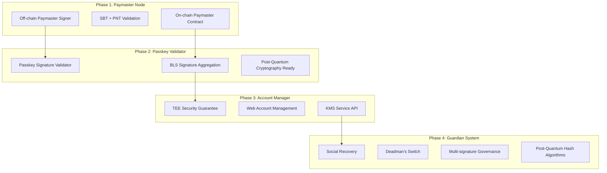

# aNode 完整路线图

## 项目愿景

aNode 是一个无许可的公共产品，为社区提供基于 ERC-20 代币的 gas 赞助、用户操作安全检查等功能。通过模块化的四阶段设计，从基础的 paymaster 服务逐步发展为完整的账户抽象生态系统。

## 总体架构演进



## Phase 1: Off-chain Paymaster Signature Node

### 核心目标
构建一个安全、可扩展的 paymaster 签名节点，支持 SBT 和 PNT 代币验证，与链上合约协同工作。

### 技术架构
基于我们已设计的可插拔模块化架构，支持多种签名机制和验证流程。

#### 1.1 版本规划

**v0.1.x - 基础 Paymaster 功能**
- ✅ 基础 UserOperation 处理和验证
- ✅ 可插拔签名机制设计（本地私钥开始）
- ✅ SBT 验证模块设计
- ✅ PNT 余额验证模块设计
- ✅ 基础安全过滤器
- ✅ RESTful + JSON-RPC API 设计

**实现时间**：2024 Q4
**部署方式**：本地开发 + Cloudflare Workers 边缘部署

**v0.2.x - 生产就绪**
- 🔄 Cloudflare Secrets Store 集成
- 🔄 完整的策略管理系统
- 🔄 多链支持（Ethereum, Polygon, Base, Arbitrum）
- 🔄 高级监控和指标收集
- 🔄 主备签名器自动切换

**实现时间**：2025 Q1
**部署方式**：Cloudflare Workers 全球边缘网络

**v0.3.x - 企业级扩展**
- 📋 AWS KMS 和 Cloudflare Keyless SSL 支持
- 📋 高级安全过滤和风险评估
- 📋 批量操作优化
- 📋 企业级审计和合规功能

**实现时间**：2025 Q2
**部署方式**：多云部署，支持私有云

#### 1.2 核心功能模块

**签名验证流程**：
1. 接收 UserOperation
2. 验证 SBT 身份凭证
3. 检查 PNT 代币余额
4. 执行安全风险评估
5. 应用 gas 策略限制
6. 生成 paymaster 签名
7. 返回已签名的 UserOperation

**链上合约集成**：
- 基于 Pimlico Singleton Paymaster 合约
- 支持可管理的公钥轮换
- EntryPoint 验证集成
- SuperPaymaster 注册机制

#### 1.3 关键技术特性

**可插拔签名机制**：
```rust
// 开发阶段
SIGNER_TYPE=local
PAYMASTER_PRIVATE_KEY=0x...

// 生产阶段
SIGNER_TYPE=cloudflare_secrets
CF_ACCOUNT_ID=...
SECRET_NAME=anode_paymaster_key

// 企业阶段
SIGNER_TYPE=aws_kms
KMS_KEY_ID=arn:aws:kms:...
```

**验证模块管道**：
```yaml
modules:
  - sbt_validator: 验证 Soul Bound Token
  - pnt_validator: 验证 PNT 代币余额
  - security_filter: 智能合约风险评估
  - policy_engine: Gas 策略和限制
  - paymaster_signer: ERC-4337 签名生成
```

## Phase 2: Passkey Signature Validator

### 核心目标
构建基于 Passkey 的签名验证器，支持 BLS 签名聚合和后量子密码学准备。

### 技术架构

#### 2.1 Passkey 集成设计

**WebAuthn 支持**：
```rust
pub struct PasskeyValidator {
    webauthn: WebAuthn,
    credential_store: CredentialStore,
    bls_aggregator: BLSAggregator,
}

impl PasskeyValidator {
    pub async fn verify_passkey_signature(
        &self,
        user_operation: &UserOperation,
        passkey_signature: &PasskeySignature,
    ) -> Result<BLSSignature, PasskeyError> {
        // 1. 验证 WebAuthn 签名
        let webauthn_result = self.webauthn.verify_credential(
            &passkey_signature.credential,
            &passkey_signature.assertion,
        )?;
        
        // 2. 生成 BLS 签名
        let bls_signature = self.bls_aggregator.sign(
            &user_operation.hash(),
            &webauthn_result.user_id,
        )?;
        
        Ok(bls_signature)
    }
}
```

#### 2.2 BLS 签名聚合

**聚合机制**：
```rust
pub struct BLSAggregator {
    threshold: u32,
    participants: Vec<BLSPublicKey>,
    signatures: HashMap<String, BLSSignature>,
}

impl BLSAggregator {
    pub async fn aggregate_signatures(&self) -> Result<AggregatedSignature, BLSError> {
        if self.signatures.len() >= self.threshold as usize {
            let aggregated = self.signatures.values()
                .fold(BLSSignature::empty(), |acc, sig| acc.aggregate(sig));
            Ok(aggregated)
        } else {
            Err(BLSError::InsufficientSignatures)
        }
    }
}
```

#### 2.3 版本规划

**v0.4.x - Passkey 基础支持**
- 📋 WebAuthn 集成
- 📋 BLS 签名库集成
- 📋 Passkey 凭证管理
- 📋 基础聚合逻辑

**v0.5.x - 生产级 BLS 聚合**
- 📋 分布式签名聚合
- 📋 阈值签名支持
- 📋 签名验证优化
- 📋 Bundler RPC 集成

**v0.6.x - 后量子密码学准备**
- 📋 PQC 算法研究和选型
- 📋 混合签名方案设计
- 📋 迁移路径规划

**实现时间**：2025 Q3 - Q4

## Phase 3: Hardware-dependent Account Manager

### 核心目标
构建基于 TEE（可信执行环境）的账户管理器，提供安全的密钥管理和生命周期管理。

### 技术架构

#### 3.1 TEE 安全保障

**Intel SGX / ARM TrustZone 集成**：
```rust
pub struct TEEAccountManager {
    enclave: SGXEnclave,
    key_store: SecureKeyStore,
    web_interface: WebAccountManager,
    kms_service: KMSServiceAPI,
}

impl TEEAccountManager {
    pub fn new() -> Result<Self, TEEError> {
        let enclave = SGXEnclave::init()?;
        let key_store = SecureKeyStore::new(&enclave)?;
        
        Ok(Self {
            enclave,
            key_store,
            web_interface: WebAccountManager::new(),
            kms_service: KMSServiceAPI::new(),
        })
    }
    
    pub async fn create_account(&self, user_id: &str) -> Result<AccountInfo, TEEError> {
        // 在 TEE 内生成密钥对
        let keypair = self.enclave.generate_keypair()?;
        
        // 安全存储
        self.key_store.store_key(user_id, &keypair)?;
        
        Ok(AccountInfo {
            address: keypair.address(),
            public_key: keypair.public_key(),
            created_at: Utc::now(),
        })
    }
}
```

#### 3.2 Web 账户管理界面

**功能特性**：
- 账户创建和导入
- 密钥备份和恢复
- 交易历史查看
- 安全设置管理
- 多设备同步

**技术栈**：
```typescript
// Next.js + React + Web3Modal
export const AccountManagerApp = () => {
  const { account, createAccount, importAccount } = useAccountManager();
  const { transactions } = useTransactionHistory(account?.address);
  
  return (
    <div>
      <AccountOverview account={account} />
      <TransactionHistory transactions={transactions} />
      <SecuritySettings />
      <DeviceManagement />
    </div>
  );
};
```

#### 3.3 KMS Service API

**企业级密钥管理**：
```rust
#[async_trait]
pub trait KMSService {
    async fn create_key(&self, key_spec: KeySpec) -> Result<KeyId, KMSError>;
    async fn sign(&self, key_id: &KeyId, data: &[u8]) -> Result<Signature, KMSError>;
    async fn get_public_key(&self, key_id: &KeyId) -> Result<PublicKey, KMSError>;
    async fn rotate_key(&self, key_id: &KeyId) -> Result<KeyId, KMSError>;
    async fn audit_log(&self, key_id: &KeyId) -> Result<Vec<AuditEntry>, KMSError>;
}

pub struct aNodeKMS {
    tee_manager: TEEAccountManager,
    policy_engine: PolicyEngine,
    audit_logger: AuditLogger,
}
```

#### 3.4 版本规划

**v0.7.x - TEE 基础架构**
- 📋 SGX/TrustZone 集成
- 📋 安全密钥生成和存储
- 📋 远程证明机制
- 📋 基础 Web 界面

**v0.8.x - 完整账户管理**
- 📋 多账户支持
- 📋 高级 Web 界面
- 📋 移动端支持
- 📋 设备同步

**v0.9.x - 企业 KMS 服务**
- 📋 完整 KMS API
- 📋 企业级权限管理
- 📋 合规性审计
- 📋 高可用部署

**实现时间**：2025 Q4 - 2026 Q2

## Phase 4: Guardian System

### 核心目标
构建完整的社交恢复和安全保障系统，支持多重签名治理和后量子密码学。

### 技术架构

#### 4.1 社交恢复机制

**Guardian 网络设计**：
```rust
pub struct GuardianSystem {
    guardians: HashMap<Address, Guardian>,
    recovery_threshold: u32,
    social_verifiers: Vec<Box<dyn SocialVerifier>>,
    deadman_switch: DeadmanSwitch,
}

pub struct Guardian {
    pub address: Address,
    pub weight: u32,
    pub verification_methods: Vec<VerificationMethod>,
    pub last_active: DateTime<Utc>,
}

impl GuardianSystem {
    pub async fn initiate_recovery(
        &self,
        account: &Address,
        new_key: &PublicKey,
        proofs: Vec<SocialProof>,
    ) -> Result<RecoveryRequest, GuardianError> {
        // 验证社交证明
        for proof in &proofs {
            self.verify_social_proof(proof).await?;
        }
        
        // 检查 Guardian 权重
        let total_weight = self.calculate_guardian_weight(&proofs)?;
        if total_weight < self.recovery_threshold {
            return Err(GuardianError::InsufficientWeight);
        }
        
        // 创建恢复请求
        Ok(RecoveryRequest {
            account: *account,
            new_key: *new_key,
            guardians: proofs.into_iter().map(|p| p.guardian).collect(),
            expires_at: Utc::now() + Duration::hours(24),
        })
    }
}
```

#### 4.2 Deadman's Switch

**自动安全机制**：
```rust
pub struct DeadmanSwitch {
    accounts: HashMap<Address, DeadmanConfig>,
    backup_guardians: Vec<Address>,
    check_interval: Duration,
}

pub struct DeadmanConfig {
    pub owner: Address,
    pub check_interval: Duration,
    pub grace_period: Duration,
    pub backup_actions: Vec<BackupAction>,
    pub last_heartbeat: DateTime<Utc>,
}

impl DeadmanSwitch {
    pub async fn check_heartbeats(&self) -> Result<Vec<DeadmanAlert>, DeadmanError> {
        let now = Utc::now();
        let mut alerts = Vec::new();
        
        for (address, config) in &self.accounts {
            let time_since_heartbeat = now - config.last_heartbeat;
            
            if time_since_heartbeat > config.check_interval + config.grace_period {
                alerts.push(DeadmanAlert {
                    account: *address,
                    last_seen: config.last_heartbeat,
                    actions: config.backup_actions.clone(),
                });
            }
        }
        
        Ok(alerts)
    }
}
```

#### 4.3 多重签名治理

**DAO 治理集成**：
```rust
pub struct MultiSigGovernance {
    pub signers: Vec<Address>,
    pub threshold: u32,
    pub proposals: HashMap<H256, Proposal>,
    pub voting_period: Duration,
}

pub struct Proposal {
    pub id: H256,
    pub proposer: Address,
    pub action: GovernanceAction,
    pub votes: HashMap<Address, Vote>,
    pub created_at: DateTime<Utc>,
    pub expires_at: DateTime<Utc>,
}

impl MultiSigGovernance {
    pub async fn create_account_proposal(
        &mut self,
        proposer: Address,
        account_config: AccountConfig,
    ) -> Result<H256, GovernanceError> {
        let proposal_id = H256::random();
        let proposal = Proposal {
            id: proposal_id,
            proposer,
            action: GovernanceAction::CreateAccount(account_config),
            votes: HashMap::new(),
            created_at: Utc::now(),
            expires_at: Utc::now() + self.voting_period,
        };
        
        self.proposals.insert(proposal_id, proposal);
        Ok(proposal_id)
    }
}
```

#### 4.4 后量子密码学迁移

**PQC 算法集成**：
```rust
pub struct PostQuantumCrypto {
    pub signature_scheme: PQCSignatureScheme,
    pub hash_function: PQCHashFunction,
    pub key_exchange: PQCKeyExchange,
}

pub enum PQCSignatureScheme {
    Dilithium,    // NIST 标准
    Falcon,       // 紧凑签名
    SPHINCS,      // 无状态哈希签名
}

pub enum PQCHashFunction {
    SHA3,         // 抗量子哈希
    BLAKE3,       // 高性能哈希
    Keccak,       // 以太坊兼容
}

impl PostQuantumCrypto {
    pub async fn hybrid_sign(
        &self,
        message: &[u8],
        classical_key: &ClassicalKey,
        pqc_key: &PQCKey,
    ) -> Result<HybridSignature, PQCError> {
        // 混合签名：经典 + 后量子
        let classical_sig = classical_key.sign(message)?;
        let pqc_sig = self.signature_scheme.sign(message, pqc_key)?;
        
        Ok(HybridSignature {
            classical: classical_sig,
            post_quantum: pqc_sig,
            timestamp: Utc::now(),
        })
    }
}
```

#### 4.5 版本规划

**v1.0.x - Guardian 基础系统**
- 📋 社交恢复机制
- 📋 Guardian 网络
- 📋 基础多重签名
- 📋 Deadman's Switch

**v1.1.x - 高级治理功能**
- 📋 DAO 治理集成
- 📋 提案和投票系统
- 📋 权重分配算法
- 📋 争议解决机制

**v1.2.x - 后量子密码学**
- 📋 PQC 算法集成
- 📋 混合签名方案
- 📋 密钥迁移工具
- 📋 兼容性保障

**实现时间**：2026 Q3 - 2027 Q2

## 跨阶段集成和部署

### 部署架构演进

#### Phase 1: 边缘计算优先
```yaml
deployment:
  primary: Cloudflare Workers
  backup: AWS Lambda
  storage: Cloudflare KV + D1
  monitoring: Cloudflare Analytics
```

#### Phase 2-3: 混合云架构
```yaml
deployment:
  edge: Cloudflare Workers (API Layer)
  compute: AWS ECS/EKS (BLS Aggregation)
  secure: AWS Nitro Enclaves (TEE)
  storage: AWS RDS + DynamoDB
  monitoring: CloudWatch + Datadog
```

#### Phase 4: 去中心化网络
```yaml
deployment:
  nodes: Distributed Guardian Network
  consensus: BFT Consensus Protocol
  storage: IPFS + Arweave
  governance: On-chain DAO
```

### 技术债务管理

**重构计划**：
- **v0.5.x**: 重构签名机制为支持多种算法
- **v0.8.x**: 数据库架构优化支持大规模用户
- **v1.0.x**: API 版本化和向后兼容
- **v1.2.x**: 完全迁移到后量子密码学

### 安全审计计划

**审计里程碑**：
- **Phase 1 完成**: 智能合约审计（Trail of Bits）
- **Phase 2 完成**: 密码学审计（NCC Group）
- **Phase 3 完成**: TEE 实现审计（Kudelski Security）
- **Phase 4 完成**: 整体系统审计（多家机构）

## 生态系统集成

### 合作伙伴集成

**ERC-4337 生态**：
- Bundler 服务商：Pimlico, Alchemy, Stackup
- 钱包集成：Safe, Argent, Biconomy
- 基础设施：Chainlink, The Graph

**DeFi 协议集成**：
- DEX：Uniswap, 1inch, Paraswap
- 借贷：Aave, Compound, Morpho
- 收益：Yearn, Convex, Lido

**企业服务**：
- KMS：AWS KMS, Azure Key Vault, HashiCorp Vault
- 监控：Datadog, New Relic, Grafana
- 合规：Chainalysis, Elliptic, TRM Labs

### 开发者生态

**SDK 和工具**：
```typescript
// aNode TypeScript SDK
import { aNodeClient, PaymasterConfig } from '@anode/sdk';

const client = new aNodeClient({
  endpoint: 'https://api.anode.network',
  apiKey: process.env.ANODE_API_KEY,
});

const result = await client.sponsorUserOperation({
  userOperation,
  policies: ['sbt-required', 'pnt-balance-100'],
});
```

**开发者文档**：
- API 参考文档
- 集成指南
- 最佳实践
- 示例代码库

## 社区和治理

### 代币经济学

**PNT 代币用途**：
- Gas 代付资格验证
- 治理投票权重
- 质押奖励分配
- Guardian 网络激励

**治理机制**：
- 技术改进提案（TIP）
- 社区投票决策
- 多重签名执行
- 透明度报告

### 开源贡献

**贡献指南**：
- 代码贡献流程
- 文档改进
- 测试用例编写
- 安全漏洞报告

**激励机制**：
- 贡献者奖励计划
- Bug 赏金计划
- 黑客松支持
- 开发者资助

## 风险评估和缓解

### 技术风险

**密钥管理风险**：
- 缓解：多重签名 + 硬件安全模块
- 监控：异常签名检测
- 恢复：社交恢复机制

**智能合约风险**：
- 缓解：多轮安全审计
- 监控：链上行为分析
- 恢复：紧急暂停机制

### 合规风险

**监管合规**：
- KYC/AML 集成准备
- 跨境数据传输合规
- 金融服务许可准备

### 运营风险

**服务可用性**：
- 多云部署策略
- 自动故障转移
- 灾难恢复计划

## 成功指标

### 技术指标
- **延迟**: < 200ms (Phase 1), < 100ms (Phase 4)
- **可用性**: 99.9% (Phase 1), 99.99% (Phase 4)
- **TPS**: 1,000 (Phase 1), 100,000 (Phase 4)

### 业务指标
- **用户数量**: 10K (Phase 1), 1M (Phase 4)
- **交易量**: $1M/月 (Phase 1), $1B/月 (Phase 4)
- **合作伙伴**: 10 (Phase 1), 100 (Phase 4)

### 生态指标
- **开发者**: 100 (Phase 1), 10K (Phase 4)
- **集成项目**: 20 (Phase 1), 1K (Phase 4)
- **社区规模**: 1K (Phase 1), 100K (Phase 4)

---

这个路线图将随着技术发展和社区反馈持续更新，确保 aNode 始终处于账户抽象技术的前沿，为全球开发者和用户提供最安全、最便捷的 Web3 账户管理解决方案。
