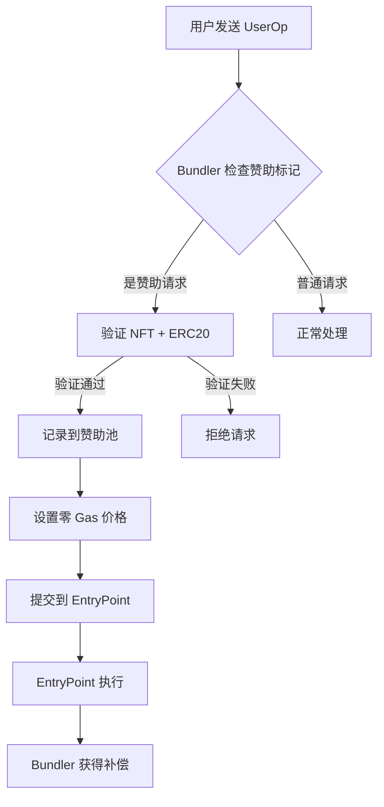

# 去中心化赞助系统设计 (Decentralized Sponsorship System)

## 概述

本系统重新设计 ERC-4337 的 gas 赞助机制，消除对中心化 paymaster 的依赖，实现完全去中心化的赞助服务。核心思想：**Bundler 直接验证资格并预付 gas，通过异步池化结算回收成本**。

## 核心创新点

### 1. 双重资格验证 (Dual Eligibility Verification)
```
用户资格 = NFT持有(SBT) + ERC20余额(PNT) + 零Gas价格标记
```

### 2. 异步池化结算 (Asynchronous Pooled Settlement)
```
实时赞助 → 池化记录 → 批量结算 → ERC20扣费
```

### 3. 去中心化治理 (Decentralized Governance)
```
DAO治理 → 参数调整 → 社区监督 → 透明审计
```

## 安全架构设计

### 1. 多层验证体系

#### **Bundler 信誉系统**
```solidity
contract BundlerRegistry {
    struct BundlerInfo {
        address bundler;
        uint256 stakeAmount;      // 质押金额
        uint256 reputationScore;  // 信誉分数
        uint256 totalSponsored;   // 总赞助量
        uint256 successfulSettlements; // 成功结算次数
        bool isActive;
    }

    // 质押要求
    uint256 public constant MIN_STAKE = 10 ether;

    // 信誉阈值
    uint256 public constant MIN_REPUTATION = 100;

    function registerBundler() external payable {
        require(msg.value >= MIN_STAKE, "Insufficient stake");
        // 注册 bundler
        // 初始化信誉分数
    }

    function slashBundler(address bundler, uint256 amount) external onlyDAO {
        // 惩罚恶意 bundler
        // 扣除质押金
        // 降低信誉分数
    }
}
```

#### **赞助记录证明系统**
```typescript
class SponsorshipProof {
    // 零知识证明: "用户有资格获得赞助且bundler正确记录"
    generateProof(userOp: UserOperation, eligibility: EligibilityData): ZKProof {
        // 证明用户拥有 NFT 和足够 ERC20
        // 证明 bundler 正确记录了赞助数据
        // 不泄露具体余额信息
    }

    verifyProof(proof: ZKProof): boolean {
        // 验证证明有效性
        // 确保 bundler 不能伪造记录
    }
}
```

### 2. 结算合约安全设计

#### **权限分层架构**
```solidity
contract DecentralizedSponsorshipPool {
    // 权限角色
    address public dao;              // DAO 治理
    address public settlementExecutor; // 结算执行器 (去中心化预言机)
    mapping(address => bool) public authorizedBundlers;

    modifier onlyAuthorizedBundler() {
        require(authorizedBundlers[msg.sender], "Not authorized bundler");
        require(BundlerRegistry.isActive(msg.sender), "Bundler not active");
        _;
    }

    modifier onlyDAO() {
        require(msg.sender == dao, "Only DAO");
        _;
    }

    // 结算执行 (仅预言机调用)
    function executeSettlement(
        uint256 periodId,
        address[] calldata users,
        uint256[] calldata amounts,
        bytes[] calldata proofs  // ZK证明
    ) external onlySettlementExecutor {
        // 1. 验证 ZK 证明
        // 2. 验证 bundler 记录的一致性
        // 3. 执行批量结算
        // 4. 更新 bundler 信誉
    }
}
```

## 系统架构

### 核心组件

#### 1. 资格验证器 (Eligibility Validator)
```typescript
class EligibilityValidator {
  // 链下验证 (性能优化)
  async validateEligibility(userOp: UserOperation): Promise<SponsorshipResult> {
    const [hasNFT, hasBalance, isZeroGas] = await Promise.all([
      this.nftChecker.checkOwnership(userOp.sender),
      this.balanceChecker.checkMinimumBalance(userOp.sender),
      this.gasChecker.isZeroGasPrice(userOp)
    ])

    return {
      eligible: hasNFT && hasBalance && isZeroGas,
      reasons: [], // 失败原因详情
      metadata: { nftVerified: hasNFT, balanceVerified: hasBalance }
    }
  }
}
```

#### 2. 赞助池合约 (Sponsorship Pool Contract)
```solidity
contract DecentralizedSponsorshipPool {
    struct SponsorshipRecord {
        address user;
        uint256 gasAmount;
        uint256 gasPrice;      // 实际 gas 价格
        uint256 blockNumber;
        bytes32 userOpHash;
        uint256 settlementPeriod; // 结算周期
    }

    struct SettlementPeriod {
        uint256 totalGasSponsored;
        uint256 totalUsers;
        uint256 startBlock;
        uint256 endBlock;
        bool settled;
    }

    // 事件定义
    event SponsorshipRecorded(address indexed user, uint256 gasAmount, bytes32 userOpHash);
    event SettlementExecuted(uint256 indexed periodId, uint256 totalSettled);
    event EmergencyPaused(address indexed pauser);

    // 核心功能
    function recordSponsorship(
        address user,
        uint256 gasAmount,
        uint256 gasPrice,
        bytes32 userOpHash
    ) external onlyBundler {
        // 记录赞助事件
        // 更新用户债务
        // 触发结算检查
    }

    function executeSettlement(uint256 periodId) external {
        // 验证结算条件
        // 批量扣除 ERC20
        // 分配收益给 bundler
        // 清理记录
    }
}
```

#### 3. Bundler 增强模块 (Enhanced Bundler)
```typescript
class DecentralizedBundler extends BaseBundler {
  private eligibilityValidator: EligibilityValidator
  private sponsorshipPool: SponsorshipPool

  async processUserOperation(userOp: UserOperation): Promise<ProcessResult> {
    // 1. 检查是否为赞助请求
    if (this.isSponsorshipRequest(userOp)) {
      // 2. 验证用户资格
      const eligibility = await this.eligibilityValidator.validateEligibility(userOp)

      if (!eligibility.eligible) {
        return { status: 'rejected', reason: eligibility.reasons }
      }

      // 3. 记录赞助到池中
      await this.recordSponsorship(userOp, eligibility.metadata)

      // 4. 设置零预付款
      userOp.maxFeePerGas = 0n
      userOp.maxPriorityFeePerGas = 0n
    }

    // 5. 正常 bundling 流程
    return await this.bundleUserOperations([userOp])
  }

  private isSponsorshipRequest(userOp: UserOperation): boolean {
    // 检查特定标记或字段
    return userOp.paymasterAndData === DELEGATED_SPONSORSHIP_MARKER
  }
}
```

## 安全设计

### 1. 资格验证安全
- **NFT 验证**: 使用 Merkle Proof 或链下缓存 + 定期同步
- **余额验证**: 链下缓存 + 阈值检查，防止闪电贷攻击
- **双重确认**: 链上最终验证兜底机制

### 2. 结算安全
- **时间锁**: 结算有时间延迟，允许争议期
- **批量处理**: 小批量结算，降低单点失败风险
- **应急机制**: 紧急暂停 + 管理员干预

### 3. 经济安全
- **债务上限**: 单个用户债务上限
- **周期限制**: 每个结算周期的赞助额度限制
- **价格预言机**: 动态调整 gas 价格上限

## 经济模型

### 收益分配
```
用户支付的 ERC20 = 实际Gas消耗 × Gas价格 × 溢价系数

Bundler收益 = 用户支付的 ERC20 × (1 - 平台抽成)
平台收益 = 用户支付的 ERC20 × 平台抽成 (用于维护)
```

### 激励机制
- **Bundler 激励**: 通过提供赞助服务获得收益
- **用户激励**: 零 Gas 费用，提升用户体验
- **生态激励**: 平台抽成用于生态建设

### 风险控制
- **坏账准备金**: 预留资金池应对用户违约
- **动态定价**: 根据市场条件调整赞助价格
- **信誉系统**: 基于历史表现的信誉评分

## 技术实现方案

### Phase 1: MVP 版本


### Phase 2: 完整结算系统
- 部署赞助池合约
- 实现批量结算逻辑
- 添加治理机制

### Phase 3: 高级功能
- 跨链赞助支持
- 动态价格调整
- AI 优化路由

## 与传统 Paymaster 的对比

| 特性 | 传统 Paymaster | 去中心化赞助系统 |
|------|----------------|------------------|
| 中心化程度 | 高 (单一合约) | 低 (多方参与) |
| 结算效率 | 实时 (每次交易) | 批量 (周期性) |
| Gas 成本 | 高 (每次验证) | 低 (链下验证) |
| 用户体验 | 好 | 优秀 (零 Gas) |
| 扩展性 | 有限 | 高 (多 bundler) |
| 治理模式 | 合约 owner | DAO 治理 |

## 优势总结

### 1. 用户体验革命
- **真正的零 Gas**: 无需任何 gas token
- **即时可用**: 无需等待确认
- **无缝集成**: 兼容现有 dApp

### 2. 经济效率提升
- **降低 Gas 成本**: 批量结算减少交易次数
- **优化资本效率**: ERC20 代币循环利用
- **激励对齐**: Bundler 有动力提供优质服务

### 3. 去中心化优势
- **无单点故障**: 多 bundler 竞争提供服务
- **透明可审计**: 所有操作上链记录
- **社区治理**: 通过 DAO 持续优化

### 4. 安全性增强
- **双重验证**: NFT + ERC20 双重保障
- **异步结算**: 降低实时风险
- **应急机制**: 多层安全防护

## 实施路线图

### 短期目标 (3个月)
- [ ] 核心验证逻辑实现
- [ ] 赞助池合约部署
- [ ] 基础 bundler 集成

### 中期目标 (6个月)
- [ ] 批量结算系统上线
- [ ] 多链支持扩展
- [ ] 治理机制建立

### 长期愿景 (1年)
- [ ] 全生态 adoption
- [ ] AI 优化算法
- [ ] 跨链桥接支持

## 核心问题深度分析

### 问题1: 如何防止 Bundler 滥用？

#### **多重防护机制**
```solidity
contract FraudPrevention {
    // 1. 质押与惩罚机制
    mapping(address => uint256) public bundlerStake;
    mapping(address => FraudRecord[]) public fraudHistory;

    function detectFraudulentSettlement(
        address bundler,
        uint256 periodId,
        bytes32 recordHash
    ) external {
        // 检测异常模式:
        // - 记录哈希不一致
        // - 异常高的赞助量
        // - 重复记录
        // - 时间异常

        if (isFraudDetected(bundler, recordHash)) {
            slashBundler(bundler, calculatePenalty());
            emit FraudDetected(bundler, periodId);
        }
    }
}
```

#### **零知识证明系统**
```typescript
class ZKSettlementProof {
    // 证明: "bundler记录的赞助数据是正确的"
    proveSettlementIntegrity(
        bundlerRecords: SettlementRecord[],
        userConfirmations: UserProof[]
    ): ZKProof {
        // 生成证明: bundler没有伪造记录
        // 用户确认赞助确实发生
        // 金额计算正确
    }
}
```

#### **去中心化预言机验证**
```solidity
contract SettlementOracle {
    // 多预言机验证
    function validateSettlementBatch(
        SettlementBatch calldata batch
    ) external returns (bool) {
        // 1. 收集多个预言机签名
        // 2. 验证记录一致性
        // 3. 阈值签名验证
        require(collectOracleSignatures(batch) >= QUORUM, "Insufficient consensus");

        return true;
    }
}
```

### 问题2: ERC20 结算合约安全性设计

#### **智能合约权限设计**
```solidity
contract ERC20SettlementIntegration {
    // ERC20 代币注册表
    struct TokenConfig {
        address tokenAddress;
        address settlementContract;    // 指定的结算合约
        uint256 maxSettlementAmount;   // 单次结算上限
        uint256 dailyLimit;           // 每日限额
        bool requiresApproval;        // 是否需要 approve
    }

    mapping(address => TokenConfig) public tokenConfigs;

    // 批量结算 (仅授权结算器调用)
    function batchSettleERC20(
        address token,
        address[] calldata users,
        uint256[] calldata amounts
    ) external onlyAuthorizedSettler {
        TokenConfig memory config = tokenConfigs[token];
        require(config.tokenAddress != address(0), "Token not registered");

        // 安全检查
        require(validateSettlementLimits(token, amounts), "Exceeds limits");

        // 执行结算
        if (config.requiresApproval) {
            // 传统 ERC20 流程
            executeWithApproval(token, users, amounts);
        } else {
            // 预授权 ERC20 流程
            executePreAuthorized(token, users, amounts);
        }
    }
}
```

#### **预授权 ERC20 代币设计**
```solidity
contract PreAuthorizedERC20 is ERC20 {
    // 在代币合约中预设结算权限
    mapping(address => mapping(address => bool)) public preAuthorizedSettlers;

    constructor(address _settlementContract) ERC20("SponsoredToken", "SPT") {
        // 部署时预授权结算合约
        preAuthorizedSettlers[address(this)][_settlementContract] = true;
    }

    // 预授权转账 (无需用户 approve)
    function preAuthorizedTransfer(
        address settler,
        address from,
        address to,
        uint256 amount
    ) external {
        require(preAuthorizedSettlers[from][settler], "Not pre-authorized");
        require(balanceOf(from) >= amount, "Insufficient balance");

        _transfer(from, to, amount);
        emit PreAuthorizedTransfer(from, to, amount, settler);
    }
}
```

### 问题3: 是否还需要链上合约？

#### **策略合约架构**
```solidity
contract SponsorshipStrategyManager {
    struct SponsorshipStrategy {
        address token;              // 赞助代币
        uint256 gasPrice;           // Gas 价格 (wei)
        uint256 markup;             // 加价百分比
        bytes32 eligibilityRules;   // 资格规则哈希
        bool isActive;
    }

    mapping(bytes32 => SponsorshipStrategy) public strategies;

    // 策略注册 (DAO 治理)
    function registerStrategy(
        bytes32 strategyId,
        SponsorshipStrategy calldata strategy
    ) external onlyDAO {
        strategies[strategyId] = strategy;
        emit StrategyRegistered(strategyId, strategy);
    }

    // 动态价格调整
    function updateGasPrice(bytes32 strategyId, uint256 newPrice) external {
        // 根据市场条件调整价格
        // 确保盈利性
    }
}
```

#### **去中心化 vs 链上合约的权衡**

| 方面 | 纯去中心化 | 链上策略合约 |
|------|------------|--------------|
| **灵活性** | 高 (随时调整) | 中 (需治理投票) |
| **安全性** | 中 (依赖预言机) | 高 (链上验证) |
| **Gas成本** | 低 | 中 |
| **响应速度** | 快 | 中 |
| **治理成本** | 高 | 中 |

#### **混合架构建议**
```solidity
contract HybridSponsorshipSystem {
    // 基础策略上链 (稳定部分)
    mapping(address => BaseStrategy) public baseStrategies;

    // 动态参数由预言机提供 (灵活部分)
    function getDynamicParameters(
        address token
    ) external view returns (DynamicParams) {
        // 从预言机获取最新参数
        // 结合基础策略计算最终价格
    }

    // 结算最终由策略合约执行
    function executeSponsoredSettlement(
        bytes32 strategyId,
        address[] calldata users,
        uint256[] calldata gasAmounts
    ) external {
        BaseStrategy memory strategy = baseStrategies[strategyId];

        // 1. 验证策略有效性
        // 2. 计算结算金额 (gasAmount * gasPrice * markup)
        // 3. 执行 ERC20 转账
        // 4. 分配收益给 bundler
    }
}
```

## 结论

这个去中心化赞助系统重新定义了 ERC-4337 的经济模型：

1. **用户至上**: 真正的零 Gas 体验
2. **去中心化**: 无中心化依赖的透明系统
3. **可持续性**: 通过 ERC20 代币形成闭环经济
4. **可扩展性**: 支持大规模 adoption

这不仅仅是技术创新，更是用户体验和经济模型的 paradigm shift！🚀

---

*设计理念：让 gas 赞助像空气一样 invisible，但又像区块链一样 transparent*
