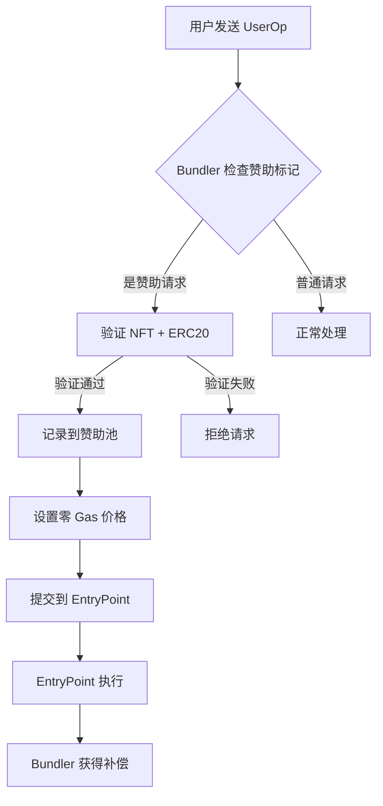

# 去中心化赞助系统设计 (Decentralized Sponsorship System)

## 概述

本系统重新设计 ERC-4337 的 gas 赞助机制，消除对中心化 paymaster 的依赖，实现完全去中心化的赞助服务。核心思想：**Bundler 直接验证资格并预付 gas，通过异步池化结算回收成本**。

## 核心创新点

### 1. 双重资格验证 (Dual Eligibility Verification)
```
用户资格 = NFT持有(SBT) + ERC20余额(PNT) + 零Gas价格标记
```

### 2. 异步池化结算 (Asynchronous Pooled Settlement)
```
实时赞助 → 池化记录 → 批量结算 → ERC20扣费
```

### 3. 去中心化治理 (Decentralized Governance)
```
DAO治理 → 参数调整 → 社区监督 → 透明审计
```

## 系统架构

### 核心组件

#### 1. 资格验证器 (Eligibility Validator)
```typescript
class EligibilityValidator {
  // 链下验证 (性能优化)
  async validateEligibility(userOp: UserOperation): Promise<SponsorshipResult> {
    const [hasNFT, hasBalance, isZeroGas] = await Promise.all([
      this.nftChecker.checkOwnership(userOp.sender),
      this.balanceChecker.checkMinimumBalance(userOp.sender),
      this.gasChecker.isZeroGasPrice(userOp)
    ])

    return {
      eligible: hasNFT && hasBalance && isZeroGas,
      reasons: [], // 失败原因详情
      metadata: { nftVerified: hasNFT, balanceVerified: hasBalance }
    }
  }
}
```

#### 2. 赞助池合约 (Sponsorship Pool Contract)
```solidity
contract DecentralizedSponsorshipPool {
    struct SponsorshipRecord {
        address user;
        uint256 gasAmount;
        uint256 gasPrice;      // 实际 gas 价格
        uint256 blockNumber;
        bytes32 userOpHash;
        uint256 settlementPeriod; // 结算周期
    }

    struct SettlementPeriod {
        uint256 totalGasSponsored;
        uint256 totalUsers;
        uint256 startBlock;
        uint256 endBlock;
        bool settled;
    }

    // 事件定义
    event SponsorshipRecorded(address indexed user, uint256 gasAmount, bytes32 userOpHash);
    event SettlementExecuted(uint256 indexed periodId, uint256 totalSettled);
    event EmergencyPaused(address indexed pauser);

    // 核心功能
    function recordSponsorship(
        address user,
        uint256 gasAmount,
        uint256 gasPrice,
        bytes32 userOpHash
    ) external onlyBundler {
        // 记录赞助事件
        // 更新用户债务
        // 触发结算检查
    }

    function executeSettlement(uint256 periodId) external {
        // 验证结算条件
        // 批量扣除 ERC20
        // 分配收益给 bundler
        // 清理记录
    }
}
```

#### 3. Bundler 增强模块 (Enhanced Bundler)
```typescript
class DecentralizedBundler extends BaseBundler {
  private eligibilityValidator: EligibilityValidator
  private sponsorshipPool: SponsorshipPool

  async processUserOperation(userOp: UserOperation): Promise<ProcessResult> {
    // 1. 检查是否为赞助请求
    if (this.isSponsorshipRequest(userOp)) {
      // 2. 验证用户资格
      const eligibility = await this.eligibilityValidator.validateEligibility(userOp)

      if (!eligibility.eligible) {
        return { status: 'rejected', reason: eligibility.reasons }
      }

      // 3. 记录赞助到池中
      await this.recordSponsorship(userOp, eligibility.metadata)

      // 4. 设置零预付款
      userOp.maxFeePerGas = 0n
      userOp.maxPriorityFeePerGas = 0n
    }

    // 5. 正常 bundling 流程
    return await this.bundleUserOperations([userOp])
  }

  private isSponsorshipRequest(userOp: UserOperation): boolean {
    // 检查特定标记或字段
    return userOp.paymasterAndData === DELEGATED_SPONSORSHIP_MARKER
  }
}
```

## 安全设计

### 1. 资格验证安全
- **NFT 验证**: 使用 Merkle Proof 或链下缓存 + 定期同步
- **余额验证**: 链下缓存 + 阈值检查，防止闪电贷攻击
- **双重确认**: 链上最终验证兜底机制

### 2. 结算安全
- **时间锁**: 结算有时间延迟，允许争议期
- **批量处理**: 小批量结算，降低单点失败风险
- **应急机制**: 紧急暂停 + 管理员干预

### 3. 经济安全
- **债务上限**: 单个用户债务上限
- **周期限制**: 每个结算周期的赞助额度限制
- **价格预言机**: 动态调整 gas 价格上限

## 经济模型

### 收益分配
```
用户支付的 ERC20 = 实际Gas消耗 × Gas价格 × 溢价系数

Bundler收益 = 用户支付的 ERC20 × (1 - 平台抽成)
平台收益 = 用户支付的 ERC20 × 平台抽成 (用于维护)
```

### 激励机制
- **Bundler 激励**: 通过提供赞助服务获得收益
- **用户激励**: 零 Gas 费用，提升用户体验
- **生态激励**: 平台抽成用于生态建设

### 风险控制
- **坏账准备金**: 预留资金池应对用户违约
- **动态定价**: 根据市场条件调整赞助价格
- **信誉系统**: 基于历史表现的信誉评分

## 技术实现方案

### Phase 1: MVP 版本


### Phase 2: 完整结算系统
- 部署赞助池合约
- 实现批量结算逻辑
- 添加治理机制

### Phase 3: 高级功能
- 跨链赞助支持
- 动态价格调整
- AI 优化路由

## 与传统 Paymaster 的对比

| 特性 | 传统 Paymaster | 去中心化赞助系统 |
|------|----------------|------------------|
| 中心化程度 | 高 (单一合约) | 低 (多方参与) |
| 结算效率 | 实时 (每次交易) | 批量 (周期性) |
| Gas 成本 | 高 (每次验证) | 低 (链下验证) |
| 用户体验 | 好 | 优秀 (零 Gas) |
| 扩展性 | 有限 | 高 (多 bundler) |
| 治理模式 | 合约 owner | DAO 治理 |

## 优势总结

### 1. 用户体验革命
- **真正的零 Gas**: 无需任何 gas token
- **即时可用**: 无需等待确认
- **无缝集成**: 兼容现有 dApp

### 2. 经济效率提升
- **降低 Gas 成本**: 批量结算减少交易次数
- **优化资本效率**: ERC20 代币循环利用
- **激励对齐**: Bundler 有动力提供优质服务

### 3. 去中心化优势
- **无单点故障**: 多 bundler 竞争提供服务
- **透明可审计**: 所有操作上链记录
- **社区治理**: 通过 DAO 持续优化

### 4. 安全性增强
- **双重验证**: NFT + ERC20 双重保障
- **异步结算**: 降低实时风险
- **应急机制**: 多层安全防护

## 实施路线图

### 短期目标 (3个月)
- [ ] 核心验证逻辑实现
- [ ] 赞助池合约部署
- [ ] 基础 bundler 集成

### 中期目标 (6个月)
- [ ] 批量结算系统上线
- [ ] 多链支持扩展
- [ ] 治理机制建立

### 长期愿景 (1年)
- [ ] 全生态 adoption
- [ ] AI 优化算法
- [ ] 跨链桥接支持

## 结论

这个去中心化赞助系统重新定义了 ERC-4337 的经济模型：

1. **用户至上**: 真正的零 Gas 体验
2. **去中心化**: 无中心化依赖的透明系统
3. **可持续性**: 通过 ERC20 代币形成闭环经济
4. **可扩展性**: 支持大规模 adoption

这不仅仅是技术创新，更是用户体验和经济模型的 paradigm shift！🚀

---

*设计理念：让 gas 赞助像空气一样 invisible，但又像区块链一样 transparent*
