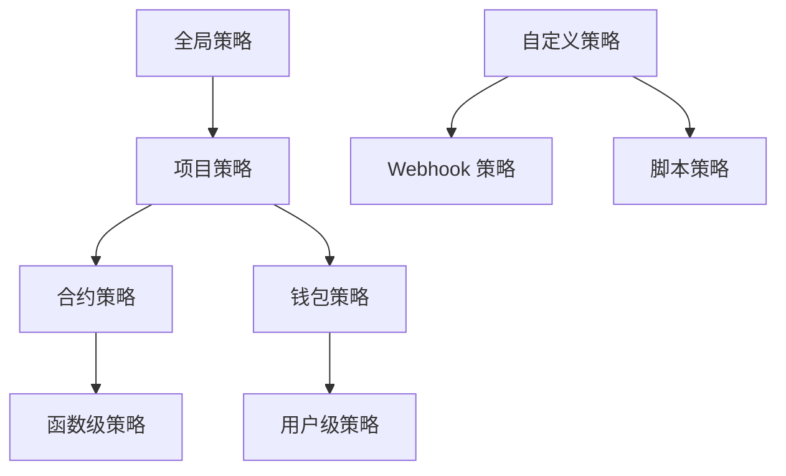

# aNode 策略管理系统设计

## 策略体系概述

基于 ZeroDev 的策略管理模式，aNode 设计了一套完整简洁的策略配置和支持机制，支持细粒度的 gas 赞助控制和安全策略管理。

## ZeroDev 策略模式分析

### ZeroDev 策略类型
1. **Project Policies**: 项目级别的全局策略
2. **Contract Policies**: 针对特定合约的策略
3. **Wallet Policies**: 针对特定钱包的策略
4. **Custom Policies**: 通过 webhook 的自定义策略

### ZeroDev 限制类型
1. **Amount Limits**: 按金额限制
2. **Request Limits**: 按请求数量限制
3. **Gas Price Limits**: 按 gas 价格限制
4. **Amount per Transaction**: 按单笔交易金额限制

## aNode 策略架构设计

### 1. 策略层次结构



### 2. 策略配置模型

#### 2.1 基础策略结构
```yaml
# policy-config.yaml
policies:
  # 全局策略
  global:
    - id: "global_daily_limit"
      name: "Global Daily Spending Limit"
      type: "global"
      enabled: true
      priority: 1
      rateLimits:
        - type: "amount"
          limit: "10000000000000000000" # 10 ETH per day
          window: 86400
          enabled: true
      conditions: []
      
  # 项目策略  
  project:
    - id: "project_hourly_limit"
      name: "Project Hourly Request Limit"
      type: "project"
      enabled: true
      priority: 10
      rateLimits:
        - type: "request"
          limit: "1000" # 1000 requests per hour
          window: 3600
          enabled: true
      conditions:
        - field: "chainId"
          operator: "in"
          value: [1, 137, 8453] # Ethereum, Polygon, Base
          
  # 合约策略
  contract:
    - id: "uniswap_v3_policy"
      name: "Uniswap V3 Trading Policy"
      type: "contract"
      target: "0x68b3465833fb72A70ecDF485E0e4C7bD8665Fc45" # Uniswap V3 Router
      enabled: true
      priority: 20
      rateLimits:
        - type: "amount"
          limit: "1000000000000000000" # 1 ETH per hour
          window: 3600
          enabled: true
        - type: "amountPerTransaction"
          limit: "100000000000000000" # 0.1 ETH per transaction
          window: 1
          enabled: true
      conditions:
        - field: "function"
          operator: "in"
          value: ["exactInputSingle", "exactOutputSingle"]
      allowedFunctions:
        - "exactInputSingle"
        - "exactOutputSingle"
      blockedFunctions:
        - "multicall"
        
  # 钱包策略
  wallet:
    - id: "new_wallet_policy"
      name: "New Wallet Restriction"
      type: "wallet"
      enabled: true
      priority: 30
      rateLimits:
        - type: "amount"
          limit: "100000000000000000" # 0.1 ETH per day for new wallets
          window: 86400
          enabled: true
      conditions:
        - field: "wallet.age"
          operator: "<"
          value: 604800 # Less than 7 days old
        - field: "wallet.transactionCount"
          operator: "<"
          value: 10
          
  # aNode 扩展策略
  sbt:
    - id: "identity_required_policy"
      name: "Identity SBT Required"
      type: "sbt"
      enabled: true
      priority: 5
      conditions:
        - field: "sbt.types"
          operator: "contains"
          value: ["identity"]
      requirements:
        sbtTypes: ["identity"]
        minLevel: "basic"
        
  pnt:
    - id: "pnt_balance_policy"
      name: "PNT Balance Requirement"
      type: "pnt"
      enabled: true
      priority: 5
      conditions:
        - field: "pnt.balance"
          operator: ">="
          value: "100000000000000000000" # 100 PNT
      requirements:
        minBalance: "100000000000000000000"
        includeStaked: true
        
  security:
    - id: "contract_security_policy"
      name: "Contract Security Filter"
      type: "security"
      enabled: true
      priority: 15
      conditions:
        - field: "contract.verified"
          operator: "=="
          value: false
        - field: "contract.age"
          operator: "<"
          value: 86400 # Less than 24 hours
      actions:
        - type: "warning"
          message: "Interacting with unverified contract"
        - type: "requireConfirmation"
          level: "medium"
```

### 3. 策略引擎架构

#### 3.1 策略处理流程
```rust
pub struct PolicyEngine {
    policies: PolicyRegistry,
    evaluator: PolicyEvaluator,
    cache: PolicyCache,
    metrics: PolicyMetrics,
}

pub struct PolicyContext {
    pub user_operation: UserOperation,
    pub sender_info: SenderInfo,
    pub contract_info: Option<ContractInfo>,
    pub chain_id: u64,
    pub timestamp: u64,
}

pub struct SenderInfo {
    pub address: String,
    pub nonce: u64,
    pub transaction_count: u64,
    pub first_seen: u64,
    pub sbt_tokens: Vec<SBTToken>,
    pub pnt_balance: PNTBalance,
}

impl PolicyEngine {
    pub async fn evaluate(&self, context: &PolicyContext) -> PolicyResult {
        // 1. 加载适用的策略（按优先级排序）
        let applicable_policies = self.load_applicable_policies(context).await?;
        
        // 2. 按优先级顺序评估策略
        for policy in applicable_policies {
            match self.evaluator.evaluate_policy(&policy, context).await? {
                PolicyDecision::Allow => continue,
                PolicyDecision::Deny(reason) => return Ok(PolicyResult::Denied(reason)),
                PolicyDecision::Warning(warning) => return Ok(PolicyResult::Warning(warning)),
                PolicyDecision::RequireConfirmation(req) => return Ok(PolicyResult::RequireConfirmation(req)),
            }
        }
        
        Ok(PolicyResult::Allowed)
    }
}
```

#### 3.2 策略评估器
```rust
pub struct PolicyEvaluator {
    rate_limiter: RateLimiter,
    condition_evaluator: ConditionEvaluator,
}

impl PolicyEvaluator {
    async fn evaluate_policy(&self, policy: &Policy, context: &PolicyContext) -> Result<PolicyDecision> {
        // 1. 检查策略是否启用
        if !policy.enabled {
            return Ok(PolicyDecision::Allow);
        }
        
        // 2. 评估策略条件
        if !self.condition_evaluator.evaluate_conditions(&policy.conditions, context)? {
            return Ok(PolicyDecision::Allow);
        }
        
        // 3. 检查速率限制
        for rate_limit in &policy.rate_limits {
            if !rate_limit.enabled {
                continue;
            }
            
            let limit_result = self.rate_limiter.check_limit(rate_limit, context).await?;
            if !limit_result.allowed {
                return Ok(PolicyDecision::Deny(
                    PolicyDenialReason::RateLimitExceeded {
                        limit_type: rate_limit.limit_type.clone(),
                        limit: rate_limit.limit.clone(),
                        current: limit_result.current_usage,
                        reset_time: limit_result.reset_time,
                    }
                ));
            }
        }
        
        // 4. 执行策略特定的检查
        match policy.policy_type {
            PolicyType::Security => self.evaluate_security_policy(policy, context).await,
            PolicyType::SBT => self.evaluate_sbt_policy(policy, context).await,
            PolicyType::PNT => self.evaluate_pnt_policy(policy, context).await,
            _ => Ok(PolicyDecision::Allow),
        }
    }
}
```

### 4. API 接口设计

#### 4.1 RESTful API

**策略管理接口：**
```http
# 获取所有策略
GET /api/v1/policies

# 创建策略
POST /api/v1/policies
{
  "name": "DeFi Protocol Limit",
  "type": "contract",
  "target": "0x1234...CONTRACT",
  "enabled": true,
  "priority": 20,
  "rateLimits": [
    {
      "type": "amount",
      "limit": "5000000000000000000",
      "window": 3600,
      "enabled": true
    }
  ],
  "conditions": [
    {
      "field": "function",
      "operator": "in", 
      "value": ["swap", "addLiquidity"]
    }
  ]
}

# 更新策略
PUT /api/v1/policies/{policyId}

# 删除策略  
DELETE /api/v1/policies/{policyId}

# 获取策略状态
GET /api/v1/policies/{policyId}/status?wallet=0x...&contract=0x...

# 策略测试
POST /api/v1/policies/test
{
  "policyId": "uniswap_v3_policy",
  "userOperation": { ... },
  "context": { ... }
}
```

#### 4.2 JSON-RPC API

**JSON-RPC 2.0 支持：**
```http
POST /api/v1/rpc
Content-Type: application/json

{
  "jsonrpc": "2.0",
  "method": "anode_sponsorUserOperation",
  "params": {
    "userOperation": { ... },
    "entryPoint": "0x5FF137D4b0FDCD49DcA30c7CF57E578a026d2789",
    "chainId": 1,
    "context": {
      "type": "sponsor"
    }
  },
  "id": 1
}
```

**方法映射表：**
```yaml
# RESTful -> JSON-RPC 方法映射
restful_to_rpc:
  "POST /api/v1/paymaster/sponsor": "anode_sponsorUserOperation"
  "POST /api/v1/paymaster/erc20": "anode_payWithERC20"
  "POST /api/v1/paymaster/estimate": "anode_estimateGas"
  "POST /api/v1/paymaster/process": "anode_processUserOperation"
  "GET /api/v1/validation/sbt/{address}": "anode_validateSBT"
  "GET /api/v1/validation/pnt/{address}": "anode_validatePNT"
  "POST /api/v1/security/assess": "anode_assessSecurity"
  "GET /api/v1/policies": "anode_getPolicies"
  "POST /api/v1/policies": "anode_createPolicy"
  "PUT /api/v1/policies/{id}": "anode_updatePolicy"
  "DELETE /api/v1/policies/{id}": "anode_deletePolicy"
  "GET /api/v1/policies/{id}/status": "anode_getPolicyStatus"
  "POST /api/v1/policies/test": "anode_testPolicy"
```

### 5. 策略配置工具

#### 5.1 策略配置 DSL
```yaml
# 策略配置的领域特定语言
policy:
  name: "Advanced DeFi Trading Policy"
  description: "Comprehensive policy for DeFi protocol interactions"
  
  # 目标定义
  targets:
    contracts: ["0x1234...UNISWAP", "0x5678...SUSHISWAP"]
    functions: ["swap*", "addLiquidity", "removeLiquidity"]
    
  # 条件组合
  conditions:
    all: # AND 逻辑
      - wallet.sbt.contains("identity")
      - wallet.pnt.balance >= 100e18
      - contract.verified == true
    any: # OR 逻辑  
      - transaction.value < 1e18
      - wallet.reputation.score > 800
      
  # 限制规则
  limits:
    amount:
      per_hour: 5e18    # 5 ETH per hour
      per_day: 20e18    # 20 ETH per day
      per_transaction: 1e18  # 1 ETH per transaction
    requests:
      per_minute: 10
      per_hour: 100
      
  # 动作定义
  actions:
    on_violation:
      - log: "Policy violation detected"
      - alert: "admin@example.com"
      - deny: "Rate limit exceeded"
    on_warning:
      - require_confirmation: 
          level: "medium"
          message: "High value DeFi transaction detected"
```

#### 5.2 策略模板库
```yaml
# 内置策略模板
templates:
  basic_sponsor:
    name: "Basic Gas Sponsorship"
    limits:
      amount:
        per_day: 1e18
      requests:
        per_hour: 100
        
  defi_trading:
    name: "DeFi Trading Policy"
    targets:
      contracts: ["uniswap_v3", "sushiswap", "1inch"]
    limits:
      amount:
        per_hour: 5e18
        per_transaction: 1e18
    conditions:
      - wallet.sbt.contains("identity")
      - contract.verified == true
      
  new_user:
    name: "New User Restrictions"
    conditions:
      - wallet.age < 7d
      - wallet.transaction_count < 10
    limits:
      amount:
        per_day: 0.1e18
      requests:
        per_hour: 10
```

### 6. 策略监控和分析

#### 6.1 策略效果监控
```http
GET /api/v1/policies/analytics
{
  "timeRange": {
    "start": "2024-03-14T00:00:00Z",
    "end": "2024-03-15T00:00:00Z"
  },
  "policies": [
    {
      "id": "uniswap_v3_policy",
      "name": "Uniswap V3 Trading Policy",
      "triggers": 156,
      "violations": 12,
      "warnings": 23,
      "effectiveness": 0.92,
      "topViolationReasons": [
        {
          "reason": "amount_per_transaction_exceeded",
          "count": 8,
          "percentage": 0.67
        }
      ]
    }
  ],
  "overallStats": {
    "totalPolicyEvaluations": 5420,
    "totalViolations": 86,
    "totalWarnings": 234,
    "averageEvaluationTime": "15ms"
  }
}
```

#### 6.2 策略优化建议
```http
GET /api/v1/policies/optimization
{
  "suggestions": [
    {
      "policyId": "new_user_policy",
      "type": "threshold_adjustment",
      "message": "Consider increasing daily limit from 0.1 ETH to 0.2 ETH",
      "reason": "95% of new users stay within 0.2 ETH limit",
      "impact": "Reduce false positives by 30%"
    },
    {
      "policyId": "defi_trading_policy",
      "type": "condition_refinement", 
      "message": "Add time-based conditions for high-frequency trading",
      "reason": "Detected pattern of legitimate high-frequency trading",
      "impact": "Improve user experience for power traders"
    }
  ]
}
```

### 7. 高级策略功能

#### 7.1 动态策略调整
```rust
pub struct AdaptivePolicy {
    base_policy: Policy,
    adaptation_rules: Vec<AdaptationRule>,
    learning_model: Option<Box<dyn PolicyLearningModel>>,
}

pub struct AdaptationRule {
    pub trigger: AdaptationTrigger,
    pub adjustment: PolicyAdjustment,
    pub duration: Duration,
}

// 示例：根据网络拥堵动态调整 gas 限制
impl AdaptivePolicy {
    async fn adapt_to_network_conditions(&mut self, network_stats: &NetworkStats) {
        if network_stats.gas_price > self.high_gas_threshold {
            // 在高 gas 价格时降低限制
            self.adjust_limits(0.7); // 降低到 70%
        } else if network_stats.gas_price < self.low_gas_threshold {
            // 在低 gas 价格时提高限制  
            self.adjust_limits(1.3); // 提高到 130%
        }
    }
}
```

#### 7.2 策略组合和继承
```yaml
# 策略继承示例
policy_inheritance:
  base_policy: "global_limits"
  inherited_policies:
    - id: "contract_specific"
      inherits: "base_policy"
      overrides:
        limits:
          amount:
            per_transaction: 0.5e18 # 覆盖基础策略
      additions:
        conditions:
          - contract.category == "defi"
          
    - id: "vip_user"
      inherits: "contract_specific"
      multipliers:
        limits:
          amount: 5.0 # 所有金额限制 x5
          requests: 2.0 # 所有请求限制 x2
```

### 8. 未来扩展预留

#### 8.1 gRPC/Protocol Buffers 预留
```proto
// 预留的 Protocol Buffers 定义
syntax = "proto3";

package anode.v1;

service PaymasterService {
  rpc SponsorUserOperation(SponsorRequest) returns (SponsorResponse);
  rpc EstimateGas(EstimateGasRequest) returns (EstimateGasResponse);
  rpc ProcessUserOperation(ProcessRequest) returns (ProcessResponse);
}

service PolicyService {
  rpc CreatePolicy(CreatePolicyRequest) returns (CreatePolicyResponse);
  rpc UpdatePolicy(UpdatePolicyRequest) returns (UpdatePolicyResponse);
  rpc GetPolicy(GetPolicyRequest) returns (GetPolicyResponse);
  rpc ListPolicies(ListPoliciesRequest) returns (ListPoliciesResponse);
}
```

这个策略管理系统设计借鉴了 ZeroDev 的成熟模式，同时扩展了 aNode 的特有功能，提供了完整简洁的策略配置和支持机制，支持 RESTful 和 JSON-RPC 两种 API 风格，并为未来的 gRPC/Protocol Buffers 扩展预留了接口。
